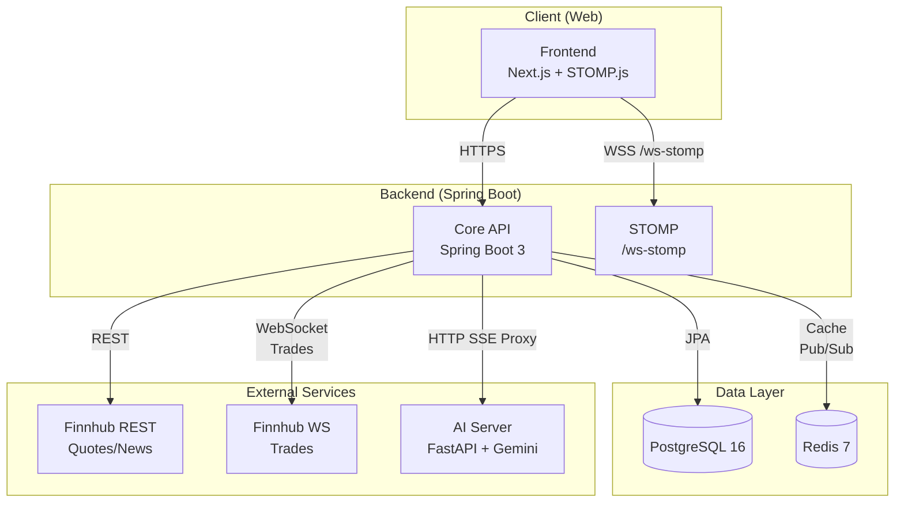
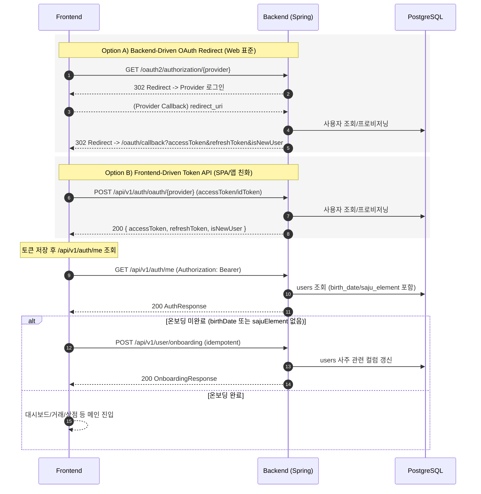
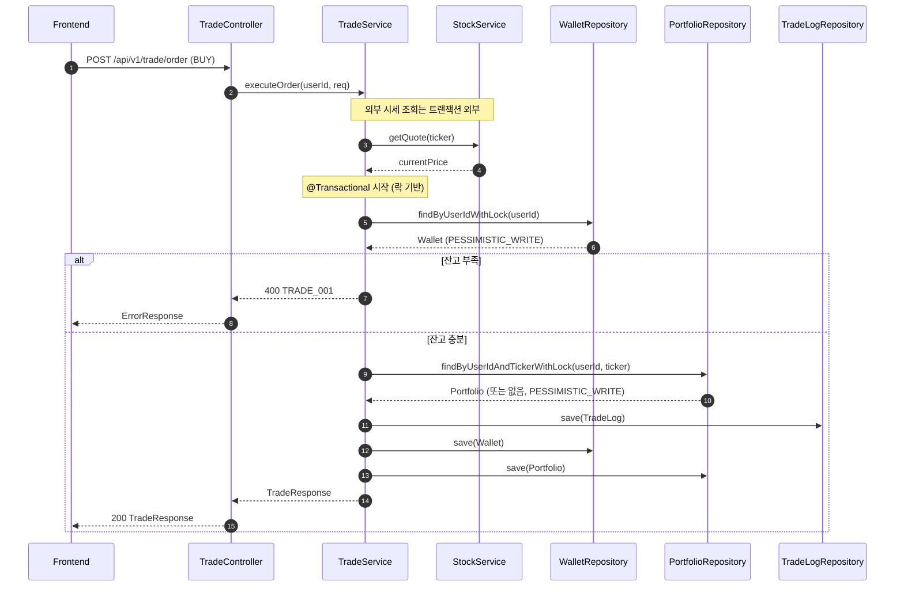
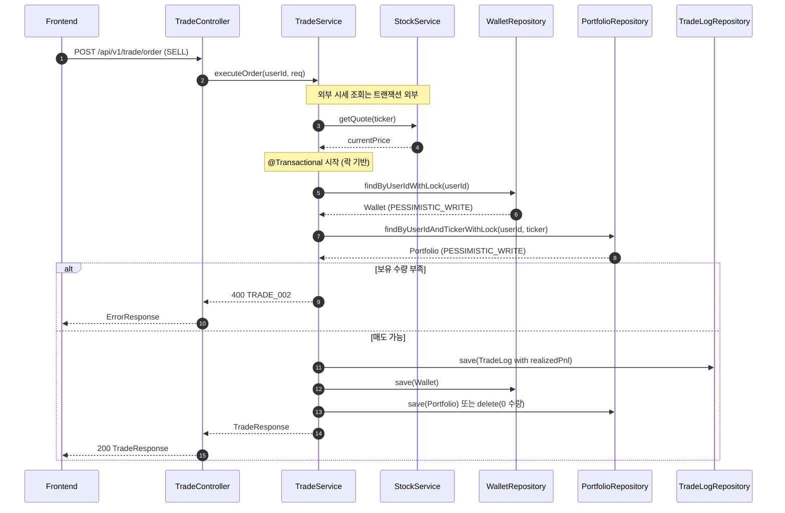
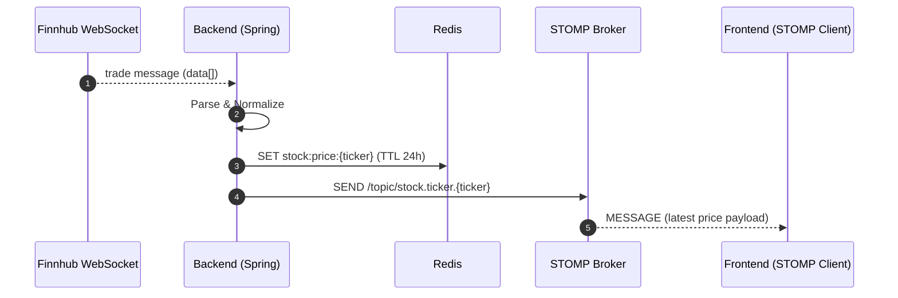
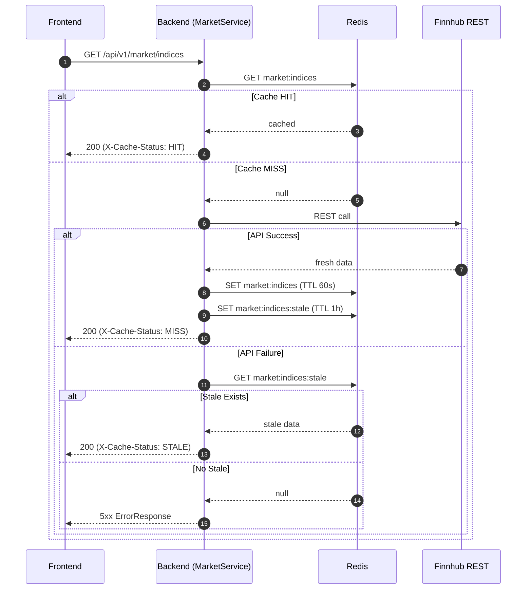
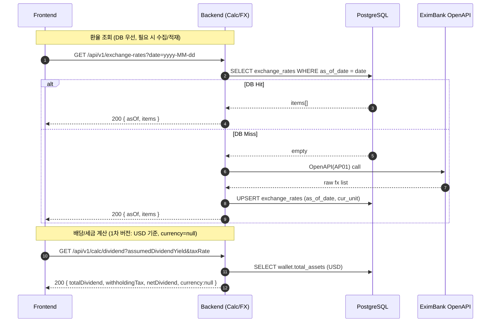
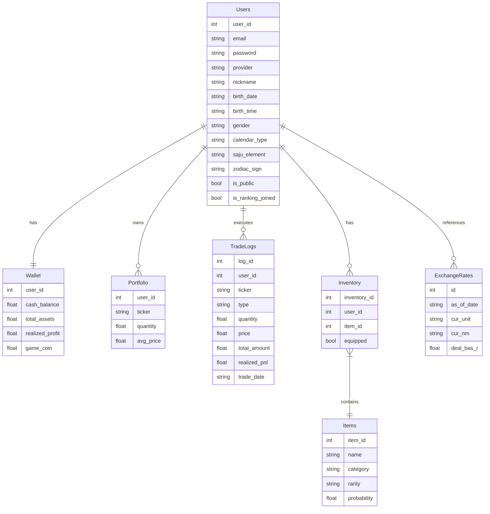

# MadCamp02 Backend - 주술사 -

Finnhub 실시간 시세 + 모의투자(거래/포트폴리오) + 게이미피케이션(가챠/인벤토리/랭킹) + 사주(온보딩) + (향후) AI 상담을 제공하는 **Spring Boot 기반 백엔드**

---

## 기술 스택

### Backend (Core & Infra)

- **언어/런타임**: Java 21 (LTS)
- **프레임워크**: Spring Boot 3.4.x
- **보안**: Spring Security 6.x (OAuth2 Client + JWT, Hybrid Auth)
- **데이터 접근**: Spring Data JPA 3.x (JPA/Hibernate)
- **실시간**: Spring WebSocket (STOMP), Endpoint `/ws-stomp`
- **API 문서화**: SpringDoc OpenAPI 2.x (Swagger UI)
- **DB 마이그레이션**: Flyway (버전드 스키마 관리)
- **캐시/브로커**: Redis 7 (시장 데이터/시세 캐싱, 최신가 저장, Pub/Sub 보조)
- **RDBMS**: PostgreSQL 16 (docker-compose 기준, 메인 트랜잭션 DB)

### Frontend / AI / DevOps

- **Frontend**: Next.js 16 + React 19 + TypeScript 5.x + Tailwind CSS + Shadcn UI + Zustand + STOMP.js
- **차트/시각화**: Lightweight Charts (캔들/라인 차트)
- **네트워크 레이어**: Axios (REST), STOMP.js (WSS)
- **AI**: Python 3.11+ FastAPI + Gemini API (향후 SSE 스트리밍 연동 계획)
- **인프라/배포**: Docker / docker-compose (PostgreSQL, Redis, Backend 컨테이너), GitHub Actions 기반 CI (Gradle 빌드 + 테스트)

---

## 시스템 아키텍처



---

## 시퀀스 다이어그램 (핵심 플로우)

### 1) 인증/온보딩 (Hybrid Auth + 온보딩 강제)



### 2) 거래 실행 (외부 시세 조회는 트랜잭션 밖, DB 갱신은 락 기반 트랜잭션)

#### 2.1 매수 주문



#### 2.2 매도 주문



### 3) 실시간 시세 브로드캐스트 (Finnhub WS → Redis 최신가 → STOMP)



### 4) Market API 캐싱 (Redis HIT/MISS/STALE)



### 5) Calc/환율 (Exchange Rates + Calculator)



---

## 데이터베이스 스키마

### PostgreSQL 스키마 개요



- **users**
  - 식별자/계정: `user_id (PK)`, `email (UNIQUE)`, `password`, `provider(LOCAL/GOOGLE/KAKAO)`
  - 프로필: `nickname`, `avatar_url`, `is_public`, `is_ranking_joined`
  - 온보딩/사주: `birth_date`, `birth_time`, `gender`, `calendar_type`, `saju_element`, `zodiac_sign`
  - 감사: `created_at`, `updated_at`

- **wallet**
  - 키: `user_id (PK, FK -> users)`
  - 금액: `cash_balance`, `total_assets`, `realized_profit`, `game_coin`
  - 랭킹 계산에 사용하는 총자산/실현손익 저장

- **portfolio**
  - 키: `(user_id, ticker)` 복합 PK
  - 포지션: `quantity`, `avg_price`, `last_price`, `market_value`, `unrealized_pnl`

- **trade_logs**
  - 키: `log_id (PK)`
  - 거래 정보: `user_id`, `ticker`, `type(BUY/SELL)`, `quantity`, `price`, `total_amount`, `realized_pnl`, `trade_date`

- **items**
  - 키: `item_id (PK)`
  - 메타: `name`, `description`, `image_url`
  - 게임 스키마: `category (NAMEPLATE/AVATAR/THEME)`, `rarity`, `probability`

- **inventory**
  - 키: `inventory_id (PK)`
  - 관계: `user_id (FK)`, `item_id (FK)`
  - 장착 여부: `equipped` (카테고리 단일 장착은 서비스 레벨에서 강제)

- **exchange_rates**
  - 키: `id (PK)`, `(as_of_date, cur_unit)` UNIQUE
  - 필드: `as_of_date`, `cur_unit`, `cur_nm`, `deal_bas_r`, `ttb`, `tts`, `bkpr`, `kftc_deal_bas_r`, `kftc_bkpr`, `created_at`, `updated_at`
  - 한국수출입은행 Open API(AP01) 기준 환율 저장, Calc/다통화 기능의 기준 데이터

- **market_cap_stocks**, **stock_candles**, **api_usage_logs** 등
  - 지수/Movers/캔들/Quota 관리용 보조 테이블

### Redis 키 스키마 개요

> Redis는 세션 스토어가 아니라 **시장 데이터/지수/시세 캐시 및 Pub/Sub 보조 채널**로 사용

- **시장/지수/뉴스 캐시**
  - `market:indices` / `market:indices:stale`  
    - 지수 카드 데이터 캐시 / 만료 후 Stale 백업, TTL: 1분(+Stale 1시간)
  - `market:news` / `market:news:stale`  
    - 뉴스 리스트 캐시 / Stale 백업, TTL: 5분(+Stale 1시간)
  - `market:movers` / `market:movers:stale`  
    - Movers 결과 캐시 / Stale 백업, TTL: 1–5분

- **시세/실시간 데이터**
  - `stock:price:{ticker}`  
    - Finnhub WebSocket에서 수신한 최신 체결가/가격, TTL 24시간

- **기타 (확장 가능 영역)**
  - 향후 랭킹/알림/세션 등의 캐시 키를 추가할 수 있으며, 모든 키/TTL/에러 처리 전략은 문서에 정리

## 핵심 기능 요약

- **인증/온보딩**
  - Hybrid Auth 지원(Backend-Driven Redirect + Frontend-Driven Token API)
  - 온보딩 완료 기준: `birthDate` && `sajuElement` (별도 플래그 없음)
- **시장 데이터**
  - `/api/v1/market/indices|news|movers`
  - 지수는 **ETF 기반**(SPY/QQQ/DIA)으로 제공 (지수 심볼 미지원 이슈 회피)
  - Redis 캐싱 + Stale fallback 전략(헤더: `X-Cache-Status`, 등)
- **거래/포트폴리오 엔진**
  - 비관적 락 기반 트랜잭션으로 동시성 제어
  - 주문 체결 알림: STOMP `/user/queue/trade`
- **게임화**
  - 가챠(코인 차감, 중복 재추첨, 실패 코드), 인벤토리/장착(카테고리 단일 장착), 랭킹
- **실시간**
  - Finnhub Trades WebSocket 수신 → Redis 최신가 저장 → STOMP 브로드캐스트
  - 지수 브로드캐스트: `/topic/stock.indices` (주기)

---

## 빠른 시작(로컬)

### 1) 환경 변수

레포의 예시 파일을 복사해 `.env`를 만든 뒤 값을 채우세요.

- 예시 파일: `env.example`
- 애플리케이션 설정: `src/main/resources/application.yml`, `application-dev.yml`

```bash
cp env.example .env
```

### 2) 인프라 실행 (Docker)

`docker-compose.yml`에 Postgres/Redis/Backend 서비스가 정의되어 있습니다.

```bash
docker compose up -d
```

백엔드까지 같이 빌드/실행하려면:

```bash
docker compose up -d --build
```

### 3) 백엔드 실행 (Gradle)

Docker로 백엔드를 띄우지 않고(=로컬에서 직접 실행) 싶으면 아래처럼 실행합니다.

```bash
./gradlew bootRun
```

또는 빌드:

```bash
./gradlew clean build
```
---

## 주요 엔드포인트(요약)

> 상세 스키마/DTO/에러 코드는 `docs/FULL_SPECIFICATION.md`가 기준입니다.

### Auth

- `POST /api/v1/auth/signup`
- `POST /api/v1/auth/login`
- `POST /api/v1/auth/logout`
- `POST /api/v1/auth/refresh`
- `GET /api/v1/auth/me`
- `POST /api/v1/auth/oauth/kakao` (Frontend-Driven)
- `POST /api/v1/auth/oauth/google` (Frontend-Driven)

### User

- `GET /api/v1/user/me`
- `PUT /api/v1/user/me`
- `POST /api/v1/user/onboarding` (온보딩/재온보딩 공용, idempotent)
- `GET /api/v1/user/wallet`
- `GET /api/v1/user/watchlist`
- `POST /api/v1/user/watchlist`
- `DELETE /api/v1/user/watchlist/{ticker}`

### Market / Stock

- `GET /api/v1/market/indices`
- `GET /api/v1/market/news`
- `GET /api/v1/market/movers`
- `GET /api/v1/stock/search`
- `GET /api/v1/stock/quote/{ticker}`
- `GET /api/v1/stock/candles/{ticker}` (EODHD + DB 캐싱, Quota 관리)

### Trade

- `GET /api/v1/trade/available-balance`
- `POST /api/v1/trade/order`
- `GET /api/v1/trade/portfolio`
- `GET /api/v1/trade/history`

### Game

- `GET /api/v1/game/items`
- `POST /api/v1/game/gacha`
- `GET /api/v1/game/inventory`
- `PUT /api/v1/game/equip/{itemId}`
- `GET /api/v1/game/ranking`

### Realtime (STOMP)

- **Endpoint**: `/ws-stomp`
- **Topics**
  - `/topic/stock.indices`
  - `/topic/stock.ticker.{ticker}`
  - `/user/queue/trade`

---
