# 🤖 MadCamp02 AI Server Specification

**Ver 1.1.0 - LLM 기반 투자 도사 / 보조 기능 서버 명세 (통합판)**

---

## 📝 변경 이력

| 버전   | 날짜       | 변경 내용                                                                                                     | 작성자    |
| ------ | ---------- | ------------------------------------------------------------------------------------------------------------- | --------- |
| 1.0.0  | 2026-01-21 | 초기 버전. 하드웨어 제약(3090 20G) 기준 모델 전략, FastAPI Gateway + LLM Backend 아키텍처, API/프롬프트/운영 명세 추가 | MadCamp02 |
| 1.1.0  | 2026-01-21 | 백엔드/프론트/FULL_SPEC/Plan 문서에 흩어져 있던 AI 관련 스펙(모델 전략, Spring SSE 프록시, 프론트 `/oracle` 연동, 구현 로드맵)을 본 문서로 통합하고, 다른 문서는 요약+참조 형태로 정리 | MadCamp02 |

---

## 1. 개요 및 인프라 제약

### 1.1 목적

- `/oracle` 페이지(“AI 도사”) 및 향후 AI 기능을 담당하는 **전용 AI 서버** 설계/구현 기준을 정의한다.
- `docs/FULL_SPECIFICATION.md`에 정의된 도메인(거래/포트폴리오/온보딩/사주/게임 등)을 활용하여,  
  - **어떤 AI 기능을 어디까지 AI 서버가 담당하는지**와  
  - **Spring 백엔드 / 프론트엔드와의 경계**를 명확히 구분한다.

### 1.2 인프라 스펙 (기준 머신)

- vCPU: **40 core**
- 메모리: **50 GB**
- 디스크: **100 GB**
- GPU: **RTX 3090 (20 GB VRAM)**, CUDA 지원
- OS: **Ubuntu 20.04 계열 (ubuntu-20-2208-csv 이미지 기준)**

> 원칙: **CUDA 기준 운용(GPU 우선)**, 장애/유지보수/비용 고려 시에만 CPU-only 백업 모델 사용.

---

## 2. 모델 전략 및 배치 설계

### 2.1 후보 모델 및 역할 매트릭스

하드웨어(3090 20G)와 요구사항을 고려한 후보 모델/역할 매트릭스는 아래와 같다.

| 구분 | 모델 예시                        | 파라미터 수 | 정밀도(예상) | VRAM 사용 추정 (3090 20G 기준, 모델 전용) | 주요 역할                                                                                       | 서빙 스택       |
| ---- | -------------------------------- | ----------- | ------------ | ----------------------------------------- | ------------------------------------------------------------------------------------------------ | --------------- |
| ① 고성능 | `gpt-oss-20b` (20B급 오픈소스) | ~20B        | 4bit / 8bit  | Q4: ~11–13GB / Q8: ~18–20GB               | `/oracle`의 **고급 투자 상담**, 복잡한 포트폴리오/시나리오 분석, 장문 설명                      | vLLM / TGI GPU  |
| ② 검열 최소 | `Dolphin3.0-Llama3.1-8B`       | ~8B         | 4bit / 8bit  | Q4: ~5–6GB / Q8: ~9–10GB                  | “검열 약한” 응답이 필요한 **내부/ADMIN 전용 엔드포인트** (연구/디버깅/프롬프트 실험)           | vLLM / TGI GPU  |
| ③ 기본형 | Llama 3.1 8B 계열 Instruct      | ~8B         | 4bit / 8bit  | Q4: ~5–6GB / Q8: ~9–10GB                  | `/oracle`의 **일반 사용자용 기본 모델**, 튜토리얼/짧은 설명/요약                                | vLLM / TGI GPU  |
| ④ 저사양 | Tiny/Small Llama 계열 (1–4B)    | 1–4B        | 4bit / 8bit  | CPU RAM: 4–12GB 정도 (VRAM 불필요)        | GPU 장애/유지보수 시 fallback, batch 백오피스 태스크(간단 요약, 로그 해석 등)                  | llama.cpp CPU   |

> **주의**: 실제 VRAM 사용량은 구현/라이브러리 버전에 따라 달라지므로, 초기 배포 시 반드시 `nvidia-smi` + vLLM 로그로 실측 후 여유 10–20%를 남긴다.

### 2.2 모델별 운용 정책

- **기본 상주 조합 (권장)**  
  - GPU에는 **Llama 8B Instruct (기본형)** + **Dolphin 8B** 두 모델을 Q4/5 quant로 상주시킨다.
  - 20B 모델(`gpt-oss-20b`)은 **옵션 2 중 택1**:
    1. 상주: 4bit + context window 제한으로 항상 떠 있게 두되, 동시성/응답속도 trade-off 수용.
    2. On-demand 로딩: 특정 관리자 플래그가 있는 highValue 요청에만 **cold start**로 사용.
- **CPU fallback 조합**
  - GPU 장애나 모델 업그레이드 중에는 CPU용 1–4B 모델을 활성화하여 `/oracle`의 “경고가 붙은 간단 버전”을 제공:
    - 예: “현재 고급 모델 점검 중이라, 요약 수준의 간단 답변만 제공한다”는 메시지를 선두에 붙인다.

### 2.3 서빙 스택 선택

- **GPU LLM Backend (권장)**: `vLLM`
  - 장점: 고성능, 효율적인 KV cache 관리, OpenAI 스타일 REST API 호환 레이어 제공.
  - 각 모델당 하나의 vLLM 프로세스/컨테이너를 두고, AI Gateway(FastAPI)가 라우팅.
- **CPU LLM Backend**: `llama.cpp` 서버 모드 또는 `llama-cpp-python`
  - 서버 모드로 띄우고, HTTP/gRPC 인터페이스를 통해 AI Gateway가 호출.

> 이 문서에서는 **vLLM + llama.cpp** 조합을 기준으로 아키텍처/설정을 명세한다.

### 2.4 동시성/리소스 정책

- RTX 3090 20G 기준 **한 번에 상주시킬 GPU 모델 수는 최대 2개**로 제한 (예: Llama 8B + Dolphin 8B).
- 20B 모델은 다음 중 하나로 운용:
  - **Option A**: 테스트/내부용으로만 사용, 운영 환경에서는 8B 계열만 노출.
  - **Option B**: 특정 ADMIN 요청에만 사용하고, 평상시에는 vLLM 프로세스를 내려둔 상태에서 필요 시 `docker compose up -d ai-20b` 형태로 스핀업.
- AI Gateway에서는
  - **동시 요청 수 제한 (per-model, per-user)**,
  - **요청당 최대 토큰 수**,  
  를 명시적으로 두고, 초과 시 `AI_004 RATE_LIMIT_EXCEEDED` 등을 반환한다.

---

## 3. AI 서버 아키텍처

### 3.1 논리 구조

```mermaid
flowchart TD
  client[Frontend /oracle] --> springBackend[Spring Backend]
  springBackend --> aiGateway[FastAPI AI Gateway]
  aiGateway --> vllmMain[LLM Backend vLLM (Llama8B)]
  aiGateway --> vllmDolphin[LLM Backend vLLM (Dolphin8B)]
  aiGateway --> llamaCpu[LLM Backend llama.cpp CPU]
```

- **Spring Backend**
  - 기존처럼 사용자의 인증/인가, 포트폴리오/거래/사주/게임 데이터를 관리.
  - AI 서버 호출 전, 필요한 **도메인 컨텍스트 DTO**를 구성하여 AI Gateway에 전달.
- **AI Gateway (FastAPI)**
  - 이 문서의 중심. `/api/v1/ai/**` 엔드포인트를 제공.
  - 모델 선택, 프롬프트/컨텍스트 머지, SSE 스트리밍, 에러 처리 담당.
- **LLM Backend (vLLM / llama.cpp 서버)**
  - 순수 LLM inference 전용. Prompt in → Token stream out.
  - 모델별로 독립된 포트/서비스로 구성.

### 3.2 주요 컴포넌트

- `AiRouterService`
  - 입력: **useCase(oracle/portfolio/onboarding 등)**, **userTier(일반/ADMIN)**, **요청 난이도/길이**.
  - 출력: 사용할 모델 ID(`MODEL_LLAM8B`, `MODEL_DOLPHIN8B`, `MODEL_GPT20B`, `MODEL_CPU_SMALL`)와 호출 파라미터.
- `PromptBuilder`
  - `/oracle`, `/portfolio/explain`, `/onboarding/summary` 등 **엔드포인트별 프롬프트 템플릿**을 관리.
  - system_prompt, style_hint(도사 말투 등), context JSON, user message 를 하나의 prompt로 조립.
- `ContextProvider`
  - Spring 백엔드의 REST API를 호출하여, 사용자/포트폴리오/온보딩/랭킹 정보를 가져옴.
  - 실패/지연 시, degraded 모드(컨텍스트 없이 generic 조언만)로 동작하도록 정책 포함.
- `SafetyFilter`
  - LLM 응답에 대해 최소한의 후처리:
    - 금융 오해 가능성이 큰 표현(“100% 수익 보장” 등) 필터링 또는 경고문 추가.
    - 욕설/혐오/부적절 표현 감지 시 완화된 대사로 치환.

### 3.3 시퀀스 다이어그램 (예: /oracle 조언)

```mermaid
sequenceDiagram
  participant FE as Frontend
  participant SB as SpringBackend
  participant AI as AiGateway(FastAPI)
  participant CTX as ContextProvider
  participant LLM as vLLM(Llama8B)

  FE->>SB: GET /api/v1/oracle/advice (또는 유사 도메인 API)
  SB->>CTX: 사용자/포트폴리오/사주 조회
  CTX-->>SB: Context DTO (user, portfolio, saju ...)
  SB->>AI: POST /api/v1/ai/oracle/advice { context, question }
  AI->>AI: AiRouterService: 모델 선택 (기본 Llama8B)
  AI->>AI: PromptBuilder: system + context + user 메시지 조립
  AI->>LLM: generate(prompt, params) (stream)
  LLM-->>AI: 토큰 스트림
  AI-->>SB: SSE 또는 chunked response
  SB-->>FE: 최종 메시지(스트리밍 또는 완료 후 한 번에)
```



---

## 4. AI 서버 API 명세

### 4.1 공통 규약

- Base URL (내부 기준): `http://ai-server:9000`
- 모든 엔드포인트는 **Spring Backend만** 호출하는 것을 원칙으로 하고, 프론트는 Spring만 바라본다.
- 인증
  - 내부용 헤더: `X-Internal-Token: <jwt-or-shared-secret>`
  - Spring Backend는 이 토큰으로만 AI 서버를 호출한다.
- 에러 응답 형식 (공통)

```json
{
  "timestamp": "2026-01-21T12:00:00",
  "status": 500,
  "error": "AI_001",
  "message": "모델 응답 생성 중 오류가 발생했습니다."
}
```

### 4.2 `POST /api/v1/ai/chat` (범용 채팅)

- 설명: 페이지/용도별로 라우팅이 가능한 **범용 엔드포인트**. Spring은 `useCase`를 명시적으로 넘긴다.
- Request

```json
{
  "useCase": "oracle", // "oracle" | "portfolio_explain" | "onboarding_summary" | "generic"
  "userId": 123,
  "message": "나의 포트폴리오 상태를 요약해줘.",
  "context": {
    "portfolio": { /* FULL_SPEC의 PortfolioResponse 요약 */ },
    "saju": { /* 사용자의 오행/띠 등 */ },
    "ranking": { /* 선택: 현재 순위 등 */ }
  },
  "options": {
    "stream": true,
    "maxTokens": 512,
    "temperature": 0.7
  }
}
```

- Response (non-stream)

```json
{
  "model": "llama-3.1-8b-instruct",
  "useCase": "oracle",
  "content": "허허, 자네의 포트폴리오를 보니...",
  "usage": {
    "promptTokens": 512,
    "completionTokens": 128,
    "totalTokens": 640
  }
}
```

- 에러 코드 예시
  - `AI_001`: LLM 호출 실패
  - `AI_002`: 컨텍스트 페치 실패
  - `AI_003`: 요청 스키마 오류
  - `AI_004`: Rate limit 초과

### 4.3 `POST /api/v1/ai/oracle/advice`

- 설명: `/oracle` 페이지 전용 엔드포인트. 도사 페르소나/어투가 강하게 고정된다.

```json
{
  "userId": 123,
  "question": "지금 내 보유 종목으로 봤을 때 공격적으로 가도 될까?",
  "portfolio": {
    "summary": { /* PortfolioResponse.summary */ },
    "positions": [ /* 상위 N개 요약 */ ]
  },
  "saju": {
    "element": "FIRE",
    "zodiacSign": "용",
    "rawPillars": { /* 연/월/일/시주 등 선택 */ }
  }
}
```

- Response (비스트리밍)

```json
{
  "advice": "허허, 자네의 사주는 불(火) 기운이 왕성하니...",
  "model": "gpt-oss-20b",
  "safetyNotes": [
    "본 조언은 교육용이며, 실제 투자 결정은 자네 스스로의 책임이네."
  ]
}
```

### 4.4 `POST /api/v1/ai/portfolio/explain`

- 설명: 포트폴리오 요약/리밸런싱 이유를 자연어로 설명.

```json
{
  "userId": 123,
  "portfolio": {
    "summary": { /* PortfolioResponse.summary */ },
    "positions": [ /* 전체 또는 상위 N개 */ ]
  },
  "focus": "risk", // "overview" | "risk" | "performance"
  "language": "ko"
}
```

- Response 예시

```json
{
  "summary": "현재 자네의 포트폴리오는 기술주 비중이 매우 높아...",
  "bullets": [
    "기술 섹터 비중이 70%를 넘어 변동성이 크다네.",
    "현금 비중이 낮아 급락 시 매수 여력이 부족하다네."
  ],
  "model": "llama-3.1-8b-instruct"
}
```

### 4.5 `POST /api/v1/ai/onboarding/summary`

- 설명: 온보딩 완료 시 사주/투자 스타일을 요약한 카드 텍스트 생성.

```json
{
  "userId": 123,
  "onboardingInput": {
    "birthDate": "2000-01-01",
    "birthTime": "13:05",
    "gender": "MALE",
    "calendarType": "SOLAR"
  },
  "saju": {
    "element": "WOOD",
    "zodiacSign": "용"
  }
}
```

- Response 예시

```json
{
  "title": "바람을 타는 목(木)의 용",
  "subtitle": "성장주를 사랑하는 학습형 투자자",
  "description": "자네는 새로운 것을 배우고 익히는 데 거리낌이 없는 타입이니...",
  "model": "llama-3.1-8b-instruct"
}
```

---

## 5. 프롬프트 / 페르소나 설계

### 5.1 기본 도사 페르소나 (공통 system_prompt)

```text
당신은 천 년을 산 전설적인 주식 투자 도사입니다.
항상 한국어로만 대답해야 합니다.
말투는 신비롭고 옛스러운 '하게체'를 사용하세요. (예: '허허, 자네 왔는가?', '내 말을 명심하게나.')
절대 존댓말이나 영어를 쓰지 마세요.
투자 조언은 진지하게 하되, 유머러스한 도사 컨셉을 유지하세요.
답변은 너무 길지 않게 3~6문장 이내로 핵심만 간결하게 말하세요.
어떠한 경우에도 '100% 수익 보장', '무조건 오른다'와 같은 표현은 쓰지 말고,
항상 '투자의 최종 책임은 자네에게 있다네'와 같이 책임 경고 문구를 덧붙이세요.
```

### 5.2 엔드포인트별 프롬프트 템플릿 (개요)

- `/oracle/advice`
  - Input: `question`, `portfolio`, `saju`.
  - Template:

```text
[역할]
너는 사주와 포트폴리오를 함께 보는 투자 도사다.

[사용자 정보]
사주 오행: {saju.element}
띠: {saju.zodiacSign}

[포트폴리오 요약]
총 자산: {summary.totalEquity} {summary.currency}
현금 비중: {cash_ratio}%
주요 보유 종목: {top_positions}

[사용자 질문]
{question}

[지침]
- 사주 특징을 1문장 정도 언급하되, 미신처럼 단정 짓지 말 것.
- 구체적인 종목 추천보다는 비중/리스크 관점에서 조언할 것.
- 마지막 문장은 항상 '투자의 최종 책임은 자네에게 있다네.' 로 끝날 것.
```

- `/portfolio/explain`
  - 투자 도사 말투는 유지하되, 보다 분석/설명 중심으로.
- `/onboarding/summary`
  - 카드형 요약(제목/부제/설명)을 생성하도록 지침을 포함.

### 5.3 모델별 파라미터 기본값

| 모델 ID            | temperature | top_p | max_tokens | 목적                                      |
| ------------------ | ----------- | ----- | ---------- | ----------------------------------------- |
| `MODEL_LLAM8B`     | 0.7         | 0.9   | 512        | 일반 `/oracle`, `/portfolio`, `/onboarding` |
| `MODEL_DOLPHIN8B`  | 0.8         | 0.9   | 768        | 내부용/자유도가 높은 답변                   |
| `MODEL_GPT20B`     | 0.6         | 0.9   | 768        | 고급/정교한 설명, 시나리오 분석             |
| `MODEL_CPU_SMALL`  | 0.7         | 0.9   | 256        | Fallback/간단 요약                         |

---

## 6. Spring 백엔드 연동 상세

> 이 장은 `docs/BACKEND_DEVELOPMENT_PLAN.md` 9.3, 12.10과 통합된 AI 연동 규약의 단일 진실입니다.

### 6.1 Spring ↔ AI 서버 호출 규약

- Spring은 **AI 서버의 단일 진입점**인 `/api/v1/ai/**` 엔드포인트만 사용한다.
- 모든 요청에 아래 헤더를 포함한다.
  - `X-Internal-Token: {AI_INTERNAL_SECRET}` (내부 호출 검증용 공유 시크릿 또는 JWT)
  - `X-Request-Id: {uuid}` (추적용, 선택)
- Spring 쪽에서는 기존 도메인 DTO를 그대로 사용하되,  
  AI 서버에는 **최소한의 요약/집계 정보만** 넘기도록 Mapper 계층에서 필터링한다.
- AI 서버는 에러 시 항상 `ErrorResponse` 스타일을 따른다.
  - `timestamp`, `status`, `error`(예: `AI_001`), `message`

### 6.2 AiClient (Spring → FastAPI 프록시 클라이언트)

- 패키지 예시: `com.madcamp02.external.ai`
- 역할:
  - FastAPI AI Gateway의 `/api/v1/ai/chat` 및 서브 엔드포인트들을 호출하는 전용 클라이언트.
  - HTTP 타임아웃, 재시도, 로깅, 내부 토큰 주입을 단일 책임으로 관리.
- 주요 메서드 예시:
  - `AiChatResponse chat(AiChatRequest request)`
  - `OracleAdviceResponse oracleAdvice(OracleAdviceRequest request)`
  - `PortfolioExplainResponse explainPortfolio(PortfolioExplainRequest request)`
  - `OnboardingSummaryResponse onboardingSummary(OnboardingSummaryRequest request)`
- 공통 동작:
  - 요청 시 `X-Internal-Token`, `X-Request-Id` 헤더 자동 주입.
  - FastAPI 쪽 `AI_00X` 에러를 Spring `ErrorCode`로 매핑.

### 6.3 ChatController (SSE 프록시, `POST /api/v1/chat/ask`)

- 패키지 예시: `com.madcamp02.controller`
- 역할:
  - 프론트엔드 `/oracle` 페이지가 **직접 호출하는 유일한 AI 진입점**.
  - SSE(Server-Sent Events)를 통해 FastAPI AI Gateway의 스트리밍 응답을 그대로 중계.
- 엔드포인트:
  - `POST /api/v1/chat/ask`
  - `produces = MediaType.TEXT_EVENT_STREAM_VALUE`
- 요청 처리 흐름:
  1. 인증된 사용자 컨텍스트에서 `userId`를 추출.
  2. `UserService`, `TradeService`, `SajuService` 등을 통해 포트폴리오/사주/온보딩 정보를 조회.
  3. 조회 결과로 AI 서버가 요구하는 `context` DTO를 구성 (포트폴리오 요약, 상위 N개 포지션, 사주 오행/띠 등).
  4. `AiClient.chat(...)` 또는 `AiClient.oracleAdvice(...)`를 호출해 FastAPI Gateway에 프록시.
  5. FastAPI에서 오는 SSE/스트리밍 응답을 그대로 프론트에 흘려보냄.
  6. 필요 시 질문/응답 요약을 `ChatHistory`에 비동기 저장.

### 6.4 ChatService & ChatHistory (대화 이력 저장)

- 엔티티 예시: `ChatHistory`
  - `id`, `userId`, `useCase`, `question`, `response`, `model`, `createdAt`
  - PII/보안 이슈를 고려해 **프롬프트/응답 전체가 아니라 요약 또는 해시**만 저장하는 것을 권장.
- 서비스 예시: `ChatService`
  - `saveHistory(userId, useCase, request, response, modelId)`
  - 백엔드 요청/응답 로그와 연계하여 AI 서버 사용량/품질을 분석할 수 있는 기반 제공.

### 6.5 온보딩/포트폴리오/사주 컨텍스트 생성 규칙

- 온보딩/사주:
  - `users.birth_date`, `birth_time`, `gender`, `calendar_type`, `saju_element`, `zodiac_sign`을 기반으로  
    `/api/v1/ai/onboarding/summary` 또는 `/api/v1/ai/oracle/advice`의 `saju` 블록을 구성.
- 포트폴리오:
  - `PortfolioResponse.summary` + 상위 N개 포지션을 요약해 `portfolio.summary`, `portfolio.positions` 필드에 매핑.
- 랭킹/게임:
  - 필요한 경우 현재 랭킹/코인/인벤토리 일부를 context에 추가할 수 있으나,  
    **최초 버전에서는 `/oracle` 중심으로 포트폴리오+사주를 우선**으로 한다.

---

## 7. 프론트엔드 `/oracle` 및 SSE 연동 상세

> 이 장은 `docs/FRONTEND_DEVELOPMENT_PLAN.md`의 `/oracle`, SSE, `chat-store`, `lib/api/ai.ts` 관련 내용을 통합한 스펙입니다.

### 7.1 관련 파일/라우트 개요

- 라우트:
  - `src/app/(main)/oracle/page.tsx` — AI 도사 메인 페이지.
  - (선택) `ChatbotPopup` 컴포넌트가 있을 경우, 동일 API/스토어를 재사용.
- 상태 관리:
  - `src/stores/chat-store.ts` — 채팅 메시지/로딩/스트리밍 상태 관리.
- 네트워크:
  - `src/lib/api/ai.ts` — Spring `/api/v1/chat/ask` SSE 프록시 클라이언트.

### 7.2 Chat Store (`src/stores/chat-store.ts`)

- 기본 상태:
  - `messages: { text: string; isUser: boolean }[]`
  - `isLoading: boolean`
  - **통합 후 확장 상태**:
    - `isStreaming: boolean`
    - `currentUseCase: 'oracle' | 'portfolio_explain' | 'generic'`
    - `error?: string`
- 기본 메시지:
  - 첫 진입 시 도사의 인사 한 마디를 서버와 무관하게 로컬에서 보여준다.
    - 예: `"안녕하세요. 나는 천년을 살아온 투자 도사라네.\n자네의 투자와 운세에 대해 무엇이든 물어보게나."`
- 액션:
  - `addMessage(message)`
  - `setLoading(loading)`
  - `clearMessages()`
  - `startStreaming()`, `stopStreaming()`, `setUseCase(useCase)`, `setError(error)`

### 7.3 AI API 클라이언트 (`src/lib/api/ai.ts`)

- 기존 구현:
  - `AI_API_URL = 'http://localhost:8000'` + `POST /chat`로 FastAPI를 직접 호출.
- 통합 후 목표:
  - **Base URL**: `NEXT_PUBLIC_API_URL` (Spring 백엔드) 기준.
  - **엔드포인트**: `POST /api/v1/chat/ask` (Spring SSE 프록시).
- 함수 설계:
  - 헬스체크 (선택):
    - `checkAIHealth(): Promise<boolean>` — 개발용으로 FastAPI `/health`를 직접 확인할 때 사용.
  - 스트리밍 클라이언트:
    - `startOracleChatStream(message: string, callbacks)` 형태로 구현.
    - 내부적으로는 `EventSource` 또는 `fetch` + `ReadableStream` 으로 SSE(`text/event-stream`)를 파싱.
    - SSE 포맷 예시:
      - `event: message` + `data: {"content":"허허, 자네의 포트폴리오를 보니..."}`  
      - `event: done` + `data: {}`  
      - `event: error` + `data: {"error":"AI_001","message":"..."}`  

### 7.4 `/oracle` 페이지 동작 플로우

1. 페이지 진입 시:
   - `useChatStore`에서 초기 메시지(도사 인사)를 가져와 렌더링.
   - (선택) `useUserStore.profile`을 조회해 사주/닉네임 등 기본 정보를 우측 카드에 표시.
2. 사용자가 입력:
   - 인풋에 질문을 입력 후 Enter 또는 "전송" 버튼 클릭.
   - 공백이면 무시, 이미 `isStreaming`/`isLoading` 상태면 중복 전송 방지.
3. 메시지 전송:
   - `addMessage({ text: userText, isUser: true })`.
   - `startStreaming()` 호출 후 `aiApi.startOracleChatStream` 실행.
   - 현재 구현에서 프로필의 생년월일을 질문 앞에 붙이던 로직은,  
     실제 운영 구조에서는 Spring이 컨텍스트를 조립하므로 **개발/디버그 모드 전용**으로만 유지하는 것을 권장.
4. 스트림 처리:
   - `onChunk(contentChunk)` 콜백에서 마지막 assistant 메시지를 점진적으로 업데이트:
     - 없으면 새 assistant 메시지를 추가.
     - 있으면 기존 텍스트에 청크를 이어붙인다.
   - `onDone()`에서 `stopStreaming()` 및 `setLoading(false)`.
   - `onError(err)`에서 `setError(...)` + 도사식 에러 메시지 출력  
     (예: `"허허, 기가 약해져서 목소리가 안 들리는구먼. 다시 말해주게."`).

### 7.5 UX 가이드 (도사 페르소나 + 책임 경고)

- 모든 최종 assistant 메시지는 반드시 **투자 책임 경고 문구**를 포함해야 한다.
  - 예: `"투자의 최종 책임은 자네에게 있다네."`
- 프론트에서:
  - LLM 응답 내에 해당 문장이 없다면 후처리로 한 줄을 추가하거나, 별도 작게 고정 문구를 UI 하단에 표시할 수 있다.
- 스켈레톤/로딩:
  - SSE 수신 중에는 세 개의 점이 튀는 애니메이션(typing indicator)을 좌측(assistant 위치)에 표시.

---

## 8. 운영 / 배포 / 관찰성

### 8.1 Docker / Compose 구조 (개요)

- `ai-gateway` (FastAPI)
  - 포트: 9000
  - 의존: `vllm-llama8b`, `vllm-dolphin8b`, `llama-cpu`
- `vllm-llama8b`
  - 포트: 8001, GPU 사용
- `vllm-dolphin8b`
  - 포트: 8002, GPU 사용
- `llama-cpu`
  - 포트: 8003, CPU-only

> 실제 `docker-compose.yml` 또는 K8s 매니페스트는 이 구조를 기반으로 별도 작성한다.

### 8.2 설정 / 비밀 관리

- `.env` 예시

```env
AI_INTERNAL_SECRET=change-me
AI_LLAM8B_MODEL_PATH=/models/llama3.1-8b-instruct
AI_DOLPHIN_MODEL_PATH=/models/dolphin3.0-llama3.1-8b
AI_GPT20B_MODEL_PATH=/models/gpt-oss-20b
AI_CPU_MODEL_PATH=/models/tiny-llama-1.1b
AI_MAX_CONCURRENT_REQUESTS=16
```

### 8.3 로깅 / 모니터링

- 로그
  - 요청 메타: `userId`, `useCase`, `model`, `latency_ms`, `tokens_prompt`, `tokens_completion`.
  - 프롬프트/응답 원문은 PII/보안 이슈로 **요약 또는 해시**만 남긴다.
- 메트릭
  - 모델별 QPS, 평균/95p/99p latency.
  - 에러 코드별 카운트(`AI_001~AI_004` 등).
  - GPU 메모리 사용량/온도 (Prometheus + nvidia exporter 연계).

