# ⚙️ MadCamp02: 백엔드 개발 계획서

**Ver 2.7.21 - Backend Development Blueprint (Spec-Driven Alignment)**

---

## 📝 변경 이력

| 버전      | 날짜           | 변경 내용                                                                                           | 작성자        |
| --------- | -------------- | --------------------------------------------------------------------------------------------------- | ------------- |
| 1.0       | 2026-01-15     | 초기 명세서 작성                                                                                    | MadCamp02     |
| 2.0       | 2026-01-16     | Exception 구조 정리, ErrorResponse DTO 추가                                                         | MadCamp02     |
| 2.1       | 2026-01-17     | 카카오 OAuth, 일반 회원가입/로그인 추가                                                             | MadCamp02     |
| 2.2       | 2026-01-17     | OAuth2 백엔드 주도 방식으로 변경                                                                    | MadCamp02     |
| 2.3       | 2026-01-18     | 프론트엔드 구현 현황 반영 (Market, Shop, Trade 페이지 API 추가)                                     | MadCamp02     |
| 2.4       | 2026-01-18     | 통합 명세서 및 프론트 계획 완전 동기화                                                              | MadCamp02     |
| 2.5       | 2026-01-18     | 통합 명세서(FULL_SPECIFICATION)와 버전 동기화 및 최종 점검                                          | MadCamp02     |
| **2.6**   | **2026-01-18** | **하이브리드 인증 방식(Frontend/Backend Driven) 명세 반영 및 구현 현황 점검**                       | **MadCamp02** |
| **2.7**   | **2026-01-18** | **3개 문서 버전 동기화 및 엔드포인트/용어 문구 정리(프론트 연동 기준)**                             | **MadCamp02** |
| **2.7.1** | **2026-01-18** | **Phase 0: 응답 DTO(최소 필드) 규약을 FULL_SPEC에 고정 + STOMP(`/ws-stomp`) 설정/보안 예외 고정**   | **MadCamp02** |
| **2.7.2** | **2026-01-18** | **테스트 경로 정규화(src/test/java) + CI에서 “실제 테스트 실행”을 위한 후속(CI/CD) 작업 항목 명시** | **MadCamp02** |
| **2.7.3** | **2026-01-18** | **Phase 1: `items.category` 레거시→목표 매핑 표 및 Unknown 값 마이그레이션 실패(raise) 정책 고정**  | **MadCamp02** |
| **2.7.4** | **2026-01-18** | **Phase 2 확장: 정밀 사주 계산(성별/양력음력/시간 포함) 및 타인 프로필 공개 API DTO 분리**          | **MadCamp02** |
| **2.7.5** | **2026-01-18** | **Phase 2 완성: 월주/시주 계산 구현, 한국천문연구원 API 연동(양력↔음력 변환), 레거시 호환 제거**    | **MadCamp02** |
| **2.7.6** | **2026-01-19** | **데이터 전략 반영: EODHD + DB 캐싱 전략, WebSocket 구독 관리자(LRU), Quota 관리 로직, API 제한 대응** | **MadCamp02** |
| **2.7.7** | **2026-01-19** | **EODHD 무료 구독 제한(최근 1년) 주의사항 추가, 외부 API 확장 전략(Phase 9) 추가** | **MadCamp02** |
| **2.7.8** | **2026-01-19** | **지수 조회를 ETF로 변경 (Finnhub Quote API는 지수 심볼 미지원) - SPY, QQQ, DIA 사용** | **MadCamp02** |
| **2.7.9** | **2026-01-19** | **Phase 4: Trade/Portfolio Engine 완전 구현 및 문서 통합 (트랜잭션/락 전략, 다이어그램 포함)** | **MadCamp02** |
| **2.7.10** | **2026-01-19** | **Phase 5: Game/Shop/Ranking API 구현 완료 (가챠/인벤토리/장착/랭킹)** | **MadCamp02** |
| **2.7.11** | **2026-01-19** | **프론트 2.7.11 스냅샷 반영, Phase 5 완료 상태 기반 “Phase 5.5: 프론트 연동·DB 제약 보강” 계획 추가(Shop/Gacha/Inventory/Ranking 실데이터 전환, `{items:[]}`·카테고리/ETF/STOMP 정합성 고정)** | **MadCamp02** |
| **2.7.12** | **2026-01-19** | **Phase 5.5 실행: Game/Shop/Inventory/Ranking 에러 코드·DB 제약·프론트 연동 가이드 최종 반영(GAME_001~003, items.category CHECK, is_ranking_joined 필터 검증)** | **MadCamp02** |
| **2.7.13** | **2026-01-19** | **Phase 6 실행: Finnhub Trades WebSocket 연동 완료 - 싱글톤 클라이언트, 메시지 파싱/정규화, Redis/STOMP 브로드캐스트, destination 안전성 정책 고정** | **MadCamp02** |
| **2.7.14** | **2026-01-19** | **Phase 4~6 구현 코드 기준 Game/Trade/Realtime(WebSocket) 정합성 재정리 및 상태 테이블/페이로드·destination 설명 보완** | **MadCamp02** |
| **2.7.15** | **2026-01-19** | **Phase 3.6: 백엔드 Redis 캐싱 확장 (Market Indices/News/Movers) 및 프론트엔드 이중 캐싱 전략 수립** | **MadCamp02** |
| **2.7.16** | **2026-01-19** | **Phase 3.4: Candles API 날짜 범위 필터링 구현 완료 내용 문서화 (period 필드, 배치 로드 전략, Quota 관리 상세 명세 추가)** | **MadCamp02** |
| **2.7.17** | **2026-01-20** | **Kakao 동의 스코프를 `profile_nickname` 단일로 축소, 이메일 미요청 시 백엔드가 임의 이메일(`kakao-{timestamp}-{random}@auth.madcamp02.local`)을 생성·중복 검사 후 가입하도록 프로비저닝 로직 보강(하이브리드 OAuth 공통)** | **MadCamp02** |
| **2.7.18** | **2026-01-20** | **`POST /api/v1/user/onboarding`가 최초 온보딩과 마이페이지 사주 정보 수정 시 재계산(재온보딩)을 모두 처리하는 idempotent 엔드포인트임을 명시하고, 재온보딩 시 `users.*` 사주 관련 컬럼을 안전하게 덮어쓰도록 정책을 고정. 온보딩 완료 여부는 별도 플래그 없이 `users.birth_date + users.saju_element` 조합으로 해석함을 명시.** | **MadCamp02** |
| **2.7.19** | **2026-01-21** | **환율 테이블(`exchange_rates`) 및 한국수출입은행 Open API 기반 환율 수집 배치/조회 API(`/api/v1/exchange-rates`) 설계·구현 현황과 Calc API(배당/세금 계산) 1차 버전 쿼리 파라미터/응답 규약을 문서에 반영. 온보딩 전용 에러 코드(ONBOARDING_001~003)와 `User.hasCompletedOnboarding()` 헬퍼 도입을 계획서에 기록.** | **MadCamp02** |
| **2.7.20** | **2026-01-21** | **`GET /api/v1/auth/me` 응답에 `birthDate` 필드를 포함하도록 `AuthResponse`·`AuthController.me`·`AuthService`를 정리하고, `User.hasCompletedOnboarding()` 기준(`birthDate + sajuElement`)에 맞춰 온보딩 강제 플로우(백엔드/프론트 `hasCompletedOnboarding(user)`/AuthGuard)가 실제 구현과 정합하게 동작함을 확인. 개발/테스트 계정 더미 데이터(`V7__insert_test_data.sql`)의 비밀번호를 공통 값(평문 `Password123!`)으로 통일하고 주석으로 명시하여 로그인 시나리오를 문서화.** | **MadCamp02** |
| **2.7.21** | **2026-01-21** | **프론트 연동 문서(`FRONTEND_API_WIRING`)와 3대 스펙 문서(Backend/Frontend Plan, Full Spec)의 “현재까지 완료된 구현/연동”을 단일 요약 섹션으로 통합 정리(계약/현황/미완료 항목 분리).** | **MadCamp02** |
| **2.7.22** | **2026-01-21** | **AI 관련 상세 스펙(모델 전략, FastAPI AI Gateway, Spring SSE 프록시, `/oracle` 연동)은 `docs/AI_SERVER_SPEC.md` 1.1.0으로 이전하고, 본 문서에는 AI 연동을 요약+참조 형태로만 유지하도록 정리** | **MadCamp02** |

### Ver 2.6 주요 변경 사항

1.  **인증 아키텍처 현실화**: 실제 코드(`SecurityConfig`, `AuthController`)에 구현된 **하이브리드 인증(Hybrid Auth)** 방식을 명세에 반영. 백엔드 주도(Redirect)와 프론트엔드 주도(Token API) 방식을 모두 지원함.
2.  **구현 현황 추적**: 현재 코드베이스 상태와 명세서 간의 갭(Gap)을 분석하여 '구현 현황' 섹션 추가.

### Ver 2.7 주요 변경 사항

1.  **정합성 기준 고정**: `FULL_SPECIFICATION` 및 프론트/백엔드 개발 계획서(2.7)를 기준으로 API/실시간/인증 인터페이스를 고정하고, 구현을 그 기준에 맞춰 진행.
2.  **프론트 연동 우선순위 반영**: (1) Hybrid Auth Callback/토큰 저장 → (2) `lib/api` 모듈화 및 401 Refresh/Retry → (3) 페이지 실데이터 치환 → (4) STOMP/SSE 실시간 순으로 연동.
3.  **향후 실행 계획 추가**: `FRONTEND_DEVELOPMENT_PLAN`, `FULL_SPECIFICATION`을 기준으로 백엔드 구현 순서/산출물을 문서 하단에 명시.

### Ver 2.7.1 주요 변경 사항

1.  **응답 DTO 스키마 고정**: 프론트 연동을 위해 Market/Portfolio/Inventory/Ranking의 “최소 필드”를 `docs/FULL_SPECIFICATION.md`의 **5.0 공통 응답 규약**으로 고정.
2.  **STOMP 엔드포인트 고정**: 문서/코드 정합성 기준으로 `/ws-stomp`를 고정하고, 보안 예외도 동일하게 정렬.

### Ver 2.7.2 주요 변경 사항

1.  **테스트 경로 정규화(정석)**: 테스트 소스를 `src/test/java` 표준 경로로 통일하여 Gradle/CI에서 테스트 탐지가 안정적으로 동작하도록 정리.
2.  **CI/CD 후속 작업 명시**: 통합 테스트를 “항상 통과”시키기 위한 전략(서비스 컨테이너 vs 테스트 프로파일)을 문서화하고 Phase로 분리.

### Ver 2.7.3 주요 변경 사항

1.  **`items.category` 레거시 정합화 정책 고정**: Flyway V3에서의 레거시→목표 매핑 표를 명시하고, Unknown 값 발견 시 마이그레이션을 실패(raise)시키는 Fail Fast 정책을 고정.

### Ver 2.7.4 주요 변경 사항

1.  **정밀 사주 계산 확장**: Phase 2에서 성별(`gender`), 양력/음력 구분(`calendar_type`), 생년월일시(`birth_time`)까지 포함한 정밀 사주 계산으로 확장. Flyway V4로 `users` 테이블에 `birth_time`(TIME), `gender`(VARCHAR), `calendar_type`(VARCHAR) 컬럼 추가.
2.  **타인 프로필 공개 API DTO 분리**: `UserMeResponse`(내 정보, email 포함)와 `UserPublicResponse`(타인 정보, email 제외)를 분리하여 보안 강화.
3.  **SajuCalculator 정밀 계산 확장**: `calculatePrecise()` 메서드 추가로 연주/월주/일주/시주까지 포함한 정밀 사주 계산 지원.

### Ver 2.7.5 주요 변경 사항

1.  **월주/시주 계산 완전 구현**: 연주/월주/일주/시주 4주(四柱) 모두 계산하여 정밀 사주 산출. 최종 오행은 일주(日柱)의 천간을 기준으로 도출.
2.  **한국천문연구원 API 연동**: 공공데이터포털의 "한국천문연구원\_음양력 정보" API를 통합하여 양력↔음력 정확한 변환 지원. `LunarCalendarClient` 구현.
3.  **레거시 호환 제거**: 서비스 시작 전 단계이므로 레거시 데이터가 없어 기존 `calculate(LocalDate)` 메서드 제거. 모든 계산은 `calculatePrecise()`로 통일.
4.  **시간 기본값 변경**: 생년월일시 모를 경우 기본값을 `12:00:00`에서 `00:00:00`으로 변경.

### Ver 2.7.6 주요 변경 사항

1.  **데이터 전략 수립**: `docs/DATA_STRATEGY_PLAN.md` 기반으로 무료 API 제한(Finnhub Premium, EODHD 일일 20회) 극복 전략 수립.
2.  **EODHD + DB 캐싱 전략**: Historical Candles 데이터를 DB에 저장하고 API 응답은 항상 DB에서 제공. Quota 관리 로직 추가.
3.  **WebSocket 구독 관리자**: Finnhub 50 Symbols 제한 대응을 위한 Dynamic Subscription Manager (LRU 기반) 구현 계획 추가.
4.  **Market Movers 캐싱**: Redis 기반 1분~5분 캐싱 전략 명시.
5.  **에러 처리**: Quota 초과 시 Case A(기존 데이터 반환 + Stale 표시) 또는 Case B(429 에러) 분기 처리 명시.

---

## ✅ 현재까지 완료된 구현/연동 요약 (Snapshot)

> 목적: “지금 당장 돌아가는 것(완료)”과 “백엔드가 유지해야 할 계약(필수)”을 한 눈에 고정합니다.  
> 상세 프론트 관점 연결 상태는 `docs/FRONTEND_API_WIRING.md`를 단일 진실로 함께 참고합니다.

### 1) 인증/Auth (Hybrid)

- **완료**
  - `POST /api/v1/auth/signup|login|refresh`, `GET /api/v1/auth/me`
  - Frontend-Driven: `POST /api/v1/auth/oauth/kakao|google`
  - Backend-Driven: `/oauth2/authorization/{provider}` → `/oauth/callback` 리다이렉트
- **계약(중요)**
  - `GET /api/v1/auth/me`는 프론트 `hasCompletedOnboarding(user)` 판단을 위해 `birthDate`, `sajuElement`(또는 `saju.element`)를 **항상** 포함
  - Kakao 스코프는 `profile_nickname`만 필수, 이메일 미제공 시 백엔드가 임의 이메일 프로비저닝

### 2) 온보딩/User

- **완료**
  - `POST /api/v1/user/onboarding`는 **최초 온보딩 + 재온보딩(마이페이지 사주 재계산)**을 모두 처리하는 **idempotent** 엔드포인트
  - `GET/PUT /api/v1/user/me`, `GET /api/v1/user/wallet`, Watchlist CRUD
- **계약(중요)**
  - 온보딩 전용 에러 코드: `ONBOARDING_001~003`를 `ErrorResponse.error`로 내려주고(가능하면 `fieldErrors` 포함) 프론트가 코드 기반 UX를 유지할 수 있게 함

### 3) Market/Stock (캐싱 포함)

- **완료**
  - Market: `GET /api/v1/market/indices|news|movers` (ETF: SPY/QQQ/DIA)
  - Stock: search/quote/candles/orderbook 등 프론트가 요구하는 REST 계약 기반 연동
- **계약(중요)**
  - `/api/v1/market/**`는 `X-Cache-Status`, `X-Cache-Age`, `X-Data-Freshness` 헤더를 일관되게 포함(프론트는 헤더를 UI 배지로 노출)
  - Candles는 EODHD 무료 제한(최근 1년) + Quota 정책에 따른 `stale`/에러 분기 유지

### 4) Trade/Portfolio Engine

- **완료**
  - `GET /api/v1/trade/available-balance|portfolio|history`, `POST /api/v1/trade/order`
  - 비관적 락/트랜잭션 전략 및 테스트 문서화

### 5) Game/Shop/Inventory/Ranking

- **완료**
  - `GET /api/v1/game/items|inventory|ranking`, `POST /api/v1/game/gacha`, `PUT /api/v1/game/equip/{itemId}`
  - 카테고리 규약 `NAMEPLATE|AVATAR|THEME`, 가챠 에러 코드 `GAME_001~003`

### 6) Calc/FX (1차 버전)

- **완료(1차)**
  - Calc: `GET /api/v1/calc/dividend`, `GET /api/v1/calc/tax` (USD 기준 계산, `currency=null`)
  - FX: `exchange_rates` 테이블 및 `/api/v1/exchange-rates`, `/api/v1/exchange-rates/latest` (설계/구현 현황 반영)

### 7) 미완료/후속

- **AI(SSE) 연동**: `POST /api/v1/chat/ask`의 SSE 프록시/저장/스트리밍 UX는 계획 대비 미완(프론트는 HTTP 호출 기반, SSE는 후속)
- **관리자 기능/확장 전략**: Market Movers 관리자/다중 Historical Provider 등은 Phase 8~9로 유지

---

## 📋 목차

1. [시스템 개요](#1-시스템-개요)
2. [아키텍처 설계](#2-아키텍처-설계)
3. [기술 스택](#3-기술-스택)
4. [프로젝트 구조](#4-프로젝트-구조)
5. [데이터베이스 설계](#5-데이터베이스-설계)
6. [API 상세 설계](#6-api-상세-설계)
7. [인증 및 보안](#7-인증-및-보안)
8. [실시간 통신](#8-실시간-통신)
9. [외부 API 연동](#9-외부-api-연동)
10. [비즈니스 로직](#10-비즈니스-로직)
11. [구현 현황 (Status)](#11-구현-현황-status)
12. [향후 실행 계획 (Next Plan)](#12-향후-실행-계획-next-plan)

---

## 1. 시스템 개요

### 1.1 백엔드 역할

MadCamp02 백엔드는 다음 핵심 기능을 담당합니다:

1. **사용자 관리**: OAuth2 인증(Hybrid), JWT 토큰 발급, 프로필 및 사주 데이터 관리
2. **모의투자 엔진**: 실시간 호가/체결 처리, 포트폴리오 평가, 매수/매도 트랜잭션 관리
3. **실시간 데이터**: Finnhub WebSocket → Redis → 클라이언트 중계 (주가, 호가)
4. **게이미피케이션**: 가챠(확률형 아이템), 아이템 인벤토리, 랭킹 산정
5. **AI 상담**: 사주 기반 투자 조언 (FastAPI 연동)

---

## 2. 아키텍처 설계

### 2.1 레이어드 아키텍처

```
┌─────────────────────────────────────────────────────────────────┐
│                     PRESENTATION LAYER                           │
│  ┌─────────────────────────────────────────────────────────────┐ │
│  │  Controllers (REST API)                                     │ │
│  │  ├── AuthController, UserController, MarketController       │ │
│  │  ├── TradeController, StockController, GameController       │ │
│  │  └── ChatController, NotificationController, CalcController │ │
│  └─────────────────────────────────────────────────────────────┘ │
│  ┌─────────────────────────────────────────────────────────────┐ │
│  │  WebSocket Handlers (STOMP)                                 │ │
│  │  ├── StockPriceHandler (주가/호가)                          │ │
│  │  └── TradeNotificationHandler (체결 알림)                   │ │
│  └─────────────────────────────────────────────────────────────┘ │
└─────────────────────────────────────────────────────────────────┘
                              │
                              ▼
┌─────────────────────────────────────────────────────────────────┐
│                      SERVICE LAYER                               │
│  ├── AuthService, UserService, MarketService                     │
│  ├── TradeService, StockService, PortfolioService                │
│  ├── GachaService, InventoryService, RankingService              │
│  └── ChatService, SajuService, DividendService                   │
└─────────────────────────────────────────────────────────────────┘
```

---

## 3. 기술 스택

### 3.1 Core Server (Spring Boot)

| 기술              | 버전   | 용도                      |
| ----------------- | ------ | ------------------------- |
| Java              | 21 LTS | 언어                      |
| Spring Boot       | 3.4.x  | 프레임워크                |
| Spring Security   | 6.x    | 인증/인가 (OAuth2 Client) |
| Spring Data JPA   | 3.x    | ORM                       |
| Spring WebSocket  | 6.x    | 실시간 통신 (STOMP)       |
| SpringDoc OpenAPI | 2.8.x  | Swagger/OpenAPI 문서      |

### 3.2 AI Server (FastAPI)

| 기술    | 버전   | 용도                               |
| ------- | ------ | ---------------------------------- |
| Python  | 3.11+  | 언어                               |
| FastAPI | 0.100+ | API 프레임워크                     |
| SSE     | -      | 스트리밍 응답 (Server-Sent Events) |

---

## 4. 프로젝트 구조 (패키지)

```
📦 src/main/java/com/madcamp02
 ┣ 📂 config            # Security, Swagger, WebSocket, Redis 설정
 ┣ 📂 controller        # REST API 컨트롤러
 ┣ 📂 domain            # Entity 및 Repository
 ┃ ┣ 📂 user
 ┃ ┣ 📂 stock
 ┃ ┣ 📂 trade
 ┃ ┣ 📂 item
 ┃ ┗ 📂 chat
 ┣ 📂 dto               # Request/Response DTO
 ┣ 📂 service           # 비즈니스 로직
 ┣ 📂 security          # JWT, OAuth2 핸들러
 ┣ 📂 exception         # Global Exception Handler
 ┗ 📂 external          # Finnhub, AI Server 연동 클라이언트
```

---

## 5. 데이터베이스 설계

### 5.1 ERD

```mermaid
erDiagram
    Users ||--|| Wallet : has
    Users ||--o{ Portfolio : owns
    Users ||--o{ TradeLogs : executes
    Users ||--o{ Inventory : has
    Users ||--o{ ChatHistory : chats
    Inventory }|--|| Items : contains

    Users {
        Long user_id PK
        String email
        String nickname
        String provider
        Date birth_date
        String saju_element
        Boolean is_public "🆕 프로필 공개 여부"
        Boolean is_ranking_joined "🆕 랭킹 참여 여부"
    }

    Items {
        Long item_id PK
        String name
        String category "NAMEPLATE, AVATAR, THEME"
        String rarity
        Double probability
    }
```



### 5.2 주요 테이블 변경사항

1.  **Users 테이블**
    - `is_public` (BOOLEAN, Default TRUE): 마이페이지 설정 반영
    - `is_ranking_joined` (BOOLEAN, Default TRUE): 랭킹 참여 여부

2.  **Items 테이블**
    - `category` 컬럼 ENUM: `NAMEPLATE` (이름표/테두리), `AVATAR` (아바타 장식), `THEME` (앱 테마)
    - 프론트엔드 `Shop` 페이지 탭 구성과 정확히 일치

3.  **ExchangeRates 테이블 (환율) 🆕**
    - 테이블명: `exchange_rates`
    - 용도: 한국수출입은행 Open API(AP01 - 현재 환율)에서 수집한 환율 정보를 일별로 저장
    - 주요 컬럼:
        - `as_of_date` (DATE): 환율 기준일 (예: `2026-01-21`)
        - `cur_unit` (VARCHAR(20)): 통화 코드 (예: `USD`, `JPY(100)`)
        - `cur_nm` (VARCHAR(100)): 국가/통화명 (예: `미국 달러`)
        - `deal_bas_r` (NUMERIC(18,6)): 매매 기준율
        - `ttb`, `tts`, `bkpr`, `kftc_deal_bas_r`, `kftc_bkpr` (선택): 수출입은행 원본 필드
        - `created_at`, `updated_at` (TIMESTAMP)
    - 제약:
        - `(as_of_date, cur_unit)` 유니크 인덱스(`ux_exchange_rates_asof_curunit`)로 Upsert 기준 키를 고정
    - 변환 규칙:
        - Open API의 숫자 문자열(`deal_bas_r` 등)은 콤마 제거 후 `BigDecimal`로 파싱해서 저장

---

## 6. API 상세 설계

### 6.1 Market API (신규)

프론트엔드 `/market` 페이지 지원

| 메서드 | 경로                     | 설명                              |
| ------ | ------------------------ | --------------------------------- |
| GET    | `/api/v1/market/indices` | 주요 지수 조회 (ETF 사용: SPY, QQQ, DIA) |
| GET    | `/api/v1/market/news`    | 최신 시장 뉴스 조회               |
| GET    | `/api/v1/market/movers`  | 급등/급락/거래량 상위 종목 조회   |

### 6.2 Game/Shop API (확장)

프론트엔드 `/shop`, `/mypage` 페이지 지원

| 메서드 | 경로                          | 설명                                            |
| ------ | ----------------------------- | ----------------------------------------------- |
| GET    | `/api/v1/game/items`          | 아이템 목록 조회 (Query Param: `category` 지원) |
| POST   | `/api/v1/game/gacha`          | 가챠 뽑기 (코인 차감 및 인벤토리 지급)          |
| GET    | `/api/v1/game/inventory`      | 내 인벤토리 조회                                |
| PUT    | `/api/v1/game/equip/{itemId}` | 아이템 장착/해제                                |

### 6.3 Trade API (확장)

프론트엔드 `/trade` 및 `/portfolio` 페이지 지원

| 메서드 | 경로                               | 설명                            |
| ------ | ---------------------------------- | ------------------------------- |
| GET    | `/api/v1/stock/orderbook/{ticker}` | 호가(Orderbook) 데이터 조회     |
| GET    | `/api/v1/trade/available-balance`  | 현재 매수 가능 금액 조회        |
| GET    | `/api/v1/trade/portfolio`          | 상세 포트폴리오 (평가손익 포함) |

### 6.4 Calculation API (신규) 🆕

프론트엔드 `/calculator` 페이지 지원

| 메서드 | 경로                    | 설명                                    |
| ------ | ----------------------- | --------------------------------------- |
| GET    | `/api/v1/calc/dividend` | 보유 종목 기반 예상 배당금 및 세금 계산 |
| GET    | `/api/v1/calc/tax`      | 실현 수익 기반 예상 양도소득세 계산     |

#### 6.4.1 배당/세금 계산 쿼리 파라미터 (1차 버전)

- **공통 전제**
    - Calc 내부 계산은 **USD 기준**으로 수행한다.
    - 통화 변환(`currency` 파라미터, `fxAsOf`, `fxRateUsed`)은 향후 `exchange_rates` 테이블을 사용해 확장할 계획이며, 현재 버전에서는 응답의 `currency`를 `null`로 유지한다.

- **GET `/api/v1/calc/dividend`**
    - **Query**
        - `assumedDividendYield?: number` — 배당 수익률 (예: `0.03` = 3%)
        - `dividendPerShare?: number` — 주당 배당액 (현재 버전에서는 미사용, 향후 종목별 포지션 기반 계산에서 활용 예정)
        - `taxRate?: number` — 배당소득세 세율 (예: `0.154` = 15.4%)
    - **처리**
        - 기준 금액: 지갑의 `wallet.totalAssets` (USD 기준)
        - `totalDividend = totalAssets × assumedDividendYield` (assumedDividendYield가 없으면 0)
        - `withholdingTax = totalDividend × taxRate` (taxRate가 없으면 0)
        - `netDividend = totalDividend - withholdingTax`

- **GET `/api/v1/calc/tax`**
    - **Query**
        - `taxRate?: number` — 양도소득세 세율 (예: `0.22` = 22%)
    - **처리**
        - 기준 금액: 지갑의 `wallet.realizedProfit` (USD 기준)
        - `taxBase = max(realizedProfit, 0)`
        - `estimatedTax = taxBase × taxRate` (taxRate가 없으면 0)

> 다통화(calc `currency` 파라미터, 환율 기반 변환)는 `docs/FRONTEND_API_WIRING.md` 및 `plans/fx-batch-and-multi-currency-calc`에 Future work로 명시되어 있으며, 향후 `exchange_rates` 테이블과 `/api/v1/exchange-rates` API를 기반으로 확장된다.

### 6.5 Exchange Rate API (신규) 🆕

프론트엔드 `/calculator` 페이지와 통화 선택 UI, 향후 다통화 Calc 지원을 위한 환율 조회 API.

| 메서드 | 경로                             | 설명                                       |
| ------ | -------------------------------- | ------------------------------------------ |
| GET    | `/api/v1/exchange-rates`        | 특정 일자의 환율 리스트 조회 (`date` 쿼리) |
| GET    | `/api/v1/exchange-rates/latest` | 가장 최근 기준일(`as_of_date`) 환율 조회    |

- **GET `/api/v1/exchange-rates`**
    - Query:
        - `date?: string(yyyy-MM-dd)` — 지정하지 않으면 오늘 날짜 기준(주말 보정 포함)
    - Response (요약):
        - `asOf: string(yyyy-MM-dd)` — 환율 기준일
        - `items: { curUnit, curNm, dealBasR, ttb, tts }[]`

- **GET `/api/v1/exchange-rates/latest`**
    - Query 없음
    - `exchange_rates`에서 `as_of_date`가 가장 큰 레코드 기준으로 동일 형식 응답

### 6.6 Auth API (기존 유지)

| 메서드 | 경로                  | 설명                              |
| ------ | --------------------- | --------------------------------- |
| POST   | `/api/v1/auth/signup` | 일반 회원가입                     |
| POST   | `/api/v1/auth/login`  | 일반 로그인                       |
| GET    | `/api/v1/auth/me`     | 현재 사용자 정보 (사주 정보 포함) |

---

## 7. 인증 및 보안

### 7.1 Hybrid OAuth2 Architecture

MadCamp02는 다양한 클라이언트 환경(Web, Mobile, External)을 지원하기 위해 **두 가지 인증 방식을 모두 지원**합니다.

#### A. Backend-Driven (표준 웹 방식)

- **흐름**: `GET /oauth2/authorization/kakao` → Provider Login → Redirect to Backend → Redirect to Frontend with Token.
- **장점**: 보안성이 높음, 클라이언트 구현 간단.
- **구현**: `SecurityConfig`의 `oauth2Login()` 설정 및 `OAuth2SuccessHandler`.

#### B. Frontend-Driven (모바일/SPA 친화적)

- **흐름**: Frontend에서 Provider SDK로 토큰 획득 → `POST /api/v1/auth/oauth/kakao` (Body: accessToken) → Backend 검증 및 JWT 발급.
- **장점**: 모바일 네이티브 SDK 활용 용이, 유연한 UI 제어.
- **구현**: `AuthController`의 `kakaoLogin`, `googleLogin` 엔드포인트.

#### C. Kakao 스코프·프로비저닝 규칙 (2026-01-20)

- **동의 스코프**: `profile_nickname` **단일 필수**. `account_email` 요청 없음.
- **이메일 처리**: Kakao 응답에 이메일이 없으면 백엔드가 `kakao-{timestamp}-{random}@auth.madcamp02.local` 형태로 생성하고, 중복 시 재생성하여 저장.
- **닉네임 처리**: 닉네임이 비어 있으면 `kakao-user-{random}` 임의 닉네임 부여.
- **가입/로그인 분기**: 이메일(임의 포함)로 사용자 조회 → 없으면 회원가입+지갑/기본 관심종목 생성, 있으면 로그인. 응답 `isNewUser`로 프론트가 온보딩(`/onboarding`) 리다이렉트 여부 결정.

---

## 8. 실시간 통신 (WebSocket)

### 8.1 토픽 설계

- **Endpoint**: `/ws-stomp` _(문서 정합성 기준, 프론트 연동 시 동일 엔드포인트 사용)_
- `/topic/stock.indices`: 시장 지수 업데이트 (10초 주기)
- `/topic/stock.ticker.{ticker}`: 개별 종목 체결가/호가 (실시간)
- `/user/queue/trade`: 사용자 개인 주문 체결 알림

### 8.2 구독 관리 전략 (Dynamic Subscription Manager)

**문제점**: Finnhub WebSocket은 동시에 최대 50개 심볼만 구독 가능.

**해결 전략**:
1. **Active Sessions 추적**: 현재 접속한 사용자가 보고 있는 종목(`currentTicker`)을 Map으로 관리.
2. **LRU (Least Recently Used) 기반 해제**: 
   - 사용자가 종목 상세 페이지 진입 시 구독 추가.
   - 구독 풀이 50개 초과 시, 현재 아무도 보고 있지 않은 종목 중 가장 오래된 것을 자동 해제.
3. **구현 위치**: `StockSubscriptionManager` (Thread-safe)
4. **이벤트 훅**: STOMP Subscribe/Unsubscribe 이벤트(`@EventListener`)에서 Manager 호출.

---

## 9. 외부 API 연동

### 9.1 Finnhub (주식 데이터)

- **WebSocket**: 실시간 미국 주식 데이터 수신
  - **제한**: 50 Symbols 동시 구독 제한
  - **전략**: Dynamic Subscription Manager (LRU 기반)로 구독 관리
- **REST API**: Quote, News 등
  - **Quote API 제한**: US stocks만 지원, 지수 심볼(`^DJI`, `^GSPC`, `^IXIC`)은 지원하지 않음
  - **지수 데이터 대안**: 해당 지수를 추적하는 ETF 사용 (SPY=S&P 500, QQQ=NASDAQ-100, DIA=Dow Jones)
- **Redis 캐싱**: 최신가 캐싱 (`stock:price:{ticker}`)

### 9.2 EODHD (Historical Data)

- **용도**: Historical Candles (OHLCV) 데이터 제공 (Finnhub Premium 대체)
- **제한**: 
  - **일일 호출 제한**: 20회/일 (매우 엄격)
  - **⚠️ 무료 구독 제한**: **최근 1년 데이터만 제공** (무료 플랜)
    - 1년 이전 데이터 요청 시 `{"warning":"Data is limited by one year as you have free subscription"}` 경고 메시지 반환
    - 실제 캔들 데이터 없이 경고만 반환될 수 있으므로, 응답에서 `warning` 필드 체크 및 필터링 필요
- **전략**: 
  - **DB 캐싱**: `stock_candles` 테이블에 데이터 저장, API 응답은 항상 DB에서 제공
  - **Quota 관리**: `api_usage_logs` 테이블로 일일 호출 횟수 추적
  - **에러 처리**: Quota 초과 시 기존 데이터(Stale) 반환 또는 429 에러 응답
  - **경고 메시지 처리**: `warning` 필드가 있는 응답은 필터링하여 유효한 캔들 데이터만 저장
- **Base URL**: `https://eodhd.com/api`
- **엔드포인트**: `/eod/{ticker}?fmt=json`
- **티커 형식**: `{SYMBOL}.{EXCHANGE_ID}` 형식 권장 (예: `AAPL.US`). 거래소 코드가 없으면 자동으로 `.US` 추가

### 9.3 FastAPI (AI 서버)

- **역할 요약**
  - FastAPI 기반 AI Gateway는 `/api/v1/ai/**` 엔드포인트를 통해 LLM Backend(vLLM/llama.cpp)를 호출하는 전용 서버이다.
  - Spring 백엔드는 `AiClient`를 통해 이 Gateway를 호출하고, `ChatController`의 `POST /api/v1/chat/ask` 엔드포인트에서 SSE로 프론트(`/oracle`)에 스트리밍 응답을 중계한다.
- **상세 스펙**
  - 모델 전략(8B/20B/CPU Fallback), 프롬프트/페르소나, AI 서버 API(`/api/v1/ai/chat|oracle/advice|portfolio/explain|onboarding/summary`),  
    Spring SSE 프록시 및 프론트 `/oracle` 클라이언트까지의 전체 흐름은  
    **`docs/AI_SERVER_SPEC.md` v1.1.0**의 2~7장과 9장을 단일 진실로 사용한다.

---

## 10. 비즈니스 로직 (핵심)

### 10.1 가챠(Gacha) 로직

1.  사용자 지갑에서 코인 차감 (`WalletService`)
2.  확률 테이블(`Items`의 `probability`)에 따라 아이템 추첨 (`RandomUtils`)
3.  인벤토리에 아이템 추가 (중복 시 대체 보상 또는 레벨업 고려)
4.  결과 DTO 반환

### 10.2 사주 분석 로직 (`SajuCalculator`)

1.  정밀 사주 계산 (4주 완전 구현):
    - 입력: 생년월일(양력/음력), 생년월일시, 성별
    - 연주(年柱): 연도 기준 천간/지지 (띠는 연주 지지 기준)
    - 월주(月柱): 월 기준 천간/지지 (연주 천간과 월 지지 오프셋 조합)
    - 일주(日柱): 일 기준 천간/지지 (1900-01-01 기준 일수 차이 계산, **오행은 일주 천간 기준**)
    - 시주(時柱): 시간 기준 천간/지지 (일주 천간과 시간 지지 오프셋 조합)
2.  오행(Wood, Fire, Earth, Metal, Water) 도출: 일주(日柱)의 천간을 기준으로 산출
3.  오행별 투자 성향 매핑 (DB 또는 Enum 관리)
4.  음력 변환: 한국천문연구원 API(`LunarCalendarClient`)를 통한 정확한 양력↔음력 변환

---

## 11. 구현 현황 (Status)

**Current Date:** 2026-01-19

| 모듈       | 진행률 | 상태           | 비고                                                                                                                      |
| ---------- | ------ | -------------- | ------------------------------------------------------------------------------------------------------------------------- |
| **Auth**   | 100%   | ✅ Complete    | Hybrid 인증 인터페이스(Backend/Frontend Driven) 확정. 프론트 `/oauth/callback` 및 토큰 저장/갱신 연동은 Phase 1에서 진행. |
| **User**   | 80%    | ⚠️ Update Req  | 기본 엔티티 존재하나 `is_public` 등 신규 필드 누락됨.                                                                     |
| **Market** | 100%   | ✅ Complete    | Phase 3.4~3.6 구현 완료: Indices/News/Movers REST + Redis 캐싱, ETF 지수 규약 반영.                                      |
| **Trade**  | 100%   | ✅ Complete    | Phase 4: Trade/Portfolio Engine 완전 구현(트랜잭션/비관적 락, 동시성 테스트 포함).                                         |
| **Game**   | 100%   | ✅ Complete    | Phase 5 구현 완료(Shop/Gacha/Inventory/Ranking). 프론트는 현재 모의데이터 상태이므로 Phase 5.5에서 실데이터 연동 필요.    |
| **Realtime**| 100%  | ✅ Complete    | Phase 6 완료: Finnhub Trades WebSocket + `/topic/stock.indices` + `/user/queue/trade` 브로드캐스트 구현 완료. Watchlist API 구현 완료. |
| **AI**     | 0%     | ⬜ Pending     | FastAPI 연동 미구현.                                                                                                      |

---

## 12. 향후 실행 계획 (Next Plan)

**정합성 기준(Single Source of Truth)**  
`docs/FULL_SPECIFICATION.md` + `docs/FRONTEND_DEVELOPMENT_PLAN.md` (둘 다 v2.7.6) 기준으로, 백엔드 구현을 아래 순서로 진행합니다.

### 12.1 Phase 0: 인터페이스 고정(프론트 연동 선행)

- **Auth 연동 고정**: `POST /api/v1/auth/*` + `GET /oauth2/authorization/{provider}` + `/oauth/callback` 리다이렉트 파라미터 규약 유지
- **실시간(STOMP) 엔드포인트 정합성**: 프론트 문서 기준 `Endpoint: /ws-stomp`로 고정하고, 백엔드 보안 예외/설정도 동일하게 맞춤
- **응답 DTO 확정**: 프론트 페이지가 필요한 최소 필드(지수/뉴스/무버/포트폴리오/인벤토리/랭킹)를 먼저 확정한 뒤 구현
  - **단일 진실(Single Source of Truth)**: `docs/FULL_SPECIFICATION.md`의 `5.0 공통 응답 규약 (Phase 0: Interface Freeze)` 섹션을 기준으로 Response 스키마를 고정

### 12.2 Phase 1: DB/도메인 2.7(2.6 목표 포함) 정합성 (Blocking)

- **Flyway V2**: `users.is_public`, `users.is_ranking_joined` 컬럼 추가(+ 기본값 TRUE)
- **Flyway V3**: `items.category`를 `NAMEPLATE/AVATAR/THEME` 체계로 전환/매핑(기존 데이터 대응 포함)
- **Entity 정합화**:
  - `User`에 공개/랭킹참여 필드 및 업데이트 메서드 추가
  - `Item.Category` Enum을 목표 체계로 변경(레거시 매핑 전략 문서화)

#### 12.2.1 `items.category` 레거시→목표 매핑 정책 (Single Source of Truth)

아래 매핑은 **Flyway V3(데이터 마이그레이션)** 및 **백엔드 도메인 Enum**의 단일 진실입니다.

| Legacy Category (V1) | Target Category (Phase 1+) | 비고                         |
| -------------------- | -------------------------- | ---------------------------- |
| `COSTUME`            | `AVATAR`                   | 아바타 꾸미기 아이템(레거시) |
| `ACCESSORY`          | `AVATAR`                   | 아바타 꾸미기 아이템(레거시) |
| `AURA`               | `AVATAR`                   | 아바타 꾸미기 아이템(레거시) |
| `BACKGROUND`         | `THEME`                    | 화면/배경 계열(레거시)       |

> `NAMEPLATE`는 레거시에 직접 대응 값이 없으므로, 신규 데이터부터 `NAMEPLATE`로 생성/저장합니다.

#### 12.2.2 Unknown 처리 정책 (Fail Fast)

- **Flyway V3는 “조용한 통과”를 금지**합니다.
- 마이그레이션 수행 후 `items.category`에 `NAMEPLATE | AVATAR | THEME` 외 값이 하나라도 남아있으면 **즉시 실패(raise)**하여 배포를 차단합니다.
- (권장) 마이그레이션에서 `CHECK (category IN ('NAMEPLATE','AVATAR','THEME'))` 제약을 추가해 **재발을 원천 차단**합니다.

### 12.3 Phase 2: User/Onboarding API (프론트 Phase 1~2 연동 핵심)

- **구현 대상**: `UserController`, `UserService`, `SajuCalculator`
- **엔드포인트**:
  - `GET /api/v1/user/me` (`UserMeResponse`, email 포함)
  - `PUT /api/v1/user/me` (nickname, is_public, is_ranking_joined 등)
  - `POST /api/v1/user/onboarding` (정밀 사주 계산: 성별/양력음력/시간 포함).  
    → 이 엔드포인트는 **최초 온보딩과 마이페이지에서의 사주 정보 재계산(재온보딩)**을 모두 처리하는 **단일 idempotent 진입점**으로 사용된다. 동일 사용자에 대해 반복 호출 시 `users.birth_date/birth_time/gender/calendar_type/saju_element/zodiac_sign` 컬럼을 새 입력값 기준으로 항상 덮어쓴다.
  - `GET /api/v1/user/wallet`
- **온보딩 완료 해석 규칙 및 소셜 플래그 역할**
  - 온보딩 완료 여부는 별도의 boolean 컬럼 없이, `users.birth_date IS NOT NULL` 이고 `users.saju_element IS NOT NULL`인 경우로 해석한다.
  - 프론트엔드는 `/api/v1/auth/me` 또는 `/api/v1/user/me` 응답을 기반으로 동일한 규칙을 사용해 `hasCompletedOnboarding(user)`를 계산하며, 메인 기능 접근 전 온보딩을 강제한다.
  - 소셜 로그인 응답 DTO의 `isNewUser` 플래그는 **라우팅 힌트**로만 사용되며, 권한/보안 판단은 항상 JWT 및 DB 상태(`birth_date/saju_element`)를 기준으로 한다.
- **DB 스키마 확장 (Flyway V4)**:
  - `users.birth_time` (TIME): 생년월일시 (기본값 00:00:00)
  - `users.gender` (VARCHAR): 성별 (MALE/FEMALE/OTHER)
  - `users.calendar_type` (VARCHAR): 양력/음력 구분 (SOLAR/LUNAR/LUNAR_LEAP)
- **정밀 사주 계산 (4주 완전 구현)**:
  - `SajuCalculator.calculatePrecise()`: 연주/월주/일주/시주 4주 모두 계산
  - 최종 오행은 일주(日柱)의 천간을 기준으로 산출
- **한국천문연구원 API 연동**:
  - `LunarCalendarClient`: 공공데이터포털 API를 통한 양력↔음력 정확한 변환
  - 환경변수 `KASI_SERVICE_KEY` 필요 (공공데이터포털에서 발급)
- **타인 프로필 공개 API (향후)**:
  - `GET /api/v1/user/{userId}` (`UserPublicResponse`, email 제외)

### 12.4 Phase 3: Market/Stock API (프론트 `/market`, `/trade` 실데이터 치환)

- **구현 대상**: `MarketController/Service`, `StockController/Service` (+ Finnhub REST 연동)
- **엔드포인트**:
  - `GET /api/v1/market/indices` (ETF 사용: SPY=S&P 500, QQQ=NASDAQ-100, DIA=Dow Jones)
  - `GET /api/v1/market/news`
  - `GET /api/v1/market/movers`
  - `GET /api/v1/stock/search`
  - `GET /api/v1/stock/quote/{ticker}`
  - `GET /api/v1/stock/candles/{ticker}` (EODHD + DB 캐싱)
- **캐시 전략(권장)**: indices/news/movers는 Redis TTL 기반 캐시로 비용/지연 최소화
- **지수 조회 주의사항**: Finnhub Quote API는 지수 심볼(`^DJI`, `^GSPC`, `^IXIC`)을 지원하지 않으므로, 해당 지수를 추적하는 ETF를 사용

### 12.4.1 Phase 3.5: 데이터 전략 구현 (DATA_STRATEGY_PLAN 기반)

**구현 완료**: Market Movers Redis 캐싱 (1-5분 TTL)

### 12.4.2 Phase 3.6: 백엔드 Redis 캐싱 확장 (Market Indices/News/Movers) 🆕

**목표**: 프론트엔드 localStorage 캐싱과 연계하여 이중 캐싱 전략으로 API 실패 시에도 안정적인 데이터 제공

**구현 대상**: `MarketService`의 `getIndices()`, `getNews()`, `getMovers()` 메서드

**Redis 캐싱 전략**:

1. **캐시 키 패턴**:
   - `market:indices` - 시장 지수 데이터
   - `market:news` - 시장 뉴스 데이터
   - `market:movers` - 시장 동향 데이터 (이미 구현됨)

2. **TTL 설정**:
   - **Market Indices**: 1분 (60초) - 실시간성이 중요하지만 외부 API 호출 비용 절감
   - **Market News**: 5분 (300초) - 뉴스는 상대적으로 업데이트 빈도가 낮음
   - **Market Movers**: 1-5분 (기존 구현 유지) - 시장 변동성이 높을 때는 짧게, 낮을 때는 길게

3. **캐시 동작 흐름**:
   ```mermaid
   flowchart TD
       A[GET /api/v1/market/indices] --> B[Redis 캐시 확인]
       B -->|Hit| C[캐시된 데이터 반환 + X-Cache-Status: HIT]
       B -->|Miss| D[Finnhub API 호출]
       D -->|Success| E[Redis에 저장 TTL: 1분]
       D -->|Failure| F{이전 캐시 있음?}
       F -->|Yes| G[Stale 캐시 반환 + X-Cache-Status: STALE]
       F -->|No| H[에러 응답]
       E --> I[데이터 반환 + X-Cache-Status: MISS]
       G --> I
   ```

4. **응답 헤더 추가**:
   - `X-Cache-Status`: `HIT` (캐시에서 조회), `MISS` (API 호출), `STALE` (만료되었지만 사용)
   - `X-Cache-Age`: 캐시 생성 후 경과 시간 (초 단위)
   - `X-Data-Freshness`: 데이터 신선도 (`FRESH`, `STALE`, `EXPIRED`)

5. **Stale 데이터 처리**:
   - Redis TTL 만료 후에도 데이터를 `market:indices:stale` 키로 추가 저장 (TTL: 1시간)
   - API 실패 시 Stale 데이터 반환하여 프론트엔드가 최소한의 데이터라도 표시 가능
   - Stale 데이터 반환 시 `X-Cache-Status: STALE` 헤더 포함

6. **구현 상세**:
   - `MarketService`에 `@Cacheable` 어노테이션 또는 수동 Redis 캐싱 로직 추가
   - `RedisTemplate` 또는 `@Cacheable` 사용 (Spring Cache Abstraction)
   - 캐시 키는 `CACHE_KEY_PREFIX` 상수로 관리
   - 에러 발생 시 Fallback으로 Stale 캐시 조회

7. **프론트엔드 연계**:
   - 프론트엔드는 `X-Cache-Status` 헤더를 확인하여 캐시 상태 표시
   - `STALE` 상태일 때는 "캐시된 데이터" 알림 표시
   - 프론트엔드 localStorage 캐시는 백엔드 응답을 받으면 항상 업데이트
   - 백엔드 Redis 캐시가 있으면 프론트엔드 localStorage 캐시도 함께 갱신

**예상 효과**:
- 외부 API 호출 횟수 감소 (Redis 캐시 Hit 시)
- API 실패 시에도 Stale 데이터로 서비스 지속성 보장
- 프론트엔드와 백엔드 이중 캐싱으로 안정성 극대화
- 네트워크 지연 감소 (캐시 Hit 시)

**구현 우선순위**: High (프론트엔드 캐싱과 함께 사용 시 효과 극대화)

**참고**: 프론트엔드에서 이미 localStorage 기반 캐싱을 구현했으므로, 백엔드 Redis 캐싱은 추가적인 안정성 레이어로 작동합니다.

- **DB 스키마 (Flyway V5, V8)**:
  - `stock_candles` 테이블: `symbol`, `date`, `period` (복합 PK), `open/high/low/close`, `volume`, `last_updated`
    - `period` 필드: `d` (daily), `w` (weekly), `m` (monthly) - V8 마이그레이션으로 추가
  - `api_usage_logs` 테이블: `provider`('EODHD'), `call_date`, `count`
- **EODHD Client 구현**:
  - `EodhdClient`: RestTemplate 기반, `getHistoricalData(ticker, fromDate, toDate, period, order)` 메서드
  - `warning` 필드 처리: 무료 구독 제한(최근 1년) 경고 메시지 필터링
  - `QuotaManager`: 일일 호출 횟수 체크 및 DB 기록 로직 (일일 20회 제한)
- **StockService.getCandles() 구현 완료**:
  
  **엔드포인트**: `GET /api/v1/stock/candles/{ticker}`
  
  **Request 파라미터**:
  - `ticker` (path): 종목 심볼 (예: "AAPL")
  - `resolution` (query): 시간 간격 (`d`=daily, `w`=weekly, `m`=monthly)
  - `from` (query): 시작 시간 (ISO-8601 형식, 예: "2024-01-19T00:00:00Z")
  - `to` (query): 종료 시간 (ISO-8601 형식, 예: "2026-01-19T23:59:59Z")
  
  **Response DTO**: `StockCandlesResponse`
  - `ticker`: 종목 심볼
  - `resolution`: 요청한 시간 간격
  - `items`: 캔들 데이터 리스트 (`timestamp`, `open`, `high`, `low`, `close`, `volume`)
  - `stale`: 데이터가 구식인지 여부 (Quota 초과 시 기존 데이터 반환 표시)
  
  **구현 상세**:
  - ✅ Step 1: 날짜 범위 필터링 (from/to 파라미터를 LocalDate로 변환하여 DB 조회)
  - ✅ Step 2: DB 조회 시 날짜 범위 필터링 (`findAllBySymbolAndPeriodAndDateBetweenOrderByDateAsc`)
  - ✅ Step 3: 배치 로드 전략
    - 전체 배치 로드: d 데이터가 없을 때 d, w, m 모두 한번에 가져오기 (Quota 1회만 카운트)
    - 부분 배치 로드: d는 있지만 w, m 중 일부가 없을 때 누락된 것만 가져오기 (Quota 1회만 카운트)
    - 개별 보완: 요청된 resolution만 개별적으로 가져오기
  - ✅ Step 4: EODHD API 호출 시 날짜 범위 전달 (`getHistoricalData(ticker, fromDate, toDate, period, order)`)
  - ✅ Step 5: DB 저장 시 날짜 범위 데이터만 저장 (UPSERT 전략, `period` 필드 포함)
  - ✅ Step 6: 응답 데이터 필터링 (요청한 날짜 범위의 데이터만 반환)
  - ✅ Step 7: 데이터 최신성 체크 (오늘 장 종료 후 오늘 데이터 존재 여부)
  - ✅ Step 8: Quota 체크 → EODHD 호출 또는 기존 데이터 반환
  - ✅ Step 9: Quota 초과 시 Case A(기존 데이터 반환 + `stale=true` 표시) 또는 Case B(429 에러)
  
  **⚠️ 주의사항**:
  - **EODHD 무료 구독 제한**: 최근 1년 데이터만 제공. 1년 이전 날짜 범위 요청 시 `warning` 필드가 포함될 수 있음
  - **경고 메시지 처리**: EODHD API 응답의 `warning` 필드는 필터링하여 유효한 캔들 데이터만 저장
  - **티커 형식**: EODHD API는 `{SYMBOL}.{EXCHANGE_ID}` 형식 권장 (예: `AAPL.US`). 거래소 코드가 없으면 자동으로 `.US` 추가
- **초기 구축 전략 (Seed Data)**:
  - 서버 시작 시점이 아니라, **"최초 요청 시"** 또는 **"관리자 트리거"**로 인기 종목(Top 10)만 우선 적재
  - 비인기 종목은 요청이 들어올 때 쿼터가 남으면 적재
- **Market Movers 캐싱** (구현 완료):
  - Redis에 1분~5분간 캐싱 (`MarketService.getMovers()` 결과)
  - **DB 관리**: `market_cap_stocks` 테이블로 Top 20 Market Cap 종목 관리 (Flyway V6)
    - Entity: `MarketCapStock` (`symbol`, `company_name`, `market_cap_rank`, `is_active`)
    - Repository: `MarketCapStockRepository.findByIsActiveTrueOrderByMarketCapRankAsc()`
    - 초기 데이터: 20개 종목 시드 (2026-01-19 기준)
      - 상위 20개: `AAPL`, `MSFT`, `GOOGL`, `AMZN`, `NVDA`, `META`, `TSLA`, `BRK.B`, `V`, `UNH`, `JNJ`, `WMT`, `JPM`, `MA`, `PG`, `HD`, `DIS`, `AVGO`, `PEP`, `COST`
    - Fallback: DB에 데이터가 없으면 기존 하드코딩 리스트(10개 종목) 사용
    - 종목명 조회: DB의 `company_name` 우선 사용, 없으면 Search API로 조회
  - **데이터 흐름**:
    ```mermaid
    flowchart TD
        A[GET /api/v1/market/movers] --> B[MarketService.getMovers]
        B --> C{DB에 데이터 있음?}
        C -->|Yes| D[MarketCapStockRepository 조회]
        C -->|No| E[Fallback: 하드코딩 리스트]
        D --> F[활성화된 종목 20개 조회]
        E --> G[기존 10개 종목]
        F --> H[각 종목 Quote API 호출]
        G --> H
        H --> I[changePercent 기준 정렬]
        I --> J[상위 5개 반환]
        J --> K[MarketMoversResponse]
    ```
  - **향후 확장 가능성** (Phase 9 계획):
    1. **관리자 API**: 종목 리스트 업데이트 엔드포인트 (Phase 9.1)
    2. **자동 갱신**: 스케줄러로 시가총액 순위 자동 업데이트 (Phase 9.2)
    3. **다른 시장**: 한국/일본 등 다른 시장의 Top 20 추가 (Phase 9.3)

### 12.5 Phase 4: Trade/Portfolio Engine (프론트 `/trade`, `/portfolio` 완성)

- **구현 대상**: `TradeController/Service`, `PortfolioService`, `WalletService`
- **엔드포인트**:
  - `GET /api/v1/trade/available-balance`
  - `POST /api/v1/trade/order`
  - `GET /api/v1/trade/portfolio`
  - `GET /api/v1/trade/history`
- **무결성**: 동시 요청 대비 트랜잭션/락 전략을 명확히 하고(명세서의 흐름 그대로) 테스트로 고정

#### 12.5.1 Phase 4 상세 설계

**트랜잭션 및 락 전략**:

- **비관적 락 (Pessimistic Lock) 사용**
  - `WalletRepository.findByUserIdWithLock()`: Wallet 조회 시 락 획득
  - `PortfolioRepository.findByUserIdAndTickerWithLock()`: Portfolio 조회 시 락 획득
  - 락 범위: 트랜잭션 시작 시점부터 커밋까지 유지

- **트랜잭션 격리 수준**
  - 기본값: `READ_COMMITTED` (PostgreSQL 기본값)
  - 락 타임아웃: 5초 (기본값, 필요 시 조정)

- **트랜잭션 범위**
  - `@Transactional` 어노테이션으로 전체 거래를 하나의 트랜잭션으로 처리
  - ✅ **외부 API 호출(`StockService.getQuote()`)은 트랜잭션 외부에서 호출됨**
    - `executeOrder()`: 외부 API 호출 (트랜잭션 없음)
    - `executeOrderInTransaction()`: 실제 거래 로직 (트랜잭션 내부)
    - 외부 API 지연 시에도 트랜잭션 유지 시간을 최소화하여 성능 개선
  - ✅ **Self-invocation 문제 해결**: Spring AOP 프록시 동작을 위해 자기 주입(Self-injection) 패턴 사용
    - `TradeService`에 `@Autowired @Lazy private TradeService self` 주입
    - `executeOrder()`에서 `self.executeOrderInTransaction()` 호출로 프록시를 경유하여 트랜잭션 적용
    - `executeOrderInTransaction()`은 `public`으로 변경 (프록시 호출 가능하도록)
    - 보안: Controller에 매핑되지 않아 외부 HTTP 요청으로는 접근 불가능

**거래 실행 흐름 다이어그램**:

매수 주문 흐름:


매도 주문 흐름:


**동시성 문제 해결 방안**:

1. **동시 매수 주문**: 비관적 락으로 Wallet 조회 시 락 획득, 한 번에 하나의 거래만 실행
2. **동시 매도 주문**: 비관적 락으로 Portfolio 조회 시 락 획득, 한 번에 하나의 거래만 실행
3. **매수/매도 동시 실행**: 비관적 락으로 Portfolio와 Wallet 모두 락 획득, 순차 실행

**Service 구현 상세**:

- **TradeService**
  - `executeOrder()`: 거래 주문 실행 (외부 API 호출, 트랜잭션 외부)
  - `executeOrderInTransaction()`: 트랜잭션 내부에서 거래 실행 (비관적 락 포함)
  - `executeBuyOrder()`: 매수 주문 실행 (잔고 확인, Portfolio 생성/업데이트, 평단가 재계산)
  - `executeSellOrder()`: 매도 주문 실행 (수량 확인, 실현 손익 계산, Portfolio 삭제)
  - `getTradeHistory()`: 거래 내역 조회 (페이징, 기간 필터링 지원)

- **PortfolioService**
  - `getPortfolio()`: 포트폴리오 조회 및 평가 (현재가 조회, 손익률 계산, 현재가 조회 실패 시 처리)

- **WalletService**
  - `getAvailableBalance()`: 매수 가능 금액 조회

**테스트 전략**:

- **단위 테스트**: 잔고 부족, 수량 부족 시나리오
- **통합 테스트**: 전체 거래 흐름 검증
- **동시성 테스트**: 동시 매수/매도 주문 시나리오 (락 동작 확인)
- **트랜잭션 검증 테스트**: 
  - 트랜잭션 롤백 확인 (`TradeServiceTransactionTest.testTransactionRollbackOnException`)
  - 트랜잭션 커밋 확인 (`TradeServiceTransactionTest.testTransactionCommitOnSuccess`)
  - 외부 API 호출이 트랜잭션 외부에서 수행되는지 확인
  - 비관적 락 동작 확인 (`TradeServiceTransactionTest.testPessimisticLockSequentialProcessing`)
  - 테스트 클래스 레벨 `@Transactional` 제거 (동시성 테스트를 위해)
  - 스레드 안전한 리스트 사용 (`Collections.synchronizedList()`)
  - `StockService` 모킹 (`@MockBean`)으로 외부 API 호출 변수 제거

### 12.6 Phase 5: Shop/Game/Ranking (프론트 `/shop`, `/mypage`, `/ranking`)

- **구현 대상**: `GameController`, `GachaService`, `InventoryService`, `RankingService`
- **엔드포인트**:
  - `GET /api/v1/game/items` (Query: `category`)
  - `POST /api/v1/game/gacha`
  - `GET /api/v1/game/inventory`
  - `PUT /api/v1/game/equip/{itemId}`
  - `GET /api/v1/game/ranking` (랭킹 참여 토글 반영)

### 12.6.1 Phase 5.5: 프론트 연동·DB 보강 (Shop/Gacha/Inventory/Ranking)

- **목표**: Phase 5에서 구현된 Game/Shop/Ranking API를 프론트 2.7.11 실제 화면에 연결하고, DB/응답 제약을 단단히 고정
- **연동 체크리스트 (프론트 상태: 전면 Mock → 실데이터 전환)**:
  - `/api/v1/game/items` → 상점 목록/확률 카드 (카테고리 `NAMEPLATE|AVATAR|THEME` 고정, `{ items: [...] }` 패턴)
  - `/api/v1/game/gacha` → 가챠 결과/코인 차감 UI (중복 시 재추첨 실패 코드 `GAME_002` 대응)
  - `/api/v1/game/inventory` + `/api/v1/game/equip/{itemId}` → 인벤토리/장착 단일성 보장 UI
  - `/api/v1/game/ranking` → 랭킹/참여 토글 연동 (`is_ranking_joined` 반영)
- **DB/제약 보강**:
  - `items.category`는 Flyway V3에서 레거시 매핑 + `CHECK (category IN ('NAMEPLATE','AVATAR','THEME'))` 제약까지 이미 적용되어 있으며, Unknown 값 존재 시 마이그레이션이 실패하도록 고정됨
  - 응답 DTO는 `FULL_SPECIFICATION` 5.0/5.5 기준의 `items` 래퍼와(필요 시) `asOf` 필드를 유지해 프론트 연동 시 호환성 보장
- **실시간/지표 정합성**:
  - STOMP 엔드포인트 `/ws-stomp` 재확인(프론트 문서와 동일)
  - 지수 데이터는 ETF(SPY/QQQ/DIA) 사용 문구를 프론트/스펙과 일치시켜 통신/캐싱 정책 혼선 제거

### 12.6.2 Phase 5.6: WebSocket 구독 관리자 구현 (DATA_STRATEGY_PLAN 기반)

- **구현 대상**: `StockSubscriptionManager` (Thread-safe)
- **기능**:
  - Active Sessions Map: 사용자별 현재 보고 있는 종목 추적
  - Subscription Pool: Finnhub WebSocket 구독 중인 심볼 리스트 (Max 50)
  - LRU 기반 자동 해제: 50개 초과 시 가장 오래된 비활성 종목 해제
- **이벤트 훅**: STOMP Subscribe/Unsubscribe 이벤트(`@EventListener`)에서 Manager 호출

### 12.7 Phase 6: 실시간(STOMP) + Finnhub WebSocket 연동 (구현 완료)

**구현 일자**: 2026-01-19

**구현 내용**:
- ✅ `FinnhubTradesWebSocketClient`: Finnhub Trades WebSocket 싱글톤 클라이언트 구현
  - API 키당 1개 연결 보장
  - 지수 백오프 재연결 전략
  - 구독 버퍼링 및 재구독 지원 (active/pending 구독 세트 관리)
- ✅ `TradePriceBroadcastService`: Trade 메시지 정규화 및 브로드캐스트 서비스
  - Redis 캐시 업데이트 (`stock:price:{ticker}`, TTL 24시간)
  - STOMP 브로드캐스트 (`/topic/stock.ticker.{ticker}`)
  - Payload 스키마: `ticker`, `price`, `ts`, `volume`, `source="FINNHUB"`, `rawType="trade"`, `conditions[]` (volume=0인 price update도 허용)
- ✅ `FinnhubClient.subscribe/unsubscribe`: 실제 WebSocket 메시지 전송으로 연결
- ✅ `StompDestinationUtils`: STOMP destination 생성/파싱 유틸리티 (`/topic/stock.ticker.{ticker}` 생성, 공백/콜론 포함 ticker 지원)
- ✅ 메시지 파싱: 다건 trade, `v=0` 업데이트, 예외 처리
- ✅ 테스트: 단위 테스트 및 통합 테스트 작성

**토픽(프론트 문서 기준)**:
- `/topic/stock.indices` (구현 완료)
- `/topic/stock.ticker.{ticker}` (구현 완료)
- `/user/queue/trade` (구현 완료)

**추가 구현 내용 (2026-01-19)**:
- ✅ `WatchlistService`: 관심종목 조회/추가/삭제 서비스 구현
- ✅ `UserController`: `/api/v1/user/watchlist` 엔드포인트 추가 (GET/POST/DELETE)
- ✅ `MarketIndicesBroadcastService`: 10초 주기로 `/topic/stock.indices` 브로드캐스트
- ✅ `TradeService`: 거래 체결 시 `/user/queue/trade` 브로드캐스트 추가
- ✅ `TradeNotificationDto`: 체결 알림 DTO 추가
- ✅ `@EnableScheduling`: AppConfig에 스케줄러 활성화 추가

### 12.8 Phase 7: CI/CD + 테스트 전략 (후속, 품질 게이트 고정)

현재 CI의 `Build Test`는 `./gradlew clean build`를 수행하므로, **테스트가 실제로 실행**됩니다.  
다만 `@SpringBootTest` 기반 통합 테스트는 Postgres/Redis/Flyway 등 외부 인프라 의존이 있어, CI에서 “항상 통과”시키려면 아래 중 하나를 선택해 고정해야 합니다.

- **Option A (Service 붙이기 / CI 친화)**: GitHub Actions 워크플로우에 Postgres/Redis 서비스를 추가하고, 테스트에서 해당 서비스로 연결
  - 장점: 운영과 가장 유사한 환경에서 검증
  - 단점: CI 시간 증가, 컨테이너 초기화/헬스체크 관리 필요
- **Option B (테스트 프로파일/내장 대체 / 빠른 피드백)**: `application-test.yml`로 H2/embedded 또는 Testcontainers 기반 프로파일을 도입해 외부 의존 없이 테스트 실행
  - 장점: 빠르고 안정적, 로컬/CI 일관성 높음
  - 단점: 운영(Postgres/Redis)과 차이가 생길 수 있어 일부 통합 버그를 놓칠 수 있음

> 위 2가지는 “CI/CD 구성 단계”에서 선택/고정하고, 선택 결과를 `docs`에 반영하여 팀 합의(단일 진실)로 유지합니다.

---

### 12.9 Phase 8: 외부 API 확장 전략 (향후 개선)

현재 EODHD API는 무료 구독 제한(최근 1년 데이터만 제공)과 일일 호출 제한(20회)이 있어, 장기적인 데이터 제공에 한계가 있습니다.

**확장 방향**:
1. **다중 API Provider 전략**:
   - EODHD 외에 다른 무료/유료 Historical Data API를 추가로 연동
   - 예: Alpha Vantage, Yahoo Finance (비공식), Polygon.io 등
   - Provider별 Quota를 독립적으로 관리하고, 우선순위에 따라 자동 전환

2. **API Provider 추상화**:
   - `HistoricalDataProvider` 인터페이스 도입
   - `EodhdProvider`, `AlphaVantageProvider` 등 구현체로 분리
   - `ProviderManager`에서 Quota 상태에 따라 자동으로 Provider 선택

3. **데이터 병합 전략**:
   - 여러 Provider에서 받은 데이터를 `stock_candles` 테이블에 병합
   - 중복 데이터는 `last_updated`가 최신인 것을 우선
   - Provider별 신뢰도 점수 기반 가중치 적용 가능

4. **Fallback 메커니즘**:
   - Primary Provider (EODHD) Quota 초과 시 → Secondary Provider로 자동 전환
   - 모든 Provider Quota 초과 시 → DB에 저장된 기존 데이터 반환 (Stale 표시)

5. **데이터 수집 최적화**:
   - 인기 종목은 여러 Provider에서 수집하여 데이터 완성도 향상
   - 비인기 종목은 Primary Provider만 사용하여 Quota 절약

**구현 우선순위**:
- Phase 8.1: `HistoricalDataProvider` 인터페이스 설계 및 EODHD를 Provider로 리팩토링
- Phase 8.2: Alpha Vantage 또는 다른 무료 API Provider 추가 구현
- Phase 8.3: `ProviderManager` 구현 및 자동 전환 로직
- Phase 8.4: 데이터 병합 및 Fallback 메커니즘 구현

### 12.10 Phase 9: Market Movers 관리 기능 (향후 개선)

현재 `market_cap_stocks` 테이블의 종목 리스트는 초기 데이터로만 관리되고 있으며, 시가총액 순위는 변동될 수 있습니다.

**구현 방향**:
1. **관리자 API**: 종목 리스트 업데이트 엔드포인트
   - `POST /api/v1/admin/market-cap-stocks`: 종목 리스트 일괄 업데이트
   - `PUT /api/v1/admin/market-cap-stocks/{id}`: 개별 종목 수정 (순위, 활성화 여부 등)
   - `DELETE /api/v1/admin/market-cap-stocks/{id}`: 종목 삭제 (비활성화)
   - 인증: 관리자 권한 필요 (ROLE_ADMIN)
   
2. **자동 갱신**: 스케줄러로 시가총액 순위 자동 업데이트
   - Spring `@Scheduled` 또는 Quartz 스케줄러 사용
   - 주기: 일일 1회 (장 마감 후, 예: 오후 6시)
   - 외부 API 활용: Finnhub 또는 다른 API로 시가총액 순위 조회
   - 업데이트 전략: 기존 종목 순위 갱신 + 신규 종목 추가 (상위 20개 유지)
   - 에러 처리: API 실패 시 기존 데이터 유지, 로그 기록

**구현 우선순위**:
- Phase 9.1: 관리자 API 구현 (인증/인가 포함)
- Phase 9.2: 스케줄러 구현 및 외부 API 연동
- Phase 9.3: 자동 갱신 로직 및 에러 처리

### 12.11 Phase 10: AI(SSE) 연동 (프론트 `/oracle`)

- **목표**: 프론트 `/oracle` 페이지가 Spring 백엔드의 `POST /api/v1/chat/ask` 엔드포인트를 통해 FastAPI AI Gateway와 SSE로 안전하게 연동되도록 한다.
- **구현 개요**:
  - `AiClient`: FastAPI AI Gateway의 `/api/v1/ai/chat` 등을 호출하는 전용 HTTP 클라이언트.
  - `ChatController`: `POST /api/v1/chat/ask`에서 SSE(`text/event-stream`)로 프론트에 스트리밍 응답을 전달.
  - `ChatService`/`ChatHistory`: 질문·응답·사용 모델을 요약 형태로 저장해 로그/분석에 활용.
- **상세 스펙**:
  - SSE 포맷, 이벤트 타입(`message/done/error`), 에러 코드 매핑, 모델 라우팅/프롬프트 구성 등은  
    **`docs/AI_SERVER_SPEC.md` v1.1.0의 3, 4, 6, 7, 9장을 단일 진실로 따른다.**

---

---

## 13. 구현 완료 현황 (Phase 3.5: Market Movers DB 관리)

### 13.1 Market Movers Top 20 Market Cap DB 관리 (구현 완료)

**구현 일자**: 2026-01-19

**구현 내용**:
- ✅ Flyway V6 마이그레이션 파일 생성 (`V6__create_market_cap_stocks.sql`)
- ✅ `MarketCapStock` Entity 생성
- ✅ `MarketCapStockRepository` 생성
- ✅ `MarketService.getMovers()` 수정 (DB 조회 로직 + Fallback)
- ✅ 초기 데이터 시드 (20개 종목)
- ✅ 문서 업데이트 완료

**검증 완료**:
- ✅ DB 스키마: `market_cap_stocks` 테이블 생성 및 인덱스 설정
- ✅ Entity: 모든 필드 정상 매핑 (`symbol`, `company_name`, `market_cap_rank`, `is_active`)
- ✅ Repository: `findByIsActiveTrueOrderByMarketCapRankAsc()` 메서드 구현
- ✅ Service: DB 조회 로직 및 Fallback 로직 구현
- ✅ 종목명 조회: DB의 `company_name` 우선 사용, 없으면 Search API 사용
- ✅ API 응답 형식: 기존과 동일 (`MarketMoversResponse`)

**참고사항**:
- API 응답 형식은 기존과 동일하므로 프론트엔드 변경 불필요
- 하위 호환성: DB에 데이터가 없으면 기존 하드코딩 리스트 사용
- 초기 데이터는 미국 주식 시장 기준 (문서와 일치)

---

## 13.2 Phase 4 구현 완료 현황 (Trade/Portfolio Engine)

**구현 일자**: 2026-01-19

**구현 내용**:
- ✅ DTO 생성: TradeOrderRequest, AvailableBalanceResponse, TradeResponse, TradeHistoryResponse
- ✅ WalletService 구현: getAvailableBalance 메서드
- ✅ PortfolioService 구현: getPortfolio 메서드 (현재가 조회 및 평가 로직 포함)
- ✅ TradeService 구현: executeOrder, executeBuyOrder, executeSellOrder, getTradeHistory 메서드
- ✅ TradeController 구현: 4개 엔드포인트 (available-balance, order, portfolio, history)
- ✅ 트랜잭션 및 비관적 락 전략 구현
- ✅ 동시성 테스트 및 통합 테스트 작성

**검증 완료**:
- ✅ 비관적 락 동작 확인: WalletRepository.findByUserIdWithLock(), PortfolioRepository.findByUserIdAndTickerWithLock()
- ✅ 트랜잭션 범위 확인: @Transactional 어노테이션 적용
- ✅ 동시성 제어 확인: 동시 매수/매도 주문 시나리오 테스트
- ✅ 실현 손익 계산: 매도 시 평단가 기준 실현 손익 자동 계산
- ✅ 포트폴리오 평가: 현재가 조회 및 손익률 계산
- ✅ 예외 처리: TradeException 및 ErrorCode 매핑

**참고사항**:
- ✅ 외부 API 호출(`StockService.getQuote()`)은 트랜잭션 외부에서 호출됨 (성능 개선 완료)
- 포트폴리오 조회 시 현재가 조회 실패 시에도 기본 정보는 포함하여 반환

**트랜잭션 동작 검증**:

구현된 코드가 계획서의 트랜잭션/락 전략을 정확히 따르는지 확인:

1. ✅ **@Transactional 적용**: `executeOrderInTransaction()` 메서드에 `@Transactional` 어노테이션 적용
   - `executeOrder()`: 외부 API 호출만 수행 (트랜잭션 없음)
   - `executeOrderInTransaction()`: 실제 거래 로직 수행 (트랜잭션 내부)
2. ✅ **비관적 락 사용**: 
   - `WalletRepository.findByUserIdWithLock()` 사용 (PESSIMISTIC_WRITE)
   - `PortfolioRepository.findByUserIdAndTickerWithLock()` 사용 (PESSIMISTIC_WRITE)
3. ✅ **락 획득 순서**:
   - **외부 API 호출** (트랜잭션 외부): 현재가 조회 (`StockService.getQuote()`)
   - **트랜잭션 시작**: `executeOrderInTransaction()` 호출
   - **매수 주문**: Wallet 락 → Portfolio 락 (또는 생성)
   - **매도 주문**: Wallet 락 → Portfolio 락
   - 실제 구현은 외부 API 호출을 먼저 수행하여 트랜잭션 유지 시간을 최소화
4. ✅ **트랜잭션 범위**: 전체 거래 로직이 하나의 트랜잭션으로 처리
5. ✅ **외부 API 호출**: `StockService.getQuote()`가 트랜잭션 외부에서 호출됨
   - `executeOrder()`: 외부 API 호출 (트랜잭션 없음)
   - `executeOrderInTransaction()`: 실제 거래 로직 (트랜잭션 내부)
   - 외부 API 지연 시에도 트랜잭션 유지 시간을 최소화하여 성능 개선 완료
6. ✅ **다이어그램 일치**: 문서 다이어그램이 실제 구현 순서와 일치하도록 업데이트 완료

**동시성 테스트 결과**:

- 동시 매수 주문: 비관적 락으로 인해 한 번에 하나의 거래만 실행됨 (잔고 초과 방지)
- 동시 매도 주문: 비관적 락으로 인해 한 번에 하나의 거래만 실행됨 (수량 초과 방지)
- 매수/매도 동시 실행: Portfolio와 Wallet 모두 락 획득으로 순차 실행 보장

**트러블슈팅 및 해결**:

- ✅ **Self-invocation 문제 해결**: `this.executeOrderInTransaction()` 호출 시 트랜잭션이 적용되지 않는 문제를 자기 주입 패턴으로 해결
- ✅ **테스트 코드 리팩토링**: 
  - 테스트 클래스 레벨 `@Transactional` 제거 (동시성 테스트를 위해)
  - `@AfterEach`에서 수동 데이터 정리로 데이터 격리 보장
  - 스레드 안전한 리스트 사용 (`Collections.synchronizedList()`)
  - `StockService` 모킹으로 외부 API 호출 변수 제거
- ✅ **트랜잭션 격리 문제 해결**: 별도 스레드에서 테스트 데이터를 볼 수 없는 문제를 트랜잭션 제거 및 수동 데이터 정리로 해결

---

**문서 버전:** 2.7.20 (온보딩 완료 해석 규칙 + `/auth/me`·`hasCompletedOnboarding` 구현 정합성 및 테스트 계정 비밀번호 정책 반영)  
**최종 수정일:** 2026-01-21

---

## 13.3 Phase 5 구현 완료 현황 (Game/Shop/Ranking)

**구현 일자**: 2026-01-19

**구현 내용**:
- ✅ `GameController` 신규 추가: `/items`, `/gacha`, `/inventory`, `/equip/{itemId}`, `/ranking`
- ✅ `ItemsResponse`, `GachaResponse` DTO 추가 (`items` 패턴, asOf 포함)
- ✅ `InventoryResponse`, `RankingResponse` DTO를 `FULL_SPECIFICATION` 5.5 스키마와 정합하게 정리(asOf/ items / my 구조 유지)
- ✅ `GachaService` 구현: 게임 코인 100 차감 → 확률 기반 추첨 → 중복 시 재추첨(최대 10회) → 인벤토리 지급
- ✅ `InventoryService` 구현: 카테고리 단일 장착 보장(기존 장착 자동 해제) + 인벤토리 조회
- ✅ `RankingService` 구현: 랭킹 참여 사용자만 대상으로 총자산 내림차순 Top 50, 수익률 = (총자산-초기자산)/초기자산*100
- ✅ `WalletRepository.findRankingWallets(Pageable)` 추가 (is_ranking_joined 필터)
- ✅ 단위 테스트: 카테고리 검증, 장착 단일성, 랭킹 수익률 계산 검증

**참고사항**:
- 가챠 비용 기본값: 100 게임 코인 (`GachaService.GACHA_COST`)
- 중복 아이템만 존재할 경우 `GAME_002` 발생
- 응답 스키마는 `FULL_SPECIFICATION` 5.5와 정합

---
