# 📁 MadCamp02: 최종 통합 명세서

**Ver 2.7.21 - Complete Edition (Spec-Driven Alignment)**

---

## 📝 변경 이력

| 버전      | 날짜           | 변경 내용                                                                                            | 작성자        |
| --------- | -------------- | ---------------------------------------------------------------------------------------------------- | ------------- |
| 1.0       | 2026-01-15     | 초기 명세서 작성                                                                                     | MadCamp02     |
| 2.0       | 2026-01-16     | 프론트엔드/백엔드 통합 명세 완성                                                                     | MadCamp02     |
| 2.1       | 2026-01-17     | Exception 구조 정리, ErrorResponse DTO 추가                                                          | MadCamp02     |
| 2.2       | 2026-01-17     | 카카오 OAuth, 일반 회원가입/로그인 추가                                                              | MadCamp02     |
| 2.3       | 2026-01-17     | OAuth2 백엔드 주도 방식으로 변경                                                                     | MadCamp02     |
| 2.4       | 2026-01-17     | 프론트엔드 현재 구현 상태 분석 및 누락 항목 정리                                                     | MadCamp02     |
| 2.5       | 2026-01-18     | 실제 구현된 프론트엔드 페이지(Market, Shop, Trade) 명세 공식화                                       | MadCamp02     |
| **2.6**   | **2026-01-18** | **하이브리드 인증 아키텍처(Frontend/Backend Driven) 반영**                                           | **MadCamp02** |
| **2.7**   | **2026-01-18** | **정합성 기준 고정 및 엔드포인트/용어 문구 정리(라우트/실시간/인증)**                                | **MadCamp02** |
| **2.7.1** | **2026-01-18** | **Phase 0: 응답 DTO(최소 필드) 규약/예시 JSON 추가 + STOMP 엔드포인트(`/ws-stomp`) 정합성 고정**     | **MadCamp02** |
| **2.7.2** | **2026-01-18** | **테스트 경로 정규화(src/test/java) 반영 및 CI/CD 단계의 테스트 전략(후속) 명시**                    | **MadCamp02** |
| **2.7.3** | **2026-01-18** | **Phase 1: `items.category` 레거시→목표 매핑 표 및 Unknown 값 마이그레이션 실패(raise) 정책 고정**   | **MadCamp02** |
| **2.7.4** | **2026-01-18** | **Phase 2 확장: 정밀 사주 계산(성별/양력음력/시간 포함) 및 타인 프로필 공개 API DTO 분리**           | **MadCamp02** |
| **2.7.5** | **2026-01-18** | **Phase 2 완성: 월주/시주 계산 구현, 한국천문연구원 API 연동(양력↔음력 변환), 시간 기본값 00:00:00** | **MadCamp02** |
| **2.7.6** | **2026-01-19** | **데이터 전략 반영: EODHD + DB 캐싱, WebSocket 구독 관리(LRU), API 제한 및 에러 처리 명시**         | **MadCamp02** |
| **2.7.7** | **2026-01-19** | **EODHD 무료 구독 제한(최근 1년) 주의사항 추가, 외부 API 확장 전략(13.3) 추가** | **MadCamp02** |
| **2.7.8** | **2026-01-19** | **지수 조회를 ETF로 변경 (Finnhub Quote API는 지수 심볼 미지원) - SPY, QQQ, DIA 사용** | **MadCamp02** |
| **2.7.9** | **2026-01-19** | **Phase 4: Trade/Portfolio Engine 완전 구현 및 문서 통합 (트랜잭션/락 전략, 다이어그램 포함)** | **MadCamp02** |
| **2.7.10** | **2026-01-19** | **Phase 5: Game/Shop/Ranking API 구현 완료 (가챠/인벤토리/장착/랭킹)** | **MadCamp02** |
| **2.7.11** | **2026-01-19** | **프론트 2.7.11 스냅샷 반영: Phase 5 완료 기반 “Phase 5.5: 프론트 연동·DB 제약 보강” 추가(Shop/Gacha/Inventory/Ranking 실데이터 전환 체크리스트, `{items:[]}`·카테고리/ETF/STOMP 정합성 재확인)** | **MadCamp02** |
| **2.7.12** | **2026-01-19** | **Phase 5.5 실행: `/api/v1/game/*` 응답 DTO/에러 코드(GAME_001~003)·items.category CHECK 제약·랭킹 필터(is_ranking_joined) 구현 상태를 스펙과 최종 정합화** | **MadCamp02** |
| **2.7.13** | **2026-01-19** | **Phase 6: 실시간 통신(10장) 추가 - STOMP 토픽/payload 스키마, Finnhub WebSocket 제약사항, ticker destination 안전성 정책 고정 (FinnhubTradesWebSocketClient/TradePriceBroadcastService/StompDestinationUtils 기준)** | **MadCamp02** |
| **2.7.14** | **2026-01-19** | **Phase 3.6: 백엔드 Redis 캐싱 확장 (Market Indices/News/Movers) 및 프론트엔드 이중 캐싱 전략 수립** | **MadCamp02** |
| **2.7.15** | **2026-01-19** | **5.3.1: Candles API 상세 명세 보강 (Request/Response DTO, 날짜 범위 필터링, period 필드, 배치 로드 전략 상세 설명 추가)** | **MadCamp02** |
| **2.7.16** | **2026-01-19** | **Candles API 범위 필터링/배치 로드/Quota 처리 최종 고정 + 문서 하단 버전 정합성 수정(Phase 3.4/3.6 반영)** | **MadCamp02** |
| **2.7.17** | **2026-01-20** | **Kakao OAuth 스코프를 `profile_nickname` 단일로 축소, 이메일 미동의 시 백엔드가 임의 이메일(`kakao-{timestamp}-{random}@auth.madcamp02.local`)을 생성·중복 검사 후 가입하도록 명시. 소셜 신규 로그인은 `isNewUser` 플래그를 통해 `/onboarding` 리다이렉트하도록 가이드(구글/카카오 공통).** | **MadCamp02** |
| **2.7.18** | **2026-01-20** | **`POST /api/v1/user/onboarding`를 최초 온보딩과 마이페이지 사주 정보 재계산(재온보딩) 양쪽에서 사용하는 idempotent 엔드포인트로 고정하고, 소셜/일반 공통 온보딩 강제 플로우 및 `hasCompletedOnboarding` 판단 기준(`users.birth_date + users.saju_element`)을 명시.** | **MadCamp02** |
| **2.7.19** | **2026-01-21** | **Calc API(배당/세금 계산) 1차 버전의 쿼리 파라미터/응답 스키마와 한국수출입은행 Open API 기반 환율 수집/조회 파이프라인(`exchange_rates` 테이블, `/api/v1/exchange-rates`)을 통합 명세에 반영. 온보딩 전용 에러 코드(ONBOARDING_001~003)도 ErrorCode 목록에 추가로 명시.** | **MadCamp02** |
| **2.7.21** | **2026-01-21** | **프론트/백엔드 실제 구현 상태를 기준으로 “완료된 계약”을 Snapshot 섹션으로 고정하고, 문서 내 ‘구현 예정/완료’ 표현의 충돌을 정리(특히 Phase 5.5 관련 문구와 프론트 실연동 상태).** | **MadCamp02** |
| **2.7.22** | **2026-01-21** | **AI 시스템 상세 스펙(모델 전략, AI 서버 API, Spring SSE 프록시, `/oracle` 연동)을 `docs/AI_SERVER_SPEC.md` v1.1.0으로 이전하고, 본 문서 9장은 전체 시스템 관점 요약+링크만 유지하도록 정리** | **MadCamp02** |
| **2.7.23** | **2026-01-21** | **프론트엔드 도메인 변경에 맞춰 OAuth2 Redirect URL 예시 및 관련 설정에서 `http://localhost:3000`을 `http://madcampstock.duckdns.org`로 정규화** | **MadCamp02** |

### Ver 2.6 주요 변경 사항

1.  **인증 아키텍처 유연화**: 다양한 클라이언트(Web, Mobile App) 지원을 위해 **하이브리드 인증 방식**을 공식 채택했습니다.
    - **Web**: 보안성이 높은 Backend-Driven (Redirect) 방식 권장.
    - **App/SPA**: 사용자 경험이 매끄러운 Frontend-Driven (Token API) 방식 지원.

### Ver 2.7 주요 변경 사항

1.  **정합성 기준(Single Source of Truth) 고정**: 본 문서와 개발 계획서(`FRONTEND_DEVELOPMENT_PLAN`, `BACKEND_DEVELOPMENT_PLAN`)를 기준으로 구현을 동기화.
2.  **Frontend 구현 현황 표현 정리**: “실제 구현 반영”이라고 단정된 항목 중, 현 시점 코드와 불일치하는 라우트/실시간/인증 표현을 **구현 예정(Phase 1~3)**으로 정리.

### Ver 2.7.1 주요 변경 사항

1.  **응답 DTO 규약 고정(프론트 연동 선행)**: 리스트 응답의 확장성을 위해 `items` 패턴을 채택하고, Market/Portfolio/Inventory/Ranking의 **최소 필드 스키마 + 예시 JSON**을 명시.
2.  **실시간(STOMP) 엔드포인트 정합성 고정**: 문서 기준 엔드포인트를 `/ws-stomp`로 고정(백엔드 보안 예외/설정은 코드에서 반영).

### Ver 2.7.2 주요 변경 사항

1.  **CI에서 테스트 “실행” 정합성**: 테스트 경로를 표준(`src/test/java`)로 정규화하여 Gradle/CI가 테스트를 탐지할 수 있는 전제를 고정.
2.  **통합 테스트 전략(후속)**: Postgres/Redis/Flyway 의존 통합 테스트는 CI/CD 단계에서 “서비스 컨테이너 추가” 또는 “테스트 프로파일/컨테이너 전략” 중 하나로 고정(세부는 백엔드 개발 계획서 Phase 8 참조).

### Ver 2.7.3 주요 변경 사항

1.  **`items.category` 정합성 정책(Fail Fast) 고정**: 레거시→목표 카테고리 매핑 표를 명시하고, Unknown 값이 남아있으면 Flyway V3 마이그레이션을 실패(raise)시켜 배포를 차단.

### Ver 2.7.4 주요 변경 사항

1.  **정밀 사주 계산 확장**: Phase 2에서 성별(`gender`), 양력/음력 구분(`calendar_type`), 생년월일시(`birth_time`)까지 포함한 정밀 사주 계산으로 확장. `users` 테이블에 `birth_time`(TIME), `gender`(VARCHAR), `calendar_type`(VARCHAR) 컬럼 추가 (Flyway V4).
2.  **타인 프로필 공개 API DTO 분리**: `UserMeResponse`(내 정보, email 포함)와 `UserPublicResponse`(타인 정보, email 제외)를 분리하여 보안 강화.

### Ver 2.7.5 주요 변경 사항

1.  **4주(四柱) 완전 구현**: 연주/월주/일주/시주 모두 계산하여 정밀 사주 산출. 최종 오행은 일주(日柱)의 천간을 기준으로 도출.
2.  **한국천문연구원 API 연동**: 공공데이터포털의 "한국천문연구원\_음양력 정보" API를 통합하여 양력↔음력 정확한 변환 지원.
3.  **시간 기본값 변경**: 생년월일시 모를 경우 기본값을 `12:00:00`에서 `00:00:00`으로 변경.

### Ver 2.7.6 주요 변경 사항

1.  **데이터 전략 수립**: `docs/DATA_STRATEGY_PLAN.md` 기반으로 무료 API 제한(Finnhub Premium, EODHD 일일 20회) 극복 전략 수립.
2.  **EODHD + DB 캐싱**: Historical Candles 데이터를 DB에 저장하고 API 응답은 항상 DB에서 제공. Quota 관리 로직 추가.
3.  **WebSocket 구독 관리**: Finnhub 50 Symbols 제한 대응을 위한 Dynamic Subscription Manager (LRU 기반) 전략 명시.
4.  **API 제한 및 에러 처리**: Quota 초과 시 Case A(기존 데이터 반환 + Stale 표시) 또는 Case B(429 에러) 분기 처리 명시.

---

## ✅ 현재까지 완료된 계약/구현 요약 (Snapshot)

> 목적: 본 문서(통합 명세)를 읽는 사람 기준으로 “이미 끝난 것”과 “반드시 유지해야 할 계약”을 한 블록에서 확인 가능하게 합니다.  
> 프론트 연결 관점 상세는 `docs/FRONTEND_API_WIRING.md`를 함께 참고합니다.

### 1) 인증/토큰/온보딩 강제

- **완료된 계약**
  - `/api/v1/auth/signup|login|refresh|me`, `/api/v1/auth/oauth/kakao|google`
  - Backend-Driven OAuth Redirect → `/oauth/callback` 토큰 전달
  - 온보딩 완료 판단: `birthDate + sajuElement`(또는 `saju.element`) 기반
  - `POST /api/v1/user/onboarding`은 최초/재온보딩 공통 **idempotent**
  - 에러: `ErrorResponse{ timestamp,status,error,message, fieldErrors? }` + `ONBOARDING_001~003`

### 2) Market/Stock (캐시 포함) / Trade / Game

- **완료된 계약**
  - Market: indices/news/movers(ETF: SPY/QQQ/DIA) + 캐시 헤더 3종
  - Stock: candles(EODHD+DB, stale/Quota 정책), search/quote/orderbook
  - Trade: available-balance/order/portfolio/history(락/트랜잭션 전략 포함)
  - Game: items/gacha/inventory/equip/ranking + 카테고리 `NAMEPLATE|AVATAR|THEME`, 에러 `GAME_001~003`

### 3) Calc/FX (1차)

- **완료된 계약**
  - Calc: dividend/tax (USD 기준 계산, `currency=null`)
  - FX: `/api/v1/exchange-rates`, `/api/v1/exchange-rates/latest` (환율 조회)

### 4) 미완료/후속

- **AI(SSE)**: `POST /api/v1/chat/ask`의 SSE 스트리밍/프록시/저장/UX 통합은 후속
- **다통화(Calc)**: `currency` 파라미터 및 `fxAsOf/fxRateUsed` 포함 응답 확장은 후속

---

## 📋 목차

1. [프로젝트 개요](#1-프로젝트-개요)
2. [시스템 아키텍처](#2-시스템-아키텍처)
3. [기술 스택](#3-기술-스택)
4. [데이터베이스 설계](#4-데이터베이스-설계)
5. [API 명세](#5-api-명세)
6. [프론트엔드 구조](#6-프론트엔드-구조)
7. [핵심 기능 상세](#7-핵심-기능-상세)
8. [게이미피케이션 시스템](#8-게이미피케이션-시스템)
9. [AI 시스템](#9-ai-시스템)
10. [실시간 통신](#10-실시간-통신)
11. [보안 및 인증](#11-보안-및-인증)
12. [배포 전략](#12-배포-전략)

---

## 1. 프로젝트 개요

### 1.1 프로젝트 정보

| 항목            | 내용                                                 |
| --------------- | ---------------------------------------------------- |
| **프로젝트명**  | MadCamp02                                            |
| **슬로건**      | "차트는 운명을 말하고, 수익은 아바타를 춤추게 한다." |
| **버전**        | 2.0                                                  |
| **타겟 플랫폼** | Web (Desktop 우선, 모바일 반응형)                    |

### 1.2 프로젝트 정의

Finnhub 실시간 주가 데이터를 기반으로, **사용자의 투자 성과와 사주(Saju)가 결합되어 아바타와 상호작용**하는 RPG형 웹 모의투자 플랫폼.

### 1.3 핵심 차별점

1. **Narrative (서사):** 딱딱한 주식을 '운세'와 '캐릭터'로 풀어냄
2. **Gamification (게임화):** 투자 수익 → 게임 코인 → 가챠 → 아바타 커스터마이징
3. **Tech (기술):** RDBMS의 안정성 + Redis의 속도 + Gen-AI의 창의성을 결합한 하이브리드 아키텍처
4. **Personalization (개인화):** 사주/별자리 기반 맞춤형 투자 조언

---

## 2. 시스템 아키텍처

### 2.1 전체 구조도

```
┌─────────────────────────────────────────────────────────────────┐
│                        CLIENT LAYER                              │
│  ┌─────────────────────────────────────────────────────────────┐ │
│  │  React (Next.js 16) + TypeScript + Tailwind CSS             │ │
│  │  ├── Zustand (상태 관리)                                     │ │
│  │  ├── STOMP.js (WebSocket)                                   │ │
│  │  ├── Lightweight Charts (캔들 차트)                          │ │
│  │  └── Shadcn/UI (컴포넌트)                                    │ │
│  └─────────────────────────────────────────────────────────────┘ │
└─────────────────────────────────────────────────────────────────┘
                              │
                    HTTPS / WSS (TLS 1.3)
                              │
                              ▼
┌─────────────────────────────────────────────────────────────────┐
│                    APPLICATION LAYER                             │
│  ┌──────────────────────┐    ┌──────────────────────┐           │
│  │  Spring Boot 3.4     │    │  FastAPI (Python)    │           │
│  │  (Core Server)       │◄───│  (AI Server)         │           │
│  │  ├── REST API        │    │  ├── LLM Inference   │           │
│  │  ├── WebSocket       │    │  ├── Stable Diffusion│           │
│  │  ├── OAuth2 (Hybrid) │    │  └── SSE Streaming   │           │
│  │  └── Transaction     │    └──────────────────────┘           │
│  └──────────────────────┘                                        │
└─────────────────────────────────────────────────────────────────┘
                              │
                              ▼
┌─────────────────────────────────────────────────────────────────┐
│                       DATA LAYER                                 │
│  ┌──────────────────┐  ┌──────────────────┐  ┌────────────────┐ │
│  │  PostgreSQL 16   │  │  Redis 7         │  │  Finnhub API   │ │
│  │  (Main DB)       │  │  (Cache/Pub-Sub) │  │  (Market Data) │ │
│  │  ├── Users       │  │  ├── Session     │  │  ├── WebSocket │ │
│  │  ├── Wallet      │  │  ├── Portfolio   │  │  └── REST API  │ │
│  │  ├── Trade Logs  │  │  ├── Ranking     │  └────────────────┘ │
│  │  ├── Chat History│  │  └── Pub/Sub     │                     │
│  │  ├── Items       │  └──────────────────┘                     │
│  └──────────────────┘                                            │
└─────────────────────────────────────────────────────────────────┘
```

- **WebSocket (STOMP) Endpoint**: `/ws-stomp`
- **Oracle SSE Endpoint**: `POST /api/v1/chat/ask` (백엔드 프록시, SSE. 상세 스펙은 AI 시스템 장 및 `AI_SERVER_SPEC` 참조)

---

## 3. 기술 스택

### 3.1 Frontend

| 기술               | 버전  | 용도                             |
| ------------------ | ----- | -------------------------------- |
| Next.js            | 16.x  | React 프레임워크 (App Router)    |
| React              | 19.x  | UI 라이브러리                    |
| TypeScript         | 5.x   | 타입 안전성                      |
| Tailwind CSS       | 3.4.x | 스타일링                         |
| Zustand            | 5.x   | 전역 상태 관리                   |
| @stomp/stompjs     | 7.x   | WebSocket 클라이언트             |
| lightweight-charts | 5.x   | 캔들 차트                        |
| Axios              | 1.x   | HTTP 클라이언트                  |
| next-auth          | 5.x   | 인증 (Credentials/OAuth Wrapper) |

### 3.2 Backend (Core)

| 기술             | 버전   | 용도                      |
| ---------------- | ------ | ------------------------- |
| Java             | 21 LTS | 언어                      |
| Spring Boot      | 3.4.x  | 프레임워크                |
| Spring Security  | 6.x    | 인증/인가 (OAuth2 Client) |
| Spring Data JPA  | 3.x    | ORM                       |
| Spring WebSocket | 6.x    | 실시간 통신 (STOMP)       |

### 3.3 Backend (AI)

| 기술         | 버전   | 용도          |
| ------------ | ------ | ------------- |
| Python       | 3.11+  | 언어          |
| FastAPI      | 0.100+ | API 서버      |
| PyTorch      | 2.x    | AI 프레임워크 |
| Transformers | Latest | LLM           |

---

## 4. 데이터베이스 설계

### 4.1 ERD 요약


### 4.2 테이블 DDL

#### users (사용자)

```sql
CREATE TABLE users (
    user_id BIGSERIAL PRIMARY KEY,
    email VARCHAR(255) NOT NULL UNIQUE,
    password VARCHAR(255),             -- 일반 회원용 (BCrypt)
    nickname VARCHAR(50) NOT NULL,
    provider VARCHAR(20) DEFAULT 'LOCAL', -- LOCAL, GOOGLE, KAKAO
    birth_date DATE,                   -- 온보딩 입력 (양력/음력)
    birth_time TIME,                   -- 🆕 생년월일시 (기본값 00:00:00)
    gender VARCHAR(10),                -- 🆕 성별 (MALE/FEMALE/OTHER)
    calendar_type VARCHAR(20),         -- 🆕 양력/음력 구분 (SOLAR/LUNAR/LUNAR_LEAP)
    saju_element VARCHAR(10),          -- FIRE, WATER, WOOD, GOLD, EARTH
    zodiac_sign VARCHAR(20),           -- 띠
    avatar_url TEXT,
    is_public BOOLEAN DEFAULT TRUE,    -- 🆕 프로필 공개 여부
    is_ranking_joined BOOLEAN DEFAULT TRUE, -- 🆕 랭킹 참여 여부
    created_at TIMESTAMP DEFAULT CURRENT_TIMESTAMP,
    updated_at TIMESTAMP DEFAULT CURRENT_TIMESTAMP
);
```

#### items (아이템 마스터)

```sql
CREATE TABLE items (
    item_id BIGSERIAL PRIMARY KEY,
    name VARCHAR(100) NOT NULL,
    description TEXT,
    category VARCHAR(20) NOT NULL,        -- 🆕 NAMEPLATE, AVATAR, THEME
    rarity VARCHAR(20) NOT NULL,          -- COMMON, RARE, EPIC, LEGENDARY
    probability FLOAT NOT NULL,           -- 확률 (0.0~1.0)
    image_url TEXT,
    created_at TIMESTAMP DEFAULT CURRENT_TIMESTAMP
);
```

##### `items.category` 레거시→목표 매핑 정책 (Phase 1 고정)

Flyway V3에서 아래 매핑으로 **기존 데이터(category 문자열)**를 목표 체계로 전환합니다.

| Legacy Category (V1) | Target Category (Phase 1+) | 비고                         |
| -------------------- | -------------------------- | ---------------------------- |
| `COSTUME`            | `AVATAR`                   | 아바타 꾸미기 아이템(레거시) |
| `ACCESSORY`          | `AVATAR`                   | 아바타 꾸미기 아이템(레거시) |
| `AURA`               | `AVATAR`                   | 아바타 꾸미기 아이템(레거시) |
| `BACKGROUND`         | `THEME`                    | 화면/배경 계열(레거시)       |

##### Unknown 처리 정책 (Fail Fast, Phase 1 고정)

- Flyway V3는 마이그레이션 완료 후 `items.category`에 `NAMEPLATE | AVATAR | THEME` 외 값이 남아있으면 **즉시 실패(raise)**해야 합니다.
- (권장) DB 제약(`CHECK`)을 추가해 이후 잘못된 값이 들어오는 것을 원천 차단합니다.

_(나머지 테이블 `wallet`, `portfolio`, `trade_logs`, `inventory`, `watchlist`, `chat_history`, `notifications`는 Ver 2.4와 동일)_

---

## 5. API 명세

### 5.0 공통 응답 규약 (Phase 0: Interface Freeze)

본 프로젝트는 **전역 `ApiResponse{ success, data }` 래퍼를 사용하지 않고**, 엔드포인트별 Response DTO를 그대로 반환합니다. (Spring에서 흔히 쓰이는 “DTO Direct Response” 방식)

#### 5.0.1 성공 응답 (2xx)

- **Content-Type**: `application/json; charset=utf-8`
- **Body**: 아래 5.0.3의 “최소 필드 스키마”를 따르는 JSON
- **리스트 응답 표준(확장성 목적)**: 리스트는 배열을 바로 내리지 않고 아래처럼 감쌉니다.

```json
{
  "items": []
}
```

> 이유: 추후 `asOf`, `nextCursor`, `totalCount` 등 메타데이터를 추가할 때 프론트/백엔드 변경 범위를 최소화합니다.

#### 5.0.2 에러 응답 (4xx/5xx)

에러는 `ErrorResponse` DTO를 사용합니다.

```json
{
  "timestamp": "2026-01-18T12:00:00",
  "status": 400,
  "error": "TRADE_001",
  "message": "잔고가 부족합니다."
}
```

#### 5.0.3 타입/단위 규약

- **시간 문자열**: ISO-8601 문자열 (예: `"2026-01-18T12:00:00"`). _(현재 서버 구현은 timezone offset을 포함하지 않을 수 있음)_
- **퍼센트**: `changePercent`, `pnlPercent`는 **\(-100 ~ 100\)** 범위의 “% 값”을 사용 (예: 1.23 = 1.23%)
- **통화**: `currency`는 ISO-4217 코드(예: `"USD"`, `"KRW"`)
- **수치**: 금액/가격/평가금액은 `number`로 내려주고, 표시는 프론트에서 포매팅

### 5.0.4 Phase 0: 최소 응답 DTO 스키마(프론트 연동 선행)

아래 스키마는 **프론트 페이지(시장/포트폴리오/상점/마이페이지/랭킹)**가 실데이터로 전환하기 위해 필요한 “최소 필드”만 우선 고정합니다.

#### A) Market: Indices (`GET /api/v1/market/indices`)

```json
{
  "asOf": "2026-01-18T12:00:00",
  "items": [
    {
      "code": "NASDAQ",
      "name": "NASDAQ",
      "value": 15000.12,
      "change": 123.45,
      "changePercent": 0.83,
      "currency": "USD"
    },
    {
      "code": "SP500",
      "name": "SP500",
      "value": 4800.56,
      "change": -12.34,
      "changePercent": -0.26,
      "currency": "USD"
    },
    {
      "code": "DJI",
      "name": "DJI",
      "value": 38500.78,
      "change": 234.56,
      "changePercent": 0.61,
      "currency": "USD"
    }
  ]
}
```

- `code`: 프론트 표시/맵핑 키 (예: NASDAQ, SP500, DJI)
- `value/change/changePercent`: 카드/차트 요약에 사용
- **참고**: Finnhub Quote API는 지수 심볼(`^DJI`, `^GSPC`, `^IXIC`)을 지원하지 않으므로, 해당 지수를 추적하는 ETF를 사용 (SPY=S&P 500, QQQ=NASDAQ-100, DIA=Dow Jones)

#### B) Market: News (`GET /api/v1/market/news`)

```json
{
  "asOf": "2026-01-18T12:00:00",
  "items": [
    {
      "id": "finnhub:123456",
      "headline": "Market headline",
      "summary": "Short summary",
      "source": "Reuters",
      "url": "https://example.com/news/123456",
      "imageUrl": "https://example.com/image.jpg",
      "publishedAt": "2026-01-18T11:50:00"
    }
  ]
}
```

#### C) Market: Movers (`GET /api/v1/market/movers`)

```json
{
  "asOf": "2026-01-18T12:00:00",
  "items": [
    {
      "ticker": "AAPL",
      "name": "Apple Inc.",
      "price": 195.12,
      "changePercent": -1.23,
      "volume": 12345678,
      "direction": "DOWN"
    }
  ]
}
```

- `direction`: `"UP" | "DOWN"` (UI 배지/색상)

#### D) Portfolio (`GET /api/v1/trade/portfolio`)

```json
{
  "asOf": "2026-01-18T12:00:00",
  "summary": {
    "totalEquity": 10500.0,
    "cashBalance": 2500.0,
    "totalPnl": 500.0,
    "totalPnlPercent": 5.0,
    "currency": "USD"
  },
  "positions": [
    {
      "ticker": "AAPL",
      "quantity": 10,
      "avgPrice": 180.0,
      "currentPrice": 195.12,
      "marketValue": 1951.2,
      "pnl": 151.2,
      "pnlPercent": 8.4
    }
  ]
}
```

#### E) Inventory (`GET /api/v1/game/inventory`)

```json
{
  "items": [
    {
      "itemId": 1,
      "name": "Golden Frame",
      "category": "NAMEPLATE",
      "rarity": "EPIC",
      "imageUrl": "https://example.com/item.png",
      "equipped": true
    }
  ]
}
```

#### F) Ranking (`GET /api/v1/game/ranking`)

```json
{
  "asOf": "2026-01-18T12:00:00",
  "items": [
    {
      "rank": 1,
      "userId": 10,
      "nickname": "pjjpj",
      "avatarUrl": "https://example.com/avatar.png",
      "totalEquity": 10500.0,
      "returnPercent": 5.0
    }
  ],
  "my": {
    "rank": 12,
    "totalEquity": 9800.0,
    "returnPercent": -2.0
  }
}
```

> 랭킹 계산/정렬 기준(예: `returnPercent` vs `totalEquity`)은 Phase 5에서 확정 구현하되, **프론트 표시 최소 필드**는 Phase 0에서 고정합니다.

### 5.1 인증 API (`/api/v1/auth`)

| Method | Endpoint        | 설명                                                 |
| ------ | --------------- | ---------------------------------------------------- |
| POST   | `/signup`       | 일반 회원가입                                        |
| POST   | `/login`        | 일반 로그인                                          |
| POST   | `/logout`       | 로그아웃                                             |
| POST   | `/refresh`      | 토큰 갱신                                            |
| GET    | `/me`           | 현재 사용자 정보 (보안)                              |
| POST   | `/oauth/kakao`  | **Frontend-Driven** Kakao 로그인 (Body: accessToken) |
| POST   | `/oauth/google` | **Frontend-Driven** Google 로그인 (Body: idToken)    |

#### 5.1.1 온보딩 필수 플로우 및 완료 기준

- **온보딩 완료 여부 판단 규칙**
  - 별도의 boolean 컬럼 없이, `users.birth_date IS NOT NULL` 이고 `users.saju_element IS NOT NULL`이면 온보딩이 완료된 것으로 해석한다.
  - 프론트엔드에서도 `/api/v1/auth/me` 또는 `/api/v1/user/me` 응답의 `birthDate`·`sajuElement`를 기반으로 동일 규칙을 사용해 `hasCompletedOnboarding(user)`를 계산한다.
- **최초 회원가입/로그인 라우팅 규칙(소셜/일반 공통)**
  - 일반 회원가입(`/api/v1/auth/signup`) 또는 소셜 로그인(`/api/v1/auth/oauth/*`, `/oauth2/authorization/*`) 직후, 사용자에 대한 온보딩이 완료되지 않았다면(위 조건이 false) **대시보드/거래/상점 등 메인 기능에 진입하기 전에 반드시 `/onboarding`을 거쳐야 한다.**
  - 소셜 로그인 응답 DTO의 `isNewUser` 플래그는 "이번 로그인에서 계정을 새로 만든 것"을 의미하며, 프론트는 일반적으로 `isNewUser === true || !hasCompletedOnboarding(user)` 인 경우 `/onboarding`으로 라우팅한다.
  - `/api/v1/user/onboarding` 호출이 성공해 `/api/v1/user/me` 기준 `birth_date`·`saju_element`가 모두 채워지면, 이후에는 메인 기능 접근을 허용한다.

### 5.2 사용자 API (`/api/v1/user`)

| Method | Endpoint           | 설명                                                            |
| ------ | ------------------ | --------------------------------------------------------------- |
| GET    | `/me`              | 내 프로필 상세 조회 (`UserMeResponse`, email 포함)              |
| PUT    | `/me`              | 프로필/설정 수정 (닉네임, 공개여부 등)                          |
| POST   | `/onboarding`      | 온보딩 (정밀 사주 계산: 4주 완전 구현, 한국천문연구원 API 연동). 마이페이지에서 생년월일/시간/성별/달력 타입/닉네임을 수정한 뒤 **사주 다시 계산하기**를 눌렀을 때도 동일 엔드포인트를 호출하여 idempotent하게 사주와 관련 필드를 재계산·저장한다. |
| GET    | `/wallet`          | 지갑 정보 (예수금, 코인 등)                                     |
| GET    | `/watchlist`       | 내 관심종목 조회 (`UserWatchlistResponse`)                      |
| POST   | `/watchlist`       | 관심종목 추가 (Request: `{ ticker: string }`)                   |
| DELETE | `/watchlist/{ticker}` | 관심종목 삭제                                                |
| GET    | `/{userId}`        | 타인 프로필 공개 조회 (향후, `UserPublicResponse`, email 제외)  |

#### 5.2.1 온보딩 전용 에러 코드 (ONBOARDING\_001~003)

- `ONBOARDING_001 (400 BAD_REQUEST)` — `ONBOARDING_INVALID_INPUT`: 온보딩 입력값(`birthDate`, `birthTime`, `gender`, `calendarType`)이 유효하지 않거나 조합이 잘못된 경우.
- `ONBOARDING_002 (400 BAD_REQUEST)` — `ONBOARDING_LUNAR_CONVERT_FAILED`: 한국천문연구원 API를 통한 음력→양력 변환 중 오류가 발생한 경우.
- `ONBOARDING_003 (400 BAD_REQUEST)` — `ONBOARDING_SAJU_CALC_FAILED`: 그 외 사주 계산 과정에서 예기치 못한 예외가 발생한 경우.

위 에러 코드는 모두 `ErrorResponse{ status, error, message }` 형식으로 내려가며, 프론트는 코드별로 사용자 친화적인 메시지를 매핑할 수 있다.

#### 5.2.2 Watchlist API

**GET /api/v1/user/watchlist**
- Response: `{ items: [{ ticker, addedAt }] }`
- 인증: JWT 필요

**POST /api/v1/user/watchlist**
- Request: `{ ticker: string }`
- Response: `UserWatchlistResponse` (전체 목록)
- 중복 시 idempotent하게 무시

**DELETE /api/v1/user/watchlist/{ticker}**
- Path Variable: `ticker`
- Response: `UserWatchlistResponse` 또는 204 No Content

### 5.3 시장/주식 API (`/api/v1/market`, `/api/v1/stock`) 🆕

| Method | Endpoint                  | 설명                                   |
| ------ | ------------------------- | -------------------------------------- |
| GET    | `/market/indices`         | 주요 시장 지수 조회 (ETF 사용: SPY, QQQ, DIA) |
| GET    | `/market/news`            | 최신 시장 뉴스 조회                    |
| GET    | `/market/movers`          | 급등/급락/거래량 상위 종목 조회        |
| GET    | `/stock/search`           | 종목 검색 (Query: keyword)             |
| GET    | `/stock/quote/{ticker}`   | 특정 종목 현재가/호가 조회             |
| GET    | `/stock/candles/{ticker}` | 캔들 차트 데이터 조회 (EODHD + DB 캐싱) |

#### 5.3.1 Historical Data (Candles) API 동작 방식

**엔드포인트**: `GET /api/v1/stock/candles/{ticker}`

**Request 파라미터**:
- `ticker` (path, required): 종목 심볼 (예: "AAPL")
- `resolution` (query, required): 시간 간격 (`d`=daily, `w`=weekly, `m`=monthly)
- `from` (query, required): 시작 시간 (ISO-8601 형식, 예: "2024-01-19T00:00:00Z")
- `to` (query, required): 종료 시간 (ISO-8601 형식, 예: "2026-01-19T23:59:59Z")

**Response DTO**:
```json
{
  "ticker": "AAPL",
  "resolution": "d",
  "items": [
    {
      "timestamp": 1705612800,
      "open": 195.12,
      "high": 196.50,
      "low": 194.80,
      "close": 195.50,
      "volume": 50000000
    }
  ],
  "stale": false
}
```

**필드 설명**:
- `ticker`: 종목 심볼
- `resolution`: 요청한 시간 간격 (`d`, `w`, `m`)
- `items`: 캔들 데이터 리스트 (요청한 날짜 범위(`from` ~ `to`) 내의 데이터만 포함)
  - `timestamp`: UNIX timestamp (초 단위)
  - `open`, `high`, `low`, `close`: OHLC 가격 데이터
  - `volume`: 거래량
- `stale`: 데이터가 구식인지 여부 (Quota 초과 시 기존 데이터 반환 표시, 기본값: `false`)

**데이터 전략**: EODHD API + DB 캐싱 기반 (`docs/DATA_STRATEGY_PLAN.md` 참조)

**날짜 범위 필터링**:
- 프론트엔드에서 받은 `from`/`to` 파라미터를 `LocalDate`로 변환하여 DB 조회 시 날짜 범위 필터링 적용
- DB 조회: `findAllBySymbolAndPeriodAndDateBetweenOrderByDateAsc(ticker, period, fromDate, toDate)`
- EODHD API 호출 시에도 동일한 날짜 범위 전달
- 응답의 `items` 배열에는 정확히 요청한 날짜 범위(`from` ~ `to`) 내의 데이터만 포함

**`period` 필드**:
- `stock_candles` 테이블에 `period` 필드 추가 (V8 마이그레이션)
- `period` 값: `d` (daily), `w` (weekly), `m` (monthly)
- 복합 Primary Key: `(symbol, date, period)`
- 같은 종목, 같은 날짜라도 `period`가 다르면 별도 레코드로 저장

**배치 로드 전략**:
1. **전체 배치 로드**: d 데이터가 없을 때 d, w, m 모두 한번에 가져오기 (Quota 1회만 카운트)
2. **부분 배치 로드**: d는 있지만 w, m 중 일부가 없을 때 누락된 것만 가져오기 (Quota 1회만 카운트)
3. **개별 보완**: 요청된 resolution만 개별적으로 가져오기 (w 또는 m만 필요한 경우)

**동작 흐름**:
1. **날짜 변환**: `from`/`to` 파라미터를 `LocalDate`로 변환
2. **배치 로드 체크**: d 데이터가 없으면 전체 배치 로드, w/m이 일부 없으면 부분 배치 로드
3. **DB 조회**: 요청한 `period`와 날짜 범위로 DB 조회
4. **개별 보완**: 요청된 resolution이 없으면 개별 보완 (w 또는 m만)
5. **최신성 체크**: 오늘 장 종료 후 오늘 데이터 존재 여부 확인
6. **Quota 체크**: `api_usage_logs` 테이블에서 오늘 EODHD 호출 횟수 확인 (일일 20회 제한)
7. **분기 처리**:
   - **데이터 최신**: DB 데이터 반환 (API 호출 없음)
   - **데이터 구식 + Quota 여유**: EODHD 호출 → DB 저장 (UPSERT 전략) → 데이터 반환
   - **Quota 초과 + 기존 데이터 있음**: DB 데이터 반환 + `stale: true` 표시
   - **Quota 초과 + 기존 데이터 없음**: `429 Too Many Requests` 에러 반환

**⚠️ 주의사항**:
- **무료 구독 제한**: EODHD 무료 플랜은 **최근 1년 데이터만 제공**합니다.
  - 1년 이전 날짜 범위 요청 시 `{"warning":"Data is limited by one year as you have free subscription"}` 경고 메시지가 반환될 수 있습니다.
  - 실제 캔들 데이터 없이 경고만 반환되는 경우, 응답에서 `warning` 필드를 체크하여 필터링해야 합니다.
  - 백엔드 `EodhdClient`에서 `warning` 필드가 있는 응답은 자동으로 필터링하여 유효한 캔들 데이터만 저장합니다.
- **티커 형식**: EODHD API는 `{SYMBOL}.{EXCHANGE_ID}` 형식을 권장합니다 (예: `AAPL.US`). 거래소 코드가 없으면 백엔드에서 자동으로 `.US`를 추가합니다.

**초기 구축 전략 (Seed Data)**:
- 서버 시작 시점이 아니라, **"최초 요청 시"** 또는 **"관리자 트리거"**로 인기 종목(Top 10)만 우선 적재
- 비인기 종목은 요청이 들어올 때 쿼터가 남으면 적재

**에러 응답 예시**:
```json
{
  "timestamp": "2026-01-19T12:00:00",
  "status": 429,
  "error": "QUOTA_EXCEEDED",
  "message": "일일 외부 데이터 요청 허용량을 초과했습니다. (매일 00:00 초기화)"
}
```

### 5.4 거래 API (`/api/v1/trade`)

| Method | Endpoint             | 설명                     |
| ------ | -------------------- | ------------------------ |
| GET    | `/api/v1/trade/available-balance` | 매수 가능 금액 조회      |
| POST   | `/api/v1/trade/order`             | 매수/매도 주문 실행      |
| GET    | `/api/v1/trade/portfolio`         | 보유 종목 및 수익률 조회 |
| GET    | `/api/v1/trade/history`           | 거래 내역 조회           |

#### 5.4.1 거래 실행 흐름

거래 주문은 비관적 락(Pessimistic Lock)을 사용하여 동시성 문제를 해결합니다.

**매수 주문 흐름**:


**매도 주문 흐름**:


#### 5.4.2 동시성 제어

**동시성 문제 시나리오**:

1. **시나리오 1: 동시 매수 주문**
   - 사용자 A가 동시에 2개의 매수 주문을 보냄
   - 잔고가 1개 주문만 가능한 경우
   - **문제**: 두 주문 모두 잔고 확인 통과 후 실행되어 잔고 초과
   - **해결**: 비관적 락으로 Wallet 조회 시 락 획득, 한 번에 하나의 거래만 실행

2. **시나리오 2: 동시 매도 주문**
   - 사용자 A가 동시에 2개의 매도 주문을 보냄
   - 보유 수량이 1개 주문만 가능한 경우
   - **문제**: 두 주문 모두 수량 확인 통과 후 실행되어 수량 초과
   - **해결**: 비관적 락으로 Portfolio 조회 시 락 획득, 한 번에 하나의 거래만 실행

3. **시나리오 3: 매수/매도 동시 실행**
   - 사용자 A가 매수 주문과 매도 주문을 동시에 보냄
   - **문제**: 포트폴리오 업데이트 시 경쟁 조건 발생
   - **해결**: 비관적 락으로 Portfolio와 Wallet 모두 락 획득, 순차 실행

**락 전략**:

- **비관적 락 (Pessimistic Lock) 사용**
  - `WalletRepository.findByUserIdWithLock()`: Wallet 조회 시 락 획득
  - `PortfolioRepository.findByUserIdAndTickerWithLock()`: Portfolio 조회 시 락 획득
  - 락 범위: 트랜잭션 시작 시점부터 커밋까지 유지

- **트랜잭션 격리 수준**
  - 기본값: `READ_COMMITTED` (PostgreSQL 기본값)
  - 락 타임아웃: 5초 (기본값, 필요 시 조정)

- **트랜잭션 범위**
  - `@Transactional` 어노테이션으로 전체 거래를 하나의 트랜잭션으로 처리
  - ✅ **외부 API 호출(`StockService.getQuote()`)은 트랜잭션 외부에서 호출됨**
    - `executeOrder()`: 외부 API 호출 (트랜잭션 없음)
    - `executeOrderInTransaction()`: 실제 거래 로직 (트랜잭션 내부)
    - 외부 API 지연 시에도 트랜잭션 유지 시간을 최소화하여 성능 개선 완료
  - ✅ **Self-invocation 문제 해결**: Spring AOP 프록시 동작을 위해 자기 주입(Self-injection) 패턴 사용
    - `TradeService`에 `@Autowired @Lazy private TradeService self` 주입
    - `executeOrder()`에서 `self.executeOrderInTransaction()` 호출로 프록시를 경유하여 트랜잭션 적용
    - `executeOrderInTransaction()`은 `public`으로 변경 (프록시 호출 가능하도록)
    - 보안: Controller에 매핑되지 않아 외부 HTTP 요청으로는 접근 불가능

#### 5.4.3 Request/Response DTO 상세

**TradeOrderRequest** (POST `/api/v1/trade/order`):

```json
{
  "ticker": "AAPL",
  "type": "BUY",
  "quantity": 10
}
```

- `ticker` (String, 필수): 종목 코드 (예: "AAPL")
- `type` (String, 필수): 거래 타입 ("BUY" 또는 "SELL")
- `quantity` (Integer, 필수, 최소값: 1): 주문 수량

**AvailableBalanceResponse** (GET `/api/v1/trade/available-balance`):

```json
{
  "availableBalance": 10000.0,
  "cashBalance": 10000.0,
  "currency": "USD"
}
```

**TradeResponse** (POST `/api/v1/trade/order`):

```json
{
  "orderId": 12345,
  "ticker": "AAPL",
  "type": "BUY",
  "quantity": 10,
  "executedPrice": 195.12,
  "totalAmount": 1951.2,
  "executedAt": "2026-01-19T12:00:00"
}
```

**TradeHistoryResponse** (GET `/api/v1/trade/history`):

```json
{
  "asOf": "2026-01-19T12:00:00",
  "items": [
    {
      "logId": 12345,
      "ticker": "AAPL",
      "type": "BUY",
      "quantity": 10,
      "price": 195.12,
      "totalAmount": 1951.2,
      "realizedPnl": null,
      "tradeDate": "2026-01-19T12:00:00"
    },
    {
      "logId": 12346,
      "ticker": "AAPL",
      "type": "SELL",
      "quantity": 5,
      "price": 200.00,
      "totalAmount": 1000.0,
      "realizedPnl": 24.4,
      "tradeDate": "2026-01-19T13:00:00"
    }
  ]
}
```

**PortfolioResponse** (GET `/api/v1/trade/portfolio`):

```json
{
  "asOf": "2026-01-19T12:00:00",
  "summary": {
    "totalEquity": 10500.0,
    "cashBalance": 2500.0,
    "totalPnl": 500.0,
    "totalPnlPercent": 5.0,
    "currency": "USD"
  },
  "positions": [
    {
      "ticker": "AAPL",
      "quantity": 10,
      "avgPrice": 180.0,
      "currentPrice": 195.12,
      "marketValue": 1951.2,
      "pnl": 151.2,
      "pnlPercent": 8.4
    }
  ]
}
```

#### 5.4.4 예외 처리

| 에러 코드 | HTTP 상태 | 설명 | 프론트엔드 처리 가이드 |
| --------- | --------- | ---- | ---------------------- |
| `TRADE_001` | 400 | 잔고 부족 | "잔고가 부족합니다" 토스트 메시지 표시 |
| `TRADE_002` | 400 | 보유 수량 부족 | "보유 수량이 부족합니다" 토스트 메시지 표시 |
| `TRADE_003` | 400 | 거래 시간 외 | 거래 불가 안내 모달 (향후 구현) |
| `TRADE_004` | 400 | 유효하지 않은 종목 | 종목 검색으로 유도 |

**에러 응답 예시**:

```json
{
  "timestamp": "2026-01-19T12:00:00",
  "status": 400,
  "error": "TRADE_001",
  "message": "잔고가 부족합니다."
}
```

### 5.5 상점/게임 API (`/api/v1/game`) 🆕

| Method | Endpoint          | 설명                               |
| ------ | ----------------- | ---------------------------------- |
| GET    | `/items`          | 상점 아이템 목록 (Query: category) |
| POST   | `/gacha`          | 가챠 뽑기 실행 (코인 차감)         |
| GET    | `/inventory`      | 내 인벤토리 조회                   |
| PUT    | `/equip/{itemId}` | 아이템 장착/해제 토글              |
| GET    | `/ranking`        | 유저 랭킹 조회                     |

#### 5.5.1 Items (`GET /api/v1/game/items`)
- Query: `category`(optional, NAMEPLATE|AVATAR|THEME)
- Response: `{ asOf, items: [{ itemId, name, category, rarity, probability, imageUrl, description }] }`

#### 5.5.2 Gacha (`POST /api/v1/game/gacha`)
- 비용: 100 게임 코인 차감 (`wallet.game_coin`)
- 동작: 확률 기반 추첨 → 이미 보유한 아이템이면 최대 10회 재추첨 → 모두 중복이면 `GAME_002`
- Response: `{ itemId, name, category, rarity, imageUrl, remainingCoin }`
- 에러:
  - `GAME_001` 코인 부족
  - `GAME_003` 가챠 대상 아이템 없음
  - `GAME_002` 재추첨 실패(모두 중복)

#### 5.5.3 Inventory (`GET /api/v1/game/inventory`)
- Response 예시 상단 E) 참고 (`items` 배열, equipped 포함)

#### 5.5.4 Equip Toggle (`PUT /api/v1/game/equip/{itemId}`)
- 카테고리별 단일 장착 보장: 같은 카테고리에 다른 아이템이 장착되어 있으면 자동 해제 후 토글
- Response: 인벤토리 전체(동일 스키마)
- 에러: `GAME_003` 아이템 미보유

#### 5.5.5 Ranking (`GET /api/v1/game/ranking`)
- 대상: `is_ranking_joined = true` 사용자
- 정렬: 총자산(`wallet.total_assets`) 내림차순, 최대 50명
- 수익률 계산: `(totalAssets - 10000) / 10000 * 100`
- Response 예시 상단 F) 참고 (`asOf`, `items`, `my`)
 
### 5.6 Calc API (`/api/v1/calc`) 🆕

#### 5.6.1 배당 계산 (`GET /api/v1/calc/dividend`)

- **설명**: 사용자의 지갑/포트폴리오 정보를 기반으로 **가정된 배당 수익률** 또는 **주당 배당액**을 이용해 예상 배당금·세후 배당금을 계산하는 1차 버전 API.
- **Query Parameters**
  - `assumedDividendYield?: number`
    - 배당 수익률 (예: `0.03` = 3%).
    - 제공되면 `wallet.totalAssets`(USD 기준)에 곱해 `totalDividend`를 계산한다.
  - `dividendPerShare?: number`
    - 주당 배당액. 현재 버전에서는 내부 로직에서 사용하지 않지만, 향후 종목별 포지션 기반 계산으로 확장할 때 활용 예정이며, 프론트 입력 필드와 API 시그니처만 확보해 둔다.
  - `taxRate?: number`
    - 배당소득세 세율 (예: `0.154` = 15.4%).
- **Response: `CalcDividendResponse` (예시)**

```json
{
  "totalDividend": 300.0,
  "withholdingTax": 46.2,
  "netDividend": 253.8,
  "currency": null
}
```

- **규칙**
  - 모든 계산은 **USD 기준 값**으로 수행된다.
  - 현재 버전에서는 통화 변환을 적용하지 않으므로 `currency` 필드는 항상 `null`이다.

#### 5.6.2 세금 계산 (`GET /api/v1/calc/tax`)

- **설명**: 사용자의 **실현 이익(realizedProfit)** 을 기반으로 양도소득세를 단순 모델로 계산하는 1차 버전 API.
- **Query Parameters**
  - `taxRate?: number`
    - 양도소득세 세율 (예: `0.22` = 22%).
- **Response: `CalcTaxResponse` (예시)**

```json
{
  "realizedProfit": 1200.0,
  "taxBase": 1200.0,
  "estimatedTax": 264.0,
  "currency": null
}
```

- **규칙**
  - `taxBase`는 0 미만일 경우 0으로 클램핑한다 (`max(realizedProfit, 0)`).
  - 여기서도 계산은 USD 기준이며, `currency`는 현재 `null`이다.

> 다통화 지원(`currency` 쿼리 파라미터, `fxAsOf`, `fxRateUsed` 필드 추가)은 `exchange_rates` 테이블과 `/api/v1/exchange-rates` API를 기반으로 하는 Future work로, `FRONTEND_API_WIRING.md` 및 FX Batch 계획 문서에 상세히 기술되어 있다.

### 5.7 환율 API (`/api/v1/exchange-rates`) 🆕

#### 5.7.1 특정 일자 환율 조회 (`GET /api/v1/exchange-rates`)

- **설명**: 한국수출입은행 Open API(AP01)의 결과를 일별로 수집한 `exchange_rates` 테이블에서 특정 기준일 환율 리스트를 조회한다.
- **Query Parameters**
  - `date?: string(yyyy-MM-dd)`
    - 조회 기준일. 지정하지 않으면 오늘 날짜 기준으로 조회하며, 내부적으로 토/일인 경우 금요일 날짜로 보정하여 API를 호출·저장한다.
- **Response: `ExchangeRateResponse`**

```json
{
  "asOf": "2026-01-21",
  "items": [
    {
      "curUnit": "USD",
      "curNm": "미국 달러",
      "dealBasR": 1330.5,
      "ttb": 1310.0,
      "tts": 1350.0
    }
  ]
}
```

- **필드 설명**
  - `asOf`: 환율 기준일 (`exchange_rates.as_of_date`).
  - `items[].curUnit`: 통화 코드 (예: `USD`, `JPY(100)`).
  - `items[].curNm`: 국가/통화명.
  - `items[].dealBasR`: 매매 기준율 (KRW 기준).
  - `items[].ttb`, `items[].tts`: 전신환 매입/매도율 (필요 시 UI에서 참고용으로 활용).

#### 5.7.2 최신 환율 조회 (`GET /api/v1/exchange-rates/latest`)

- **설명**: DB에 저장된 `exchange_rates` 레코드 중 **가장 최근 기준일(as_of_date가 최대)** 의 환율 리스트를 조회한다.
- **Query Parameters**: 없음
- **Response**: `GET /api/v1/exchange-rates`와 동일 형식

> `/calculator` 페이지의 통화 선택 드롭다운과 금액 표시 포맷은 위 환율 API 응답을 기반으로 구현되며, Calc API의 다통화 확장 시 `exchange_rates`가 기준 데이터로 사용된다.

### 5.8 Phase 5.5: 프론트 연동·DB 제약 보강 (Shop/Gacha/Inventory/Ranking)

- **프론트 현재 상태(Ver 2.7.11)**: `/shop`·`/gacha`·`/ranking`·`/mypage`는 모의데이터/상수 기반으로 렌더링되며 Axios/STOMP/SSE 미연결.
- **실데이터 전환 체크리스트**:
  - `/api/v1/game/items` → 상점/확률 카드: `{ "items": [...] }` 패턴, 카테고리 `NAMEPLATE|AVATAR|THEME`만 허용
  - `/api/v1/game/gacha` → 가챠 실행: 중복만 존재 시 `GAME_002` 처리, 코인 차감/결과 UI 동기화
  - `/api/v1/game/inventory`, `/api/v1/game/equip/{itemId}` → 인벤토리 조회·장착 단일성 반영(기존 장착 자동 해제)
  - `/api/v1/game/ranking` → 랭킹/참여 토글: `is_ranking_joined` 필터 적용 상태 유지
- **DB/제약 재확인**:
  - `items.category`는 Flyway V3 기준 `NAMEPLATE/AVATAR/THEME` 외 값 존재 시 마이그레이션 실패(Fail Fast) + `CHECK` 제약 권장
  - 모든 리스트 응답은 `{items:[...]}` 패턴 유지, 필요 시 `asOf` 메타 포함
- **실시간/지표 정합성**:
  - STOMP 엔드포인트 `/ws-stomp` 고정
  - 지수 데이터는 ETF(SPY/QQQ/DIA) 사용 문구를 프론트/백엔드 문서 모두 동일하게 유지

---

## 6. 프론트엔드 구조

### 6.1 디렉토리 구조 (목표 구조 / 구현 현황 포함)

```
src/
├── app/
│   ├── (main)/                  # 메인 레이아웃 (Sidebar + Chatbot)
│   │   ├── page.tsx             # 대시보드
│   │   ├── market/page.tsx      # 🆕 시장/뉴스
│   │   ├── trade/page.tsx       # 🆕 거래
│   │   ├── portfolio/page.tsx   # 🆕 포트폴리오
│   │   ├── shop/page.tsx        # 🆕 가챠 샵
│   │   ├── ranking/page.tsx     # 랭킹
│   │   ├── oracle/page.tsx      # AI 도사
│   │   ├── calculator/page.tsx  # 🆕 계산기 (구현 예정: Phase 1 정합성 작업)
│   │   └── mypage/page.tsx      # 마이페이지
│   ├── login/page.tsx           # 로그인
│   ├── onboarding/page.tsx      # 온보딩
│   ├── signup/page.tsx          # 🆕 회원가입 (구현 예정: Phase 1 정합성 작업)
│   ├── oauth/callback/page.tsx  # 🆕 OAuth Callback (구현 예정: Phase 1 정합성 작업)
│   └── ...
├── components/
│   ├── dashboard/               # 대시보드 위젯 (Chart, Order, Watchlist...)
│   ├── layout/                  # Sidebar, Header, Chatbot
│   ├── news/                    # Market 관련 컴포넌트 (현 구현: `news/`, 정합성 목표: `market/`로 정리)
│   ├── trade/                   # 🆕 Trade 관련 컴포넌트
│   ├── gacha/                   # 🆕 Shop/Gacha 컴포넌트
│   └── ...
├── stores/                      # Zustand Stores
│   ├── auth-store.ts
│   ├── stock-store.ts
│   ├── ui-store.ts
│   └── user-store.ts
└── lib/
    ├── api/                     # API 클라이언트 모듈
    └── saju-calculator.ts       # 사주 로직
```

### 6.2 주요 페이지 명세

1.  **대시보드 (`/`)**: 위젯 형태의 요약 정보 (자산 추이, 관심 종목, 간단 랭킹).
2.  **시장 (`/market`)**: KOSPI/NASDAQ 등 지수, 급등/급락 종목, 뉴스 피드.
3.  **거래 (`/trade`)**: 실시간 호가창, 차트, 매수/매도 주문 패널.
4.  **포트폴리오 (`/portfolio`)**: 보유 종목 상세 분석, 비중 차트, 거래 내역.
5.  **상점 (`/shop`)**: 가챠 머신 UI, 아이템 뽑기, 획득 확률 정보.
6.  **AI 도사 (`/oracle`)**: LLM 기반 투자 상담 채팅, 사주/운세 정보.
7.  **마이페이지 (`/mypage`)**: 아바타 꾸미기, 인벤토리 관리, 사용자 설정.

---

## 7. 인증 및 보안

### 7.1 인증 흐름 (Hybrid OAuth2)

MadCamp02는 유연한 연동을 위해 두 가지 인증 흐름을 모두 제공합니다.

#### A. Backend-Driven (Web Standard)

1.  **로그인 요청**: 프론트엔드에서 `GET {BACKEND_URL}/oauth2/authorization/kakao`로 리다이렉트.
2.  **인증 처리**: 백엔드에서 소셜 인증 후 JWT 생성.
3.  **토큰 전달**: 백엔드가 프론트엔드의 `/oauth/callback`으로 리다이렉트하며 Query Parameter로 토큰 전달. _(프론트 라우트 구현: Phase 1)_
    - 예: `http://madcampstock.duckdns.org/oauth/callback?accessToken=...&isNewUser=true`
4.  **세션 저장**: 프론트엔드에서 토큰 추출 후 스토리지 저장 및 `auth-store` 업데이트.
5.  **Kakao 동의 스코프**: `profile_nickname` **단일 필수**로 요청한다. `account_email`은 요청하지 않으며, Kakao 응답에 이메일이 없을 경우 백엔드가 `kakao-{timestamp}-{random}@auth.madcamp02.local` 형식의 임의 이메일을 생성해 중복 검사 후 가입시킨다.

#### B. Frontend-Driven (Mobile/SPA)

1.  **토큰 획득**: 프론트엔드(앱)에서 카카오 SDK 등을 통해 Access Token 직접 획득.
2.  **로그인 요청**: 프론트엔드가 `POST /api/v1/auth/oauth/kakao` 호출 (Body: `{ "accessToken": "..." }`).
3.  **토큰 발급**: 백엔드 검증 후 JWT 응답.
4.  **신규 가입 판단**: 백엔드 응답 `isNewUser == true`이면 프론트가 즉시 `/onboarding`으로 리다이렉트하여 `birthDate/birthTime/gender/calendarType/nickname`을 확정 입력한다(구글/카카오 공통).

---

## 10. 실시간 통신

### 10.1 WebSocket (STOMP) 개요

MadCamp02는 **Spring WebSocket (STOMP)**를 사용하여 실시간 주가 데이터를 클라이언트에 전달합니다.

**아키텍처 원칙**:
- **서버 측**: Finnhub Trades WebSocket을 **단일 연결(API 키당 1개)**로 유지하고, 수신한 trade 메시지를 STOMP로 중계
- **클라이언트 측**: 프론트엔드는 STOMP만 사용하며, 외부 WebSocket(Finnhub)에 직접 연결하지 않음
- **보안**: Finnhub API 키는 서버에서만 사용하며, 프론트엔드로 노출하지 않음

### 10.2 STOMP 엔드포인트 및 토픽

#### 엔드포인트

- **WebSocket Endpoint**: `/ws-stomp`
- **프로토콜**: STOMP over WebSocket (SockJS fallback 지원)

#### 구독 가능한 토픽

| 토픽 패턴 | 설명 | 사용 시나리오 |
|---------|------|-------------|
| `/topic/stock.indices` | 시장 지수 업데이트 (10초 주기) | Market 페이지 |
| `/topic/stock.ticker.{ticker}` | 개별 종목 체결가/호가 (실시간) | Trade 페이지 진입 시 구독 |
| `/user/queue/trade` | 사용자 개인 주문 체결 알림 | 전역 구독 |

**토픽 구독 전략**:
- **동적 구독**: 사용자가 종목 상세 페이지(`/trade`) 진입 시에만 해당 종목 구독
- **LRU 기반 해제**: 백엔드에서 Finnhub WebSocket 50 Symbols 제한으로 인해, 현재 아무도 보고 있지 않은 종목은 자동으로 구독 해제됨
- **프론트엔드 동작**: 페이지 이탈 시 명시적 구독 해제(`UNSUBSCRIBE`) 권장

### 10.3 STOMP 메시지 Payload 스키마

#### `/topic/stock.indices` Payload

**스키마**: `MarketIndicesResponse` (REST API와 동일)

```json
{
  "items": [
    {
      "symbol": "SPY",
      "name": "S&P 500",
      "price": 4850.12,
      "change": 25.50,
      "changePercent": 0.53,
      "timestamp": 1705672800000
    },
    {
      "symbol": "QQQ",
      "name": "NASDAQ-100",
      "price": 4200.45,
      "change": -10.20,
      "changePercent": -0.24,
      "timestamp": 1705672800000
    },
    {
      "symbol": "DIA",
      "name": "Dow Jones",
      "price": 38000.00,
      "change": 150.00,
      "changePercent": 0.40,
      "timestamp": 1705672800000
    }
  ]
}
```

**브로드캐스트 주기**: 10초마다 (`@Scheduled(fixedDelay = 10000)`)

#### `/topic/stock.ticker.{ticker}` Payload

**스키마**:

```json
{
  "ticker": "string",
  "price": "number",
  "ts": "number",
  "volume": "number",
  "source": "string (optional)",
  "rawType": "string (optional)",
  "conditions": "string[] (optional)"
}
```

**필드 설명**:

| 필드 | 타입 | 설명 |
|-----|------|------|
| `ticker` | string | 종목 심볼 (예: `AAPL`, `BINANCE:BTCUSDT`, `IC MARKETS:1`) |
| `price` | number | 최신 체결가 (Last Price) |
| `ts` | number | UNIX 타임스탬프 (밀리초) |
| `volume` | number | 거래량 (trade 미지원 시 `0` 가능) |
| `source` | string (optional) | 데이터 출처 (기본값: `"FINNHUB"`) |
| `rawType` | string (optional) | Finnhub 원본 메시지 타입 (예: `"trade"`) |
| `conditions` | string[] (optional) | 거래 조건 코드 리스트 (Finnhub `c` 필드) |

**예시 JSON**:

```json
{
  "ticker": "AAPL",
  "price": 195.12,
  "ts": 1705672800000,
  "volume": 1000,
  "source": "FINNHUB",
  "rawType": "trade",
  "conditions": []
}
```

**Price Update (Trade 미지원 시)**:

일부 forex/crypto 거래소에서는 trade 데이터를 제공하지 않을 수 있습니다. 이 경우 `volume=0`인 price update가 전송됩니다:

```json
{
  "ticker": "BINANCE:BTCUSDT",
  "price": 7296.89,
  "ts": 1705672800000,
  "volume": 0,
  "source": "FINNHUB",
  "rawType": "trade"
}
```

### 10.4 Ticker 심볼 형식 및 Destination 안전성

**지원하는 심볼 형식**:

- **US 주식**: `AAPL`, `MSFT`, `GOOGL` 등
- **Crypto**: `BINANCE:BTCUSDT`, `BINANCE:ETHUSDT` 등
- **Forex**: `IC MARKETS:1`, `OANDA:EUR_USD` 등 (공백/콜론 포함 가능)

**STOMP Destination 처리 규칙**:

- **Destination 패턴**: `/topic/stock.ticker.{ticker}`
- **현재 구현 정책 (Phase 6)**: 
  - Ticker 문자열을 그대로 사용합니다 (`StompDestinationUtils.createDestination()` 사용)
  - 공백/특수문자가 포함된 ticker(예: `IC MARKETS:1`)의 경우, STOMP destination은 그대로 `/topic/stock.ticker.IC MARKETS:1` 형식이 됩니다
  - 프론트엔드/백엔드 모두에서 이 형식을 그대로 처리합니다
- **향후 확장 가능성**: 
  - URL 인코딩이 필요한 경우 `StompDestinationUtils.createEncodedDestination()` 메서드를 사용할 수 있습니다
  - 예: `IC MARKETS:1` → `/topic/stock.ticker.IC%20MARKETS%3A1`
  - 현재는 인코딩 없이 사용하며, STOMP 프로토콜이 이를 지원합니다

#### `/user/queue/trade` Payload

**스키마**: `TradeNotificationDto`

```json
{
  "orderId": 12345,
  "ticker": "AAPL",
  "type": "BUY",
  "quantity": 10,
  "executedPrice": 195.12,
  "totalAmount": 1951.20,
  "realizedPnl": null,
  "executedAt": "2026-01-19T12:34:56",
  "status": "FILLED"
}
```

**필드 설명**:

| 필드 | 타입 | 설명 |
|-----|------|------|
| `orderId` | number | 거래 로그 ID (`TradeLog.logId`) |
| `ticker` | string | 종목 코드 |
| `type` | string | 거래 타입 (`"BUY"` | `"SELL"`) |
| `quantity` | number | 체결 수량 |
| `executedPrice` | number | 체결 가격 |
| `totalAmount` | number | 총 거래 금액 |
| `realizedPnl` | number \| null | 실현 손익 (매도 시만, 매수 시는 `null`) |
| `executedAt` | string | 체결 시각 (ISO-8601) |
| `status` | string | 체결 상태 (`"FILLED"`, 향후 확장: `PARTIALLY_FILLED` 등) |

**발행 시점**: `TradeService.executeBuyOrder()` 또는 `executeSellOrder()` 성공 후, 트랜잭션 커밋 후

**예시 (매도 시)**:

```json
{
  "orderId": 12346,
  "ticker": "AAPL",
  "type": "SELL",
  "quantity": 5,
  "executedPrice": 200.00,
  "totalAmount": 1000.00,
  "realizedPnl": 24.40,
  "executedAt": "2026-01-19T12:35:10",
  "status": "FILLED"
}
```

### 10.5 Finnhub WebSocket 제약사항

#### 구독 제한

- **최대 동시 구독**: 50 Symbols
- **해결 전략**: Dynamic Subscription Manager (LRU 기반)로 자동 관리
  - 50개 초과 시 가장 오래된 비활성 종목을 자동 해제
  - 모든 종목이 활성 상태면 신규 구독을 거부(Skip)

#### Trade 미지원 거래소/브로커

**Forex 브로커 (스트리밍 미지원)**:
- FXCM
- Forex.com
- FHFX

**대체 방법**: 위 브로커의 경우, 실시간 스트리밍 대신 다음 REST API를 사용하세요:
- Forex Candles API: `GET /api/v1/stock/candles/{ticker}`
- All Rates API: (향후 구현)

**Crypto/Forex Trade 미지원**:
- 일부 거래소에서는 trade 데이터를 제공하지 않을 수 있습니다
- 이 경우 `volume=0`인 price update가 전송됩니다
- 클라이언트는 `volume=0`을 감지하여 "Price Update Only" 상태로 표시할 수 있습니다

### 10.6 메시지 처리 흐름


**처리 단계**:

1. **Finnhub WebSocket 수신**: 백엔드가 Finnhub에서 trade 메시지 수신
2. **파싱 및 정규화**: JSON 파싱 후 표준 payload 형식으로 변환
3. **Redis 캐시 업데이트**: 최신가를 `stock:price:{ticker}` 키로 저장
4. **STOMP 브로드캐스트**: `/topic/stock.ticker.{ticker}` 토픽으로 모든 구독자에게 전송
5. **프론트엔드 수신**: STOMP 클라이언트가 메시지를 받아 UI 업데이트

### 10.7 에러 처리 및 재연결

**연결 실패 시**:
- 백엔드는 **지수 백오프(Exponential Backoff)** 전략으로 재연결 시도
- 재연결 성공 시 현재 구독 풀의 모든 심볼을 자동으로 재구독

**메시지 파싱 실패 시**:
- 알 수 없는 타입 또는 빈 `data` 배열은 무시하고 디버그 로그만 기록
- 파싱 오류가 발생해도 다른 정상 메시지 처리는 계속 진행

**구독 실패 시**:
- 50 Symbols 제한 초과로 신규 구독이 거부되면, 클라이언트는 기존 데이터(Redis 캐시 또는 REST API)를 사용

---

## 13. 데이터 전략 (Phase 3+)

### 13.1 외부 API 제한 및 대응 전략

**상세 전략**: `docs/DATA_STRATEGY_PLAN.md` 참조

#### 13.1.1 Finnhub API 제한

- **Candle (OHLCV) 데이터**: Premium 전용 (무료 플랜 미지원)
- **WebSocket 실시간**: 50 Symbols 동시 구독 제한
- **해결**: EODHD API로 Historical Data 대체, Dynamic Subscription Manager로 구독 관리

#### 13.1.2 EODHD API 제한

- **일일 호출 제한**: 20회/일 (매우 엄격)
- **⚠️ 무료 구독 제한**: **최근 1년 데이터만 제공** (무료 플랜)
  - 1년 이전 데이터 요청 시 경고 메시지만 반환될 수 있음
  - 응답에서 `warning` 필드 체크 및 필터링 필요
- **해결 전략**:
  - DB 캐싱: `stock_candles` 테이블에 데이터 저장, API 응답은 항상 DB에서 제공
  - Quota 관리: `api_usage_logs` 테이블로 일일 호출 횟수 추적
  - 에러 처리: Quota 초과 시 기존 데이터(Stale) 반환 또는 429 에러 응답
  - 경고 메시지 처리: `warning` 필드가 있는 응답은 필터링하여 유효한 캔들 데이터만 저장
  - 초기 구축: 서버 시작 시점이 아니라 "최초 요청 시" 또는 "관리자 트리거"로 인기 종목(Top 10)만 우선 적재

#### 13.1.3 Market Movers 캐싱 (구현 완료)

- **Redis 캐싱**: `MarketService.getMovers()` 결과를 Redis에 1분~5분간 캐싱

#### 13.1.4 백엔드 Redis 캐싱 확장 (Phase 3.6) 🆕

**목표**: Market Indices, News, Movers에 대한 Redis 캐싱을 확장하여 프론트엔드 localStorage 캐싱과 이중 캐싱 전략 수립

**캐시 전략**:

1. **Redis 캐시 키 및 TTL**:
   - `market:indices` - TTL: 1분 (60초)
   - `market:news` - TTL: 5분 (300초)
   - `market:movers` - TTL: 1-5분 (기존 구현 유지)

2. **Stale 데이터 백업**:
   - TTL 만료 후에도 `market:{type}:stale` 키로 추가 저장 (TTL: 1시간)
   - API 실패 시 Stale 데이터 반환하여 서비스 지속성 보장

3. **응답 헤더**:
   - `X-Cache-Status`: `HIT` (캐시 Hit), `MISS` (API 호출), `STALE` (만료 데이터 사용)
   - `X-Cache-Age`: 캐시 생성 후 경과 시간 (초)
   - `X-Data-Freshness`: `FRESH` (최신), `STALE` (만료되었지만 사용 가능), `EXPIRED` (만료)

4. **프론트엔드 연계**:
   - 프론트엔드는 `X-Cache-Status` 헤더를 확인하여 캐시 상태 표시
   - 백엔드 Redis 캐시와 프론트엔드 localStorage 캐시의 이중 보호
   - 백엔드에서 Stale 데이터를 반환해도 프론트엔드는 표시 가능

**데이터 흐름**:

```mermaid
sequenceDiagram
    participant Frontend as 프론트엔드
    participant Backend as 백엔드
    participant Redis as Redis Cache
    participant API as 외부 API (Finnhub)
    
    Frontend->>Backend: GET /api/v1/market/indices
    Backend->>Redis: GET market:indices
    alt Cache Hit
        Redis-->>Backend: 캐시된 데이터
        Backend-->>Frontend: 200 OK + X-Cache-Status: HIT
    else Cache Miss
        Backend->>API: API 호출
        alt API Success
            API-->>Backend: 최신 데이터
            Backend->>Redis: SET market:indices (TTL: 1분)
            Backend->>Redis: SET market:indices:stale (TTL: 1시간)
            Backend-->>Frontend: 200 OK + X-Cache-Status: MISS
        else API Failure
            Backend->>Redis: GET market:indices:stale
            alt Stale Cache Exists
                Redis-->>Backend: Stale 데이터
                Backend-->>Frontend: 200 OK + X-Cache-Status: STALE
            else No Stale Cache
                Backend-->>Frontend: 500 Internal Server Error
            end
        end
    end
    Frontend->>Frontend: localStorage에 저장 (프론트엔드 캐시)
```

- **DB 관리**: `Top 20 Market Cap` 리스트를 `market_cap_stocks` 테이블로 관리 (Flyway V6)
  - Entity: `MarketCapStock` (`symbol`, `company_name`, `market_cap_rank`, `is_active`)
  - Repository: `MarketCapStockRepository.findByIsActiveTrueOrderByMarketCapRankAsc()`
  - 초기 데이터: 20개 종목 시드 (2026-01-19 기준)
    - 상위 20개: `AAPL`, `MSFT`, `GOOGL`, `AMZN`, `NVDA`, `META`, `TSLA`, `BRK.B`, `V`, `UNH`, `JNJ`, `WMT`, `JPM`, `MA`, `PG`, `HD`, `DIS`, `AVGO`, `PEP`, `COST`
  - Fallback: DB에 데이터가 없으면 기존 하드코딩 리스트(10개 종목) 사용
  - 종목명 조회: DB의 `company_name` 우선 사용, 없으면 Search API로 조회
  - **데이터 흐름**:
    ```mermaid
    flowchart TD
        A[GET /api/v1/market/movers] --> B[MarketService.getMovers]
        B --> C{DB에 데이터 있음?}
        C -->|Yes| D[MarketCapStockRepository 조회]
        C -->|No| E[Fallback: 하드코딩 리스트]
        D --> F[활성화된 종목 20개 조회]
        E --> G[기존 10개 종목]
        F --> H[각 종목 Quote API 호출]
        G --> H
        H --> I[changePercent 기준 정렬]
        I --> J[상위 5개 반환]
        J --> K[MarketMoversResponse]
    ```

### 13.2 데이터베이스 스키마 확장

#### market_cap_stocks (Flyway V6)

```sql
CREATE TABLE market_cap_stocks (
    id BIGSERIAL PRIMARY KEY,
    symbol VARCHAR(20) NOT NULL UNIQUE,
    company_name VARCHAR(200),
    market_cap_rank INTEGER NOT NULL, -- 1~20 순위
    is_active BOOLEAN DEFAULT TRUE,    -- 활성화 여부
    created_at TIMESTAMP DEFAULT CURRENT_TIMESTAMP,
    updated_at TIMESTAMP DEFAULT CURRENT_TIMESTAMP
);

CREATE INDEX idx_market_cap_stocks_rank ON market_cap_stocks(market_cap_rank);
CREATE INDEX idx_market_cap_stocks_active ON market_cap_stocks(is_active) WHERE is_active = TRUE;
```

**설계 원칙**:
- `symbol`: 종목 심볼 (UNIQUE 제약)
- `market_cap_rank`: 시가총액 순위 (1~20)
- `is_active`: 활성화 여부 (향후 관리 기능 확장 대비)
- 인덱스: 순위 및 활성화 여부 기준 조회 최적화

**초기 데이터**: Top 20 Market Cap 종목 (2026-01-19 기준)
- 시가총액 순위는 변동될 수 있으므로, 향후 관리자 API로 업데이트 가능하도록 설계

**향후 확장 가능성** (Phase 9 계획):
1. **관리자 API**: 종목 리스트 업데이트 엔드포인트 (Phase 9.1)
2. **자동 갱신**: 스케줄러로 시가총액 순위 자동 업데이트 (Phase 9.2)
3. **다른 시장**: 한국/일본 등 다른 시장의 Top 20 추가 (Phase 9.3)

#### stock_candles (Flyway V5)

```sql
CREATE TABLE stock_candles (
    symbol VARCHAR(20) NOT NULL,
    date DATE NOT NULL,
    open DOUBLE PRECISION NOT NULL,
    high DOUBLE PRECISION NOT NULL,
    low DOUBLE PRECISION NOT NULL,
    close DOUBLE PRECISION NOT NULL,
    volume BIGINT NOT NULL,
    last_updated TIMESTAMP DEFAULT CURRENT_TIMESTAMP,
    PRIMARY KEY (symbol, date)
);
```

#### api_usage_logs (Flyway V5)

```sql
CREATE TABLE api_usage_logs (
    id BIGSERIAL PRIMARY KEY,
    provider VARCHAR(20) NOT NULL,  -- 'EODHD'
    call_date DATE NOT NULL,
    count INTEGER NOT NULL DEFAULT 0,
    UNIQUE (provider, call_date)
);
```

### 13.3 외부 API 확장 전략 (향후 개선)

현재 EODHD API는 무료 구독 제한(최근 1년 데이터만 제공)과 일일 호출 제한(20회)이 있어, 장기적인 데이터 제공에 한계가 있습니다.

**확장 방향**:
1. **다중 API Provider 전략**:
   - EODHD 외에 다른 무료/유료 Historical Data API를 추가로 연동
   - 예: Alpha Vantage, Yahoo Finance (비공식), Polygon.io 등
   - Provider별 Quota를 독립적으로 관리하고, 우선순위에 따라 자동 전환

2. **API Provider 추상화**:
   - `HistoricalDataProvider` 인터페이스 도입
   - `EodhdProvider`, `AlphaVantageProvider` 등 구현체로 분리
   - `ProviderManager`에서 Quota 상태에 따라 자동으로 Provider 선택

3. **데이터 병합 전략**:
   - 여러 Provider에서 받은 데이터를 `stock_candles` 테이블에 병합
   - 중복 데이터는 `last_updated`가 최신인 것을 우선
   - Provider별 신뢰도 점수 기반 가중치 적용 가능

4. **Fallback 메커니즘**:
   - Primary Provider (EODHD) Quota 초과 시 → Secondary Provider로 자동 전환
   - 모든 Provider Quota 초과 시 → DB에 저장된 기존 데이터 반환 (Stale 표시)

5. **데이터 수집 최적화**:
   - 인기 종목은 여러 Provider에서 수집하여 데이터 완성도 향상
   - 비인기 종목은 Primary Provider만 사용하여 Quota 절약

**구현 우선순위**:
- Phase 8.1: `HistoricalDataProvider` 인터페이스 설계 및 EODHD를 Provider로 리팩토링
- Phase 8.2: Alpha Vantage 또는 다른 무료 API Provider 추가 구현
- Phase 8.3: `ProviderManager` 구현 및 자동 전환 로직
- Phase 8.4: 데이터 병합 및 Fallback 메커니즘 구현

### 13.4 Market Movers 관리 기능 (향후 개선)

현재 `market_cap_stocks` 테이블의 종목 리스트는 초기 데이터로만 관리되고 있으며, 시가총액 순위는 변동될 수 있습니다.

**구현 방향**:
1. **관리자 API**: 종목 리스트 업데이트 엔드포인트
   - `POST /api/v1/admin/market-cap-stocks`: 종목 리스트 일괄 업데이트
   - `PUT /api/v1/admin/market-cap-stocks/{id}`: 개별 종목 수정 (순위, 활성화 여부 등)
   - `DELETE /api/v1/admin/market-cap-stocks/{id}`: 종목 삭제 (비활성화)
   - 인증: 관리자 권한 필요 (ROLE_ADMIN)
   
2. **자동 갱신**: 스케줄러로 시가총액 순위 자동 업데이트
   - Spring `@Scheduled` 또는 Quartz 스케줄러 사용
   - 주기: 일일 1회 (장 마감 후, 예: 오후 6시)
   - 외부 API 활용: Finnhub 또는 다른 API로 시가총액 순위 조회
   - 업데이트 전략: 기존 종목 순위 갱신 + 신규 종목 추가 (상위 20개 유지)
   - 에러 처리: API 실패 시 기존 데이터 유지, 로그 기록

**구현 우선순위**:
- Phase 9.1: 관리자 API 구현 (인증/인가 포함)
- Phase 9.2: 스케줄러 구현 및 외부 API 연동
- Phase 9.3: 자동 갱신 로직 및 에러 처리

---

---

## 14. 구현 완료 현황 (Phase 3.5: Market Movers DB 관리)

### 14.1 Market Movers Top 20 Market Cap DB 관리 (구현 완료)

**구현 일자**: 2026-01-19

**구현 내용**:
- ✅ Flyway V6 마이그레이션 파일 생성 (`V6__create_market_cap_stocks.sql`)
- ✅ `MarketCapStock` Entity 생성
- ✅ `MarketCapStockRepository` 생성
- ✅ `MarketService.getMovers()` 수정 (DB 조회 로직 + Fallback)
- ✅ 초기 데이터 시드 (20개 종목)
- ✅ 문서 업데이트 완료

**검증 완료**:
- ✅ DB 스키마: `market_cap_stocks` 테이블 생성 및 인덱스 설정
- ✅ Entity: 모든 필드 정상 매핑 (`symbol`, `company_name`, `market_cap_rank`, `is_active`)
- ✅ Repository: `findByIsActiveTrueOrderByMarketCapRankAsc()` 메서드 구현
- ✅ Service: DB 조회 로직 및 Fallback 로직 구현
- ✅ 종목명 조회: DB의 `company_name` 우선 사용, 없으면 Search API 사용
- ✅ API 응답 형식: 기존과 동일 (`MarketMoversResponse`)

**참고사항**:
- API 응답 형식은 기존과 동일하므로 프론트엔드 변경 불필요
- 하위 호환성: DB에 데이터가 없으면 기존 하드코딩 리스트 사용
- 초기 데이터는 미국 주식 시장 기준 (문서와 일치)

---

**문서 버전:** 2.7.23 (프론트엔드 도메인 변경 및 OAuth2 Redirect URL 정규화 반영)  
**최종 수정일:** 2026-01-21
